# Table of Contents

1. [Reverse Search (Google)](#reverse-search-google)  
   * [How to Use Reverse Image Search](#how-to-use-reverse-image-search)  
     - [On Mobile](#on-mobile)  
     - [On Desktop](#on-desktop)  
   * [What You Can Use It For](#what-you-can-use-it-for)  
     - [Find an Article](#find-an-article)  
     - [Identify a Device Name or Type](#identify-a-device-name-or-type)  
     - [Find a Brand, Restaurant, or Location](#find-a-brand-restaurant-or-location)  
   * [What You Cannot Do](#what-you-cannot-do)  
   * [Extra Tips](#extra-tips)  

2. [IMINT (Imagery Intelligence)](#imint-imagery-intelligence)  
   * [Definition](#definition)  
   * [Who Uses IMINT?](#who-uses-imint)  
   * [SOCMINT (Social Intelligence)](#socmint-social-intelligence)  
   * [Using Public Images with Maps](#using-public-images-with-maps)  
   * [Ten Practical Applications](#ten-practical-applications)  
   * [Ethical and Legal Considerations](#ethical-and-legal-considerations)  

3. [Combining IMINT, SOCMINT, and Digital Profiling](#combining-imint-socmint-reverse-search-and-digital-profiling)  
   * [Multidimensional Intelligence](#multidimensional-intelligence)  
   * [Enhanced Geolocation](#enhanced-geolocation)  
   * [Improved Digital Profiling](#improved-digital-profiling)  
   * [OPSEC Assessment](#opsec-assessment)  
   * [Real-World Applications](#real-world-applications)  

4. [10 Practical Use Cases](#10-practical-use-cases)  
5. [Best Practices & Cautions](#best-practices--cautions)
6. [reconnaissance framework](IMINT.md#reconnaissance-framework)  

---

# Reverse Search (Google)

Reverse image search tools like **Google Image Search** and **Google Lens** enable you to use images instead of text to find related information online.

### How to Use Reverse Image Search

#### On Mobile
- Open the Google app or go to google.com.
- Tap the **Google Lens** icon (camera).
- Take a photo or upload one from your device.
- Adjust the focus area if needed and view results.

#### On Desktop
- Visit google.com or images.google.com.
- Click the **camera icon** (Google Lens).
- Upload an image, paste an image URL, or drag and drop.
- View results showing visually similar images and related pages.

### What You Can Use It For
- **Find an article:** Locate the original article or similar ones using screenshots or photos.
- **Identify device name or type:** Identify brands and models of devices (e.g., Samsung, Pixel, Apple).
- **Find brand, restaurant, or location:** Recognize logos, storefronts, food items, or landmarks.

### What You Cannot Do
- **Reverse search people:** Not designed for facial recognition or identifying individuals.
- If you wanted to reverse search people, please use this tool for [facecheck.id](https://github.com/vin3110/facecheck.id-results-extractor).

### Extra Tips
- On mobile browsers, request the desktop site for full features.
- Long-press images in Chrome mobile and select “Search Image with Google.”
- Don't just rely on google image search, you may have to manually deduce an image (is this really a iphone or samsung)

---

# IMINT (Imagery Intelligence)

### Definition
IMINT is the collection and analysis of visual imagery — from satellites, drones, aerial or ground photography — to extract actionable intelligence.

### Who Uses IMINT?
- **Civilians:** Disaster tracking, social media verification, urban planning.
- **Law Enforcement:** Surveillance, crime investigation, missing persons search.

### SOCMINT (Social Intelligence)

SOCMINT refers to collecting and analyzing digital data about social relationships and networks, primarily through metadata, social media activity, and geolocation data. It focuses on:

- **Social Networks:** Mapping social dynamics and connections.
- **Data Sources:** Social platforms (Facebook, Instagram, LinkedIn), communications metadata, location info.
- **Analytical Depth:** Large-scale data and algorithms reveal patterns beyond traditional human or signals intelligence.

> See also [Digital Profiling](Digital-Profiling.md), which closely relates to SOCMINT.

### Using Public Images with Maps
Cross-referencing public images with mapping tools like Google Maps or Street View can:
- Verify locations
- Track events or individuals
- Investigate crimes or fraud
- Identify vehicles, buildings, or terrain

### Ten Practical Applications
- Confirm social media post locations
- Investigate crime scenes or accidents
- Verify travel photo authenticity
- Locate missing persons
- Detect unauthorized construction
- Map protest activities
- Validate disaster imagery
- Identify specific objects or vehicles
- Enhance geographic data with user-contributed imagery

### Ethical and Legal Considerations
Use IMINT responsibly, respecting privacy and laws, especially with personally identifiable or sensitive information.

---

# Combining IMINT, SOCMINT, Reverse Search and Digital Profiling

Combining visual intelligence (IMINT) with social data (SOCMINT) and digital profiling significantly enhances investigative depth and accuracy.

### Multidimensional Intelligence
- IMINT provides visual context (locations, layouts, environmental changes).
- SOCMINT and digital profiling supply social and behavioral data from online footprints.
- Google Reverse search can identify landmarks, devices and brands.
- Together, these reveal identities, timelines, and interactions in a holistic manner.

### Enhanced Geolocation
- Identify landmarks in images via IMINT.
- Cross-reference with social data and OSINT tools to connect locations with people or events.

### Improved Digital Profiling
- Analyze social media images with IMINT location verification.
- Use Google reverse search to figure out a device and a users ecosystem (android, apple, mac) and to find landmarks or brands (a restaurant, a landmark, et al).
- Layer data from emails, usernames, and phone lookups to build comprehensive profiles.

### OPSEC Assessment
- Use IMINT to assess physical security vulnerabilities (entry points, cameras).
- Use OSINT to identify digital exposure (breached credentials, leaked emails).
- This combined view uncovers physical and cyber vulnerabilities.

### Real-World Applications
- Missing persons searches combining photo and location data.
- Crime scene analysis with visual and digital evidence.
- Event verification by matching social media and satellite data.

---

# 10 Practical Use Cases

1. Locate residences by matching social media photos with maps and verifying identities.
2. Track suspect movements using geotagged images and breached data.
3. Verify viral news images with satellite imagery and digital footprints.
4. Identify OPSEC failures from location-revealing social posts.
5. Monitor illegal construction using satellite imagery and public records.
6. Support disaster response by mapping affected areas and finding contacts.
7. Detect fraud by matching online listing photos with real locations.
8. Analyze protest sites via crowd photos and satellite images.
9. Investigate cyberstalking by tracing images to locations and accounts.
10. Assess facility security combining IMINT layout and breached credential checks.

---

# Best Practices & Cautions

- Respect privacy laws and ethical guidelines.
- Verify findings through multiple sources.
- Protect your own digital footprint and OPSEC during investigations.

---

## Reconnaissance Framework

```mermaid
flowchart TD
    A[1. Define Target & Objective<br/>- <i>What do you need to know?<br/>- Define output: map, timeline, network</i>]
    
    B[2. Lay Psychological Foundation<br/>- <i>Analyze tone & sentiment NLP<br/>- Track behavioral cues & timing</i>]
    
    C[3. Collect OSINT & SOCMINT<br/>- <i>Gather public data: news, filings, govt<br/>- Scrape social media SOCMINT<br/>- Build network graphs</i>]
    
    D[4. Acquire IMINT<br/>- <i>Satellite: Google Earth, Bing<br/>- Drone: Legal flights only<br/>- On-foot: Public photography</i>]
    
    E[5. Reverse Image & Metadata<br/>- <i>Run image through search engines<br/>- Inspect EXIF data if available<br/>- Check historical archives</i>]
    
    F[6. Cross-Reference with Maps<br/>- <i>Pin images to geospatial tools like QGIS<br/>- Match visuals with Street View<br/>- Detect changes over time</i>]
    
    G[7. Verification & Triangulation<br/>- <i>Correlate OSINT, SOCMINT, IMINT<br/>- Flag contradictions for review<br/>- Never trust a single source</i>]
    
    H[8. Counter-OSINT Audit<br/>- <i>Strip metadata from your files<br/>- Audit your own digital footprint<br/>- Monitor for self-leaks</i>]
    
    I[9. Compile & Report<br/>- <i>Synthesize into timeline, map<br/>- List key findings & risks<br/>- Encrypt & secure report</i>]

    A --> B
    B --> C
    C --> D
    D --> E
    E --> F
    F --> G
    G --> H
    H --> I


    subgraph "Imagery Intelligence"
        A
        B
        C
        D
        E
        F
        G
        H
        I
    end
```

For mobile users:

| Step | Description | Key Actions | Example Output |
|------|-------------|-------------|---------------|
| 1. Define Target & Objective | Identify what you need to know for the investigation. | Set objectives, decide format (map, timeline, network). | Target map, timeline draft |
| 2. Lay Psychological Foundation | Analyze behavioral and emotional content. | NLP tone & sentiment analysis, monitor cues/timing. | Sentiment report |
| 3. Collect OSINT & SOCMINT | Gather public and social media intelligence. | Collect news, filings, social media; build network graphs. | Network graph |
| 4. Acquire IMINT | Collect imagery intelligence. | Use satellite maps, drone footage (legally), public photos. | Annotated images |
| 5. Reverse Image & Metadata | Verify visuals and metadata. | Reverse image search, inspect EXIF, check archives. | Image provenance summary |
| 6. Cross-Reference with Maps | Geospatially match collected data. | Pin images on QGIS, match with Street View, detect changes. | Map overlays |
| 7. Verification & Triangulation | Correlate multiple data sources for accuracy. | Compare OSINT, SOCMINT, IMINT; flag contradictions. | Verification matrix |
| 8. Counter-OSINT Audit | Self-assessment to reduce exposure. | Remove own metadata, audit digital footprint, monitor leaks. | Audit checklist |
| 9. Compile & Report | Synthesize findings for final output. | Create timeline, maps; document risks; secure report. | Final encrypted report |

back to the readme [main OPSEC-OSINT-Tools repository](README.md).
