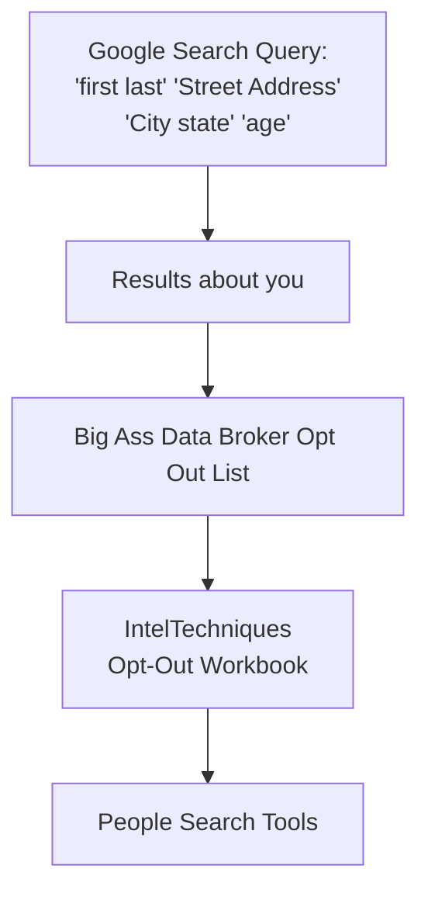

<p align="center">

</p>

## Table of Contents


1. [disclaimer](#disclaimer)
2. [Suggestions](#Suggestions)
3. [Why](#why)
4. [OSINT/OPSEC Tools](#osintopsec-Tools)
   - [methodology](./markdown/methodology.md)
5. [key points](#key-points)
6. [OPSEC](#operations-security-is-a-systematic-process-for) 
   - [How to OPSEC](#how-to-opsec)
      - [disinformation](#disinformation) 
7. [Open Source Intelligence (OSINT)](#open-source-intelligence-osint)
   - [Who uses Open-Source Intelligence (OSINT)?](#who-uses-open-source-intelligence-osint)
   - [Sources of OSINT](#sources-of-osint)
8. [Digital Profiling](#digital-profiling-osint-profiling)
9. [closed sourced](#closed-sourced-info)
      - [Breached Data](#breached-data)
      - [CSINT](./markdown/CSINT.md)
10. [IMINT](#IMINT)
    - [Reverse search](./markdown/IMINT.md#reverse-search-google)
    - [SOCMINT](./markdown/IMINT.md#socmint-social-intelligence)
11. [Real world examples of OSINT](#real-world-examples-of-osint)
      - [2016 Airstrike Coordination](#in-the-year-2016-a-basket-weaving-image-board-used-osint-to-pay-some-supposed-terrorist-a-vist-from-a-govt-in-russia-resulting-in-airstrikes)
      - [2017 Shia LaBeouf Protest](#in-2017-shia-labeouf-had-a-protest-due-to-trumps-election-this-resulted-in-a-basket-weaving-image-board-using-osint-and-sky-patterns-to-figure-out-where-a-flag-is)
12. [Tools](#tools)
      - [Toolchain Recommendations](#toolchain-recommendations)
13. [People search tools (in the states)](#people-search-tools-in-the-states)
14. [Grey literature](#grey-literature)
15. [Breached Data](#breached-data)
16. [Social Media](#social-media)
17. [Self OSINT](#toolchain-self-osint)
18. [Curated lists](#curated-lists)

## ***DISCLAIMER***

I am **not responsible** for any misuse, abuse, or unethical actions taken with the tools or methods listed here. **OSINT is a neutral technique**—anyone can use it, and anyone can be targeted.

Note: Some domains (e.g., `exposed.lol`) may be expired. Refer to the curated list or alternate links provided.

## Suggestions

Open an [issue](https://github.com/airborne-commando/OPSEC-OSINT-Tools/issues) for any suggestions or feedback.

To update this guide use:
```
git pull
```
after cloning.

## Why?

People trust the internet too much. In today’s world, online and offline are practically the same—truth and fiction blur. This README exists to raise awareness. Clone it, fork it, remix it, or even turn it into a [Rentry](https://rentry.co/) page. Spread the knowledge however you like.

Also this guide can help prevent issues such as doxxing (or is it doxing?). The obvious way is to follow [Key-Takeaways](#Key-Takeaways) and to reduce the amount of info you have on yourself publicly[^EFF_doxing_tips][^deleteme].

Can you predict someone’s behavior with this? not exactly; people are unpredictable at times.

# OSINT/OPSEC Tools

A list of OSINT/OPSEC tools I made, forked, and/or use.

If you want some quick methodology I suggest you read this [markdown](./markdown/methodology.md).

## Key points

## Notable Examples of Bad Tor OPSEC

- **School Bomb Threats**
    - Harvard’s Eldo Kim[^doj-15] identified for using Tor on school network as the only user and admitting guilt.
- **Silk Road Case**
    - Ross Ulbricht[^ulbricht][^fordham] linked to Silk Road by using his real name/email, posting about Tor, and failing to hide server IPs. The laptop was basically seized.[^FBI1]
`On Oct. 1, 2013, an F.B.I. operation in a public library in San Francisco ended with the arrest of Ross Ulbricht, who was the brain behind Silk Road. One of the breakthroughs made by the federal agents was that they had traced Ulbricht's movements and found out that he was running the Silk Road from his laptop in public places, possibly to use public Wi-Fi networks for added anonymity. The arrest was not a matter of luck but rather a meticulously planned operation to catch Ulbricht logged into Silk Road as its administrator, a critical factor for proving his identity as Dread Pirate Roberts. Using a tricky ploy, two agents performing as a couple faked a quarrel nearby, distracting Ulbricht from his laptop. At that moment, another agent took the open laptop while logged into the Silk Road administrator's panel. This quick action prevented Ulbricht from locking the laptop or triggering security measures that would have encrypted or deleted crucial evidence.`[^plasbit][^Investopedia]

Ross was pardoned[^doj1][^BBC1] in 2025.

- **LulzSec Hacking Group**
    - Members exposed themselves by discussing ops in public IRC[^archives-fbi][^Ackroyd][^purdue][^fbi], revealing personal info, using stolen cards[^archives-fbi1] to home addresses, and trusting informants.<br>
`Spitler admitted to communicating during the data breach with his co-defendant, Andrew Auernheimer, 25, who was arrested January 18, 2011, in Fayetteville, Ark., while appearing in state court on unrelated drug charges. The two wrote each other during the breach using Internet Relay Chat, an Internet instant messaging program. Those chats included discussions between Spitler, Auernheimer, and other Goatse Security members about the best way to take advantage of the breach and associated theft.`[^archives-fbi]

- **General Bad OPSEC Practices**
    - Poor compartmentalization, leaking sensitive info, predictable naming, traceable work hours, and unsecured servers.
- **Mullvad VPN: Security Contrast**[^nsfpar] [^iugl]
    - Features: anonymous accounts, strong encryption, no-logs, lockdown mode, DNS blockers, open-source, accepts Monero/cash and is independently audited[^MullvadVPNAudits][^WhyMullvad]. Mullvad collects little user information[^1umd].
    - **Caution:** No tool is foolproof; human error remains the weakest link.


## Digital Profiling and Behavioral Analysis Guide

- **Understand the Basics**
    - Digital profiling gathers and analyzes online data; behavioral analysis infers motives, habits, and future actions.
- **Collect Digital Biographical Information**
    - Gather identifiers, track online activity, search for recurring usernames, document findings.
- **Analyze Behavioral Patterns**
    - Look for posting times, topics, language, interaction style, preferred platforms, and social networks.
- **Examples**
    - Use AI tools to analyze old posts for recurring interests; tools like Blackbird/Maigret help track usernames across platforms.
- **Assess Competencies and Affinities**
    - Evaluate technical skill, privacy awareness, sociability, and domain expertise.
- **Use Analytical Tools**
    - Employ search engines, data aggregators, visualization/statistics tools and Natural Language Processing (NLPs) for deeper analysis.
- **Iterate and Refine**
    - Continuously update the profile as new data emerges; use structured documentation.
- **Ethical and Legal Considerations**
    - Only use legally accessible data; respect privacy and avoid harassment.
- **Defending Against OSINT Profiling**
    - Practice good OPSEC, use disinformation, audit yourself, and set profiles to private.


## Real-World OSINT and OPSEC Examples

- **Criminals**
    - *Sony Pictures Hack (2014):* Used OSINT on staff and infrastructure for phishing and breach. [^dojnk]
    - *Ashley Madison Breach (2015):* Used OSINT to leak sensitive user data, causing blackmail and public exposure. [^ftcamd]
- **Civilians**
    - *Identifying Russian Soldiers:* Used facial recognition and open-source images to ID participants in conflicts. [^guardian]
    - *Cameroon Investigation:* Used metadata and geolocation to verify military abuses. [^hrwcam]
- **Law Enforcement**
    - *Tracking Stolen Property:* Monitored online marketplaces to recover stolen goods. [^police1]
    - *ShadowDragon’s SocialNet:* Mapped social networks from 200+ sources to aid investigations. [^dhsfoia]
- **OPSEC Failures**
    - *Guccifer 2.0:* Forgot to activate VPN, exposing real IP and identity. [^doj]
    - *Silk Road’s Ross Ulbricht:* Used personal email and left digital traces, leading to arrest. [^ulbricht]

These guides collectively highlight the importance of strong operational security, the power and risks of OSINT, and the need for continuous vigilance and ethical conduct in information gathering and online behavior.

## (Operations Security) is a systematic process for:
1. Identifying[^nist]
2. Protecting and controlling critical information[^nist][^dol_opsec]

It's a security discipline and operations function that involves a continuous cycle of:
* Identifying critical information and indicators (CII)
  * Critical information and indicators are essential components of Operations Security aimed at protecting sensitive data that could be exploited by adversaries. Critical Information includes unclassified or controlled unclassified information about activities, intentions, capabilities, or limitations that adversaries can use to gain an advantage. Indicators are observable actions or pieces of information that reveal critical details about operations, such as sudden changes in procedures or increased security measures. Protecting this information involves identifying vulnerabilities and implementing countermeasures to prevent unauthorized disclosure
* Analyzing potential threats and vulnerabilities
* Assessing risks
* Developing countermeasures to protect CII

 is used to protect information and activities from adversaries. It helps identify and protect sensitive information that could give an adversary an advantage. OPSEC principles can be applied in daily life, such as not sharing personal information like a DOB, street address, email, phone number.

**Examples of OPSEC mistakes include:**
* Over-sharing personal information online

   * Chris Chan:<br>
     has a huge digital footprint and is easily fooled by trolls online.[^youtube][^businessinsider][^imdb]

   * suspectAGB:<br>
`Tariq Monteiro, 23, and Siyad Mohamud, 24, were part of a group which targeted Alex Smith over a gang-based feud as he left a restaurant near Euston station on 12 August 2019.The pair fled to Kenya immediately after the incident and were arrested in Nairobi last year.They both refused to appear for their sentencing hearing at the Old Bailey. Monteiro, of no fixed address, was ordered to serve a minimum of 24 years in prison, while Mohamud, of Barker Drive, Camden, will serve at least 23 years.`[^bbc]Shared a kitchen photo.[^opsecfail]

* Leaving unused social media online
* interacting with a target on social media
   * w0rmer:<br>
     w0rmer took a picture of his girlfriend, which had exif data on it, so the feds visited his girlfriend who without hesitation said his bf asked him to take the picture.[^opsecfail_w0rmer]
     `I have a way of also inciting anger in people and I think that’s obvious too, in what I was doing. I was egging everybody on. But a little backstory on that; so as you can see, all of them are pretty in-your-face and they’re trying to get and investigate or really after me.I already knew the GPS Exif data was in them and so I had a whole workflow for that. I had my dirty images and then I would clean them and put them in another file. When I went to publish that, I went one, two, three, and so, man, I need one more photo. I grabbed the wrong one, put it in there, and hit tweet.`[^darknetdiaries]

* [examples of good and bad opsec and some osint.](./markdown/examples.md)
* Also some expanded [examples](./markdown/expanded-examples/)

OPSEC supplements other security disciplines rather than replacing them.

### How to OPSEC:

* **Use services that can conceal your identity:**
---

| **Category**               | **Tool/Technique**       | **Description**                                                                 | **Pros**                                      | **Cons/Limitations**                          |
|---------------------------|-------------------------|-------------------------------------------------------------------------------|---------------------------------------------|---------------------------------------------|
| **Encrypted Messaging**   | [Telegram](https://telegram.org/)                | Cloud-based messaging with optional E2E ("Secret Chats")                      | Widely adopted, feature-rich               | Not E2E by default; stores data on servers; requires phone number |
|                            | [Simplex](https://simplex.chat/)                 | No user identifiers (not even random numbers)                                 | Maximum metadata privacy                   | Less user-friendly; smaller network         |
|                            | [Signal](https://signal.org/download/)                  | E2E encrypted by default; minimal metadata retention                         | Gold standard for privacy; court-resistant | Requires phone number                       |
| **Anonymity Networks**    | [Tor](https://www.torproject.org/)                     | Routes traffic through encrypted nodes to hide IP                             | Free; robust against tracking              | Slow; frequent CAPTCHAs                     |
|                            | [Mullvad VPN](https://mullvad.net/en)             | No-logs VPN accepting Monero (XMR) payments                                   | Strong privacy; anonymous payment options  | VPNs can’t fix poor OPSEC habits            |
| **Cryptocurrency**        | [Monero (XMR)](https://www.getmonero.org/)            | Untraceable cryptocurrency                                                   | Private transactions                       | Requires mining/local node for full anonymity + time |
| **Identity Management**   | Unique Usernames        | Use different credentials per site                                           | Prevents correlation attacks               | Hard to manage without a password manager   |
|                            | Word Spinners           | Paraphrase text to avoid detection                                           | Evades plagiarism/identity linking        | May sound unnatural                         |
|                            | AI-Generated Faces      | Fake profile pictures (e.g., ThisPersonDoesNotExist.com)                     | Hides real identity                        | May look unnatural               |
| **Self-OSINT**           | Opt-Out Guides          | Remove personal data from people-search sites                                | Reduces digital footprint                 | Time-consuming; not all sites honor requests without payment |
| **OPSEC Resources**      | Bad OPSEC Examples      | [List of pitfalls](./markdown/badopsec.md) | Learn from others’ mistakes               | N/A                                        |
|                            | Good OPSEC Practices    | [Guidelines](./markdown/good-opsec.md) | Actionable tips                          | Requires discipline                         |
| **Tool Lists**           | OPSEC Tools             | [Curated list](./markdown/opsec.md) | Comprehensive resource                   | May need updates                            |

---

### **Key Takeaways**
1. **Messaging**:  
   - **Signal** OR **Simplex** > **Telegram** for privacy.[^ieee][^signal][^simplex]

   - Remember: E2E ≠ total anonymity (metadata leaks/habits matter)[^opsecfail_w0rmer][^darknetdiaries][^youtube][^opsecfail].


2. **Anonymity**:  
   - **Tor** + **Mullvad VPN** + **XMR** = layered protection.  
   - Avoid logging into personal accounts while using these tools.
   - Pitfalls: you need to use TOR and Mullvad separately for maximum Anonymity, use a [Virtual Machine](./markdown/opsec.md#virtualization) for VPN's and TOR on another (or the host).

3. **Identity**:  
   - **Unique usernames** + **AI faces** + **word spinning** = harder to trace.  

4. **Self-Audit**:  
   - Regularly **opt out** of data brokers and **[OSINT yourself](#toolchain-self-osint)**.  

5. **OPSEC Mindset**:  
   - Follow **[good OPSEC](./markdown/good-opsec.md)** and avoid **[bad habits](./markdown/badopsec.md)**.


**Note**:

By TOR I mean Tor Browser, VPN as in Virtual Private Network, and by Virtual Private Network I mean by Virtual Private Network Service - IE: Mullvad (though it can be other types of VPN's out there as long as it's safe to use and vetted by privacy experts). XMR is Monero Coin or Monero for short, a Privacy Coin.

Check Wikipedia or the sources cited If you're confused on all of these here:
1. VPN service[^watechvpn][^njcybervpn], what we're gonna use here.
2. TOR[^cisa][^nyutor][^cia], What should be used separately.
3. XMR[^monero], for VPN's that take XMR[^monero] as payment.


---

### **Pro Tips**
- **Monero Mining**: Run a local node to avoid centralized exchanges tracing purchases.[^arxiv]

For full tool details, see the **[OPSEC Tools List](./markdown/opsec.md)**.

## disinformation

Disinformation[^misinformation][^pmc] in the context of OSINT (Open Source Intelligence) refers to deliberate actions taken to obscure, mislead, or mask the true activities, intentions, or identities of individuals or organizations from those conducting open-source intelligence gathering. [here](./markdown/disinformation.md).

## Open Source Intelligence (OSINT)

**<div align="center">What is it, how is this used and why is it important:</div>**

- OSINT is the practice of collecting and analyzing information from public sources to address specific intelligence needs. OSINT is used by government agencies and commercial organizations for various purposes, including:

  - Reconnaissance
  - Cyber crime investigations
  - Market trend analysis
  - Brand positioning analysis
  - Measuring risk to an organization
  - Understanding the actor, tactics, and targets
  - Gather real-time information
  - Make informed decisions
  - Receive early warnings of potential threats

## Who uses Open-Source Intelligence (OSINT)?

- National Security and Intelligence Agencies, Law Enforcement, Businesses, Cybersecurity and Cyber-crime Groups, Privacy-Conscious People, Non-Governmental Organizations

  - The CIA[^odni-cia], Defense Intelligence Agency (DIA)[^dia], and Office of the Director of National Intelligence (ODNI) all use OSINT[^odni].
  - OSINT can protect citizens (private or otherwise) from identity theft, sexual violence[^bellingcat_sgbv][^fbi_behavioral], and abuse[^fbi_behavioral][^bellingcat_sgbv].
  - OSINT can monitor competitors[^sba], investigate new markets[^sba], and plan marketing activities[^sba].
  - OSINT can gather intelligence about specific targets online.
  - OSINT can check how outsiders can break into their computing devices.[^ibm]
  - OSINT can be used on oneself to secure privacy.[^deleteme]
  - Bellingcat[^bellingcat_toolkit] and the Center for Information Resilience[^infores] use OSINT.
  - And you! Yes, you can use OSINT.

## Sources of OSINT
OSINT can gather information from various sources, including:
- Public government data

  - Public data is data that can be used, reused, or redistributed. Government entities at all levels (municipal, state, federal, and international) produce large amounts of public data. Typically this data is accessible without restrictions. There may be instances where terms of use must be agreed to or approval must be granted before accessing datasets, such as health or education data.[^unt]

Such can include for example [casesearch](https://ujsportal.pacourts.us/casesearch) in Pennsylvania Courts; landlord, criminal, civil et al should have an address as that's public govt info. 

A Parcel search for [tax history](https://public.eriecountypa.gov/property-tax-records/property-records/property-tax-search/search-by-parcel.aspx).

An official [Justice site](https://www.justice.gov/jmd/ls/state) listing all states and their Local Courts. Case search should be in State Judiciary, also for other information such as tax records and property records.

- [Professional and academic publications](https://www.lawinsider.com/dictionary/academic-publication)

  - Academic Publication means the publication of an abstract, article or paper in a journal or electronic repository, or its presentation at a conference or seminar.


- Commercial data[^lawinsider]

  - Commercial Data means any and all data and information relating to an identified or identifiable Person (whether the information is accurate or not), alone or in combination with other information, which Person is or was an actual or prospective customer of, or consumer of products offered by, the VS Business or L Brands Business, as applicable.

  - Commercial Data means any and all data and information relating to an identified or identifiable Person (whether the information is accurate or not), alone or in combination with other information, which Person is or was an actual or prospective customer of, or consumer of products or services offered by, the LoyaltyOne Business and/or ADS Business, as applicable.

  - Commercial Data means any and all data collected or otherwise processed by the Seller Entities relating to a customer of the Business.

- Grey literature[^welch]
  
  - Grey literature is "Information produced on all levels of government, academics, business and industry in electronic and print formats not controlled by commercial publishing i.e. where publishing is not the primary activity of the producing body."
  
  - Grey literature can be useful for your research, but finding resources requires different tactics than you'd use for commercially published materials. This is because many types of grey literature are not indexed in some of the more common research tools like PubMed, CINAHL, Scopus, etc.

- genealogical[^vt][^umd]

   - Genealogy: Using family history research and genealogy databases as an intelligence-gathering tool.
   - Death records: Gathering intelligence from records such as death notices, obituaries, gravestone databases, and burial registries.
   - Obituary: Systematically using obituaries to collect personal and relational data for investigations. (news papers or local news sites) 

- people search aggregators[^MNHouse][^ftcgov], typically used in the united states. can give you information on someone such as an email, home address, date of birth, etc.

- Google Dorks:

| Operator              | Description                                     | Example                       |
| --------------------- | ----------------------------------------------- | ----------------------------- |
| `site:`               | Search within a specific website or domain      | `site:example.com`            |
| `intitle:`            | Find pages with specific words in the **title** | `intitle:"login page"`        |
| `allintitle:`         | All words must appear in the **title**          | `allintitle:admin login`      |
| `inurl:`              | Words in the **URL**                            | `inurl:admin`                 |
| `allinurl:`           | All terms in the **URL**                        | `allinurl:dashboard admin`    |
| `filetype:` or `ext:` | Search for specific file types                  | `filetype:pdf` or `ext:xls`   |
| `intext:`             | Word or phrase in the **page body**             | `intext:"confidential"`       |
| `allintext:`          | All terms in the **body text**                  | `allintext:password username` |
| `link:`               | Pages linking to a specified URL                | `link:example.com`            |
| `define:`             | Look up a word definition                       | `define:opsec`                |
| `related:`            | Find sites similar to a URL                     | `related:example.com`         |
| `*`                   | Wildcard – matches any word                     | `"admin * login"`             |
| `OR`                  | Either search term can appear                   | `login OR signin`             |
| `AND`                 | Both terms must appear (default behavior)       | `username AND password`       |
| `-`                   | Exclude term                                    | `login -facebook`             |
| `"`                   | Exact phrase                                    | `"confidential file"`         |


**Default Behavior**
- Google treats multiple words as if connected by AND, so results must contain all terms unless you specify otherwise.
- Quotation marks, site:, and filetype: are among the most commonly used explicit operators for more targeted searches.

These operators are not used unless you include them in your query—Google’s default is simply to return results matching all your search terms, ranked by relevance.


### Real world examples of OSINT

## In the year 2016, a basket weaving image board used OSINT to pay some supposed terrorist a visit from a govt in Russia resulting in airstrikes.

  - In 2016, during the complex Syrian Civil War, various rebel groups—some with good intentions and others with nefarious motives—sought to overthrow President Assad. The chaos allowed terrorist groups to flourish, prompting intervention from the United States and Russia, with the former supporting rebels and the latter aiding Assad. An anonymous user on 4chan's Syria General board (SG) claimed that a Syrian rebel group, Jaysh al-Izza, posted a video on YouTube revealing their secret encampment. The group, linked to Al-Qaeda, was seen by 4chan users as a target. A notable 4chan user, Ivan Sirenko, who had connections with the Russian military, received the coordinates from the 4chan community and tweeted them to the Russian Ministry of Defense. This led to an airstrike on the encampment. Two months later, the same rebel group posted another video showing a new training camp. 4chan users once again pinpointed the location using landmarks seen in the video. After thorough verification, they sent the coordinates to Ivan, who facilitated another Russian airstrike.[^pezle][^hnthread]

UPDATE: Turns out it was a really complex war [^cbsnews] the 4chan got involved in, still keeping this up as a key example however; the main issue is that they exposed their training locations with geographic locations to the internet like complete morons.
Thus bad opsec.

## In 2017, Shia LaBeouf had a protest due to Trumps election; this resulted in a basket weaving image board using OSINT and [sky patterns to figure out where a flag is.

- In 2017, 4chan users managed to track down and replace Shia LaBeouf's "He Will Not Divide Us" protest flag. Using only the live-stream footage of the flag, they analyzed flight patterns, star positions, and a tweet to locate the flag in Greeneville, Tennessee. A local troll then honked his car horn until the sound was picked up on the live-stream, pinpointing the exact location. The flag was replaced with a Trump hat, marking the end of this elaborate trolling operation.[^vice4chan]

## Digital profiling (OSINT profiling).

Digital profiling and behavioral analysis are powerful techniques for understanding individuals based on their online activities and digital footprints. While these methods are often used by professionals, you can apply many of the same principles and processes yourself by following a structured approach. This creates possible interest and hobbies of an individual.

Read more inside this readme on [Digital Profiling](./markdown/Digital-Profiling.md)

## Closed Sourced Info

- [HUMINT](./markdown/HUMINT.md)

**HUMINT can be collected overtly (e.g., interviews, debriefings, diplomatic reporting) or covertly (e.g., espionage, clandestine surveillance).**

[Breached Data](#breached-data)

> And remember, closed sourced info can change depending on context. If it came from social media then it's considered open source as it's already out there. If it's from a closed source document like let's say a USB drive then consider it closed source.

See also **[CSINT](./markdown/CSINT.md)**

# IMINT

[IMINT](./markdown/IMINT.md)(Image Intelligence) involves collecting and analyzing visual imagery—satellite, aerial, drone, or ground photos—to extract useful information.[^odni_intel][^odni][^govinfo]
Contains information such as [SOCMINT](./markdown/IMINT.md#socmint-social-intelligence)[^rit] and [Reverse Search](./markdown/IMINT.md#reverse-search-google).

GEOINT[^odni_intel][^odni][^govinfo] is information on geographic locations. Geospatial data may also be called GEOINT data. It's to understand human activity or events and to layer that with data along with geolocations and timing. It has non-military uses as well, example would be for first responders issuing an emergency for a wildfire[^nctc].

Three examples of GEOINT tools that you can access right now:
- [Earth](https://earth.google.com/web/)
- [Maps](https://www.google.com/maps)
- [bing maps](https://www.bing.com/maps)

## Tools

---

| **Category**               | **Tool**                  | **Link**                                                                 | **Functionality**                                                                 | **Limitations/Notes**                                                                 |
|----------------------------|--------------------------|-------------------------------------------------------------------------|---------------------------------------------------------------------------------|-------------------------------------------------------------------------------------|
| **Search Engine Queries**  | dorksearch                | [dorksearch](https://dorksearch.com/)        | Advanced Google dorking for targeted searches                                  | AI Doesn't work, have to build manually & internet access.                                              |
|                            | Google-FU                | [GitHub](https://github.com/airborne-commando/GoogleFU-improved)        | Advanced Google dorking for targeted searches                                  | Rate limits apply; may trigger CAPTCHAs                                              |
|                            | gdork                | [gist](https://gist.github.com/airborne-commando/d6430788b2c6b786f085a9133e88de52)        | Written in shell script, Gnu Linux                                  | In dev; not sure If I'll finish this.                                              |
| **Bio-metric Analysis**     | Facecheck.ID             | [vin3110 repo](https://github.com/vin3110/facecheck.id-results-extractor) and [my repo](https://github.com/airborne-commando/facecheck.id-results-extractor-mobile/tree/main) that includes the [older scripts](https://github.com/airborne-commando/facecheck.id-results-extractor-mobile/tree/old) + [dev](https://github.com/airborne-commando/facecheck.id-results-extractor-mobile/tree/dev)     | Reverse image search bypassing paywalls                                        | Requires Tampermonkey; extracts source links only                                   |
| **Username/Email Search**  | Blackbird                | [GitHub](https://github.com/p1ngul1n0/blackbird)                       | Fast cross-platform username/email lookup                                      | CLI-only; lightweight                                                               |
|                            | Crow (GUI for Blackbird) | [GitHub](https://github.com/airborne-commando/crow)                     | GUI version of Blackbird                                                       | Same functionality as CLI                                                           |
|                            | Sherlock                 | [GitHub](https://github.com/sherlock-project/sherlock)                  | Comprehensive username search across 300+ sites                                | False positives (e.g., Imgur); CLI-based                                            |
|                            | No-Shit-Sherlock (GUI)   | [GitHub](https://github.com/airborne-commando/no-shit-sherlock)         | GUI wrapper for Sherlock                                                       | Inherits Sherlock’s limitations                                                     |
|                            | Maigret                  | [GitHub](https://github.com/soxoj/maigret)                              | Finds username connections (Sherlock fork)                                     | Focuses on profile linkages                                                         |
|                            | Maigret-Night (GUI)      | [GitHub](https://github.com/airborne-commando/maigret-night)            | GUI for Maigret                                                                | Same as Maigret CLI                                                                 |
|                            | Holehe                   | [GitHub](https://github.com/megadose/holehe)                            | Checks email usage across sites                                                | Imgur false positives; CLI-based                                                    |
| **Email Compromises**      | Hudson Rock Extractor    | [GitHub](https://github.com/airborne-commando/hudsonrock-search-extractor)| Manual email breach checker (Flask-based)                                     | Not automated; requires manual input                                                |
| **Geolocation/GEOINT**            | Google Maps              | [maps.google.com](https://maps.google.com/)                             | Pinpoint locations/compare landmarks                                           | Public data only; no advanced OSINT features                                        |
|                            | Bing maps              | [bing maps](https://www.bing.com/maps)                             | Birds eye view, satellite, street view                                          | Quality may differ in birds eye compared to google                                        |
|                            | Google Earth              | [Google Earth](https://earth.google.com/web)                            | 3D View, 2D view, satellite, street view, historical views                                          | Use in conjunction with google maps, bing maps or both.                                        |
|                            | geohints                     | [geohints](https://geohints.com/)                                     | a curated list that contains the most accurate and detailed information about metas in Geoguessr as possible.| used for Geoguessr, but can be used to give clues in where an image is located.                                 |
|                            | GeoGuessr GPT              | [GeoGuessr GPT](https://chatgpt.com/g/g-brlHi7t2R-geoguessr-gpt)                             | Use AI to pinpoint a photo                                          | Can give out false info; it's AI so ***it will*** hallucinate! Only 3 uploads for free users.                                        |
|                            | findpiclocation              | [findpiclocation](https://findpiclocation.com/)                           | Use AI to pinpoint a photo                                          | May not be as accurate as GPT.                                        |
| **Generalized OSINT**      | OSINT Rocks              | [osint.rocks](https://osint.rocks/)                                     | Multi-tool: Hudson Rock, Holehe, GHunt (Gmail), phone/domain/username look-ups  | Web-based; combines multiple tools in one interface                                 |
| **MISC CLI tools**         | zabasearch-auto   | [GitHub](https://github.com/airborne-commando/zabasearch-auto)         | A CLI tool to look up public info on someone in the USA                                                       | CLI, advanced usage                                                     |
|                            | link extractor and archive   | [GitHub](https://github.com/airborne-commando/link-extractor-and-archive)         | An archive tool for archive.ph, can extract links from a basic webpage                                                       | CLI, advanced usage; basic webpages only, Requires manual intervention (text edits FIND+REPLACE).                                                     |
|                            | voter reg status   | [GitHub](https://github.com/airborne-commando/voter-reg-status)        | A CLI tool that looks up voter info on an person                                                       | Only in PA, Needs county, zip, first last name, DOB. Advanced usage. Census data may be out of date.                                                  |


---

### **Key Insights & Pro Tips**

1. **False Positives**:  
   - **Sherlock/Holehe**: Imgur often returns misleading results—verify manually.  
   - **Facecheck.ID**: Extracts links but doesn’t analyze images; cross-reference with [Pimeyes (10 searches)](https://pimeyes.com/en) or others listed on 6.  

2. **GUI vs. CLI**:  
   - **CLI Tools (Blackbird, Sherlock, Maigret)**: requires technical familiarity.  
   - **GUI Wrappers (Crow, No-Shit-Sherlock)**: Easier for beginners; same back-end logic.  

3. **Email Investigations**:  
   - Combine **Holehe** (account detection) + **Hudson Rock Extractor** (breach data) for thorough checks; see [**Toolchain Recommendations**](#Toolchain-Recommendations).  
   - For Gmail-specific OSINT, use **GHunt** (via OSINT Rocks).  
   - Verify a google email, you'll need to be logged in to your own:

            https://calendar.google.com/calendar/u/0/embed?src=youremail@gmail.com

From this linkedin post[^Yoni]:

In a clever LinkedIn post, 🔐Yoni  shares a privacy insight and a practical OSINT technique worth bookmarking.

First, the Gmail dot trick: Google ignores dots in addresses, so variations like davidsmith@gmail[.]com, d.a.v.i.d.s.m.i.t.h[@]gmail[.]com, and david.smith[@]gmail[.]com all route to the same inbox, a fact that’s often misunderstood in email investigations.

More importantly for OSINT work, Yoni highlights a method to check if an email is linked to a Google account using Google Calendar. Just plug the email into this URL while logged into your own Google account:

https[:]//calendar[.]google[.]com/calendar/u/0/embed?src=youremail@example[.]com

If the address is connected to a Google account, the calendar interface loads and displays the bolded email address in the bottom left. If it doesn’t exist, it simply shows “Google Calendar.”

🔍 Why It Matters:
This is a quick, non-intrusive way to validate if an email is active on Google’s ecosystem, especially helpful when vetting aliases, burner accounts, or verifying user identities in investigations.

4. **Geolocation**:  
   - Use **Google Maps Street View** to verify addresses/landmarks from other tools (e.g., ClustrMaps).
   - Use birds eye view in [bing maps](https://www.bing.com/maps)
   - use [google earth](https://earth.google.com/web/) for a detailed view.

5. **OPSEC Notes**:  
   - **Rate Limits**: Tools like Google-FU may trigger blocks—use proxies/VPNs.  
   - **Legality**: Avoid scraping private data (e.g., Facebook pro) without consent.  

6. **Bio-metric Analysis**: You can supplement your bio-metric analytics with these tools by extracting the results from:
 - faceonlive.com (3 or 4 search limit, may need TOR)
 - lenso.ai 

After that open image in new tab and save or drag it into facecheck.id and compare (as mentioned earlier on step 1)

---

### **Toolchain Recommendations**
- **Quick Username Search**: Crow (GUI for in-depth) → Maigret (GUI for in-depth) → Sherlock (CLI for depth).  
- **Email Breaches**: Have I Been Pwned → Pentester (freeish) → OSINT Rocks (Hudson Rock/Holehe) → LOLArchiver.  
- **Images**: Facecheck.ID → Pimeyes → lenso.ai → faceonlive  
- **Files**: Encrypted drives (LUKS) → veracrypt → keepassxc

Note on Pentester: Pentester can provide free results on usernames, etc but on a time limit, not worth to buy a service if you're smart and keep records (snapshot).

Note: For keepassxc it's a good idea to use a strong password or a YubiKey (hardware password/security key)
you may also create an additional database, one that has the password you can remember; the other that has the generated database password for sensitive files.

For niche tools, refer to the [Curated Lists](#curated-lists) section.

Pipeline discussed [here](./markdown/opsec.md#opsec-pipeline-for-secure-files)
    
## People search tools (in the states):

**DISCLAIMER: The type of info found on these sites appear to from other data brokers, social media profiles that are public or viewable by everyone, compiled data/info from federal, state, and local government public records.**

---

| **Tool**               | **Lookup By**                | **Returns**                              | **Notes**                                                                 |
|------------------------|-----------------------------|------------------------------------------|---------------------------------------------------------------------------|
| **[FastPeopleSearch](https://www.fastpeoplesearch.com/)**   | Name, Phone, Address        | Age, Address, Phone, Email               | Free; data may be outdated.                                               |
| **[That's Them](https://thatsthem.com/)**        | Name, Email, IP, VIN, Phone | IP, Addresses, Phone, Email              | Aggregates data from Intelius/Spokeo; some paid results.                 |
| **[Nuwber](https://nuwber.com/)**            | Name, Phone, Email, Address | DOB, Address, Email, Phone               | Detailed reports may require payment.                                    |
| **[IDCrawl](https://idcrawl.com/)**           | Name, Username, Phone, Email | Names, Usernames, Phone, Email           | Focuses on usernames/social media.                                       |
| **[PeekYou](https://www.peekyou.com/)**           | Name, Username, State       | Age, Social Media, Emails, Addresses     | Strong for social media profiling.                                       |
| **[Webmii](https://webmii.com/)**            | First + Last Name           | Social Media, Search Results             | Lightweight; scans public web/social profiles.                           |
| **[PublicRecords](https://www.publicrecords.onlinesearches.com/)**     | Name, Address, State        | Name, Address, Partial Phone             | Free directory; redirects to Intelius for paid details.                  |
| **[ClustrMaps](https://clustrmaps.com/)**        | Name, Address               | Addresses, Residents, Property, IP Data  | Focuses on geolocation/demographics; may include ownership history.      |
| **[fastbackgroundcheck](https://www.fastbackgroundcheck.com)** | Name, Address, Phone Number | Name, Address, Phone Number, Emails | Seems to comb though billions of records as stated on it's [website](https://www.fastbackgroundcheck.com/about) |
| **[zbase](https://www.zabasearch.com/)** | first, last name, city state | Names, Possible Relatives, User IDs, Address, Phone Number, Emails, education, job history | comes from various sources, as stated on it's [faq](https://www.zabasearch.com/faq/), free partial look up and is **accurate*** |

---

### **Key Observations**:
1. **Free vs. Paid**: Most tools offer basic info for free but upsell detailed reports (e.g., PublicRecords → Intelius).  
2. **Data Sources**: Many pull from the same breaches/public records (emails/phones often outdated but still in use).  
3. **Specializations**:  
   - *Social Media*: PeekYou, IDCrawl.  
   - *Geo-location*: ClustrMaps.  
   - *Comprehensive*: FastPeopleSearch, Nuwber, fastbackgroundcheck.  

**Disclaimer**: Accuracy varies; users rarely update emails unless compromised. Use ethically!

- For additional tools see [Curated lists](#curated-lists)

## Grey literature

Use this site; [do not register](https://vote.gov/register), check a voter registration. Will probably need more info in some states; while others need less.

An automatic tool that I've made for [pa voter services](https://github.com/airborne-commando/voter-reg-status). Feel free to fork for other states.

## Breached Data:
---

| **Tool**               | **Lookup By**       | **Returns**                              | **Limitations/Costs**                          | **Notes**                                                                 |
|------------------------|--------------------|------------------------------------------|-----------------------------------------------|---------------------------------------------------------------------------|
| **[Have I Been Pwned](https://haveibeenpwned.com/)**  | Email, Phone       | Breach names, dates, compromised data    | Free; no passwords/raw data                   | Trusted source; alerts for new breaches.                                  |
| **[BreachDirectory](https://breachdirectory.org/)**    | Email, Username    | Partial password hashes (SHA-1, first 4 chars), length | Free; no full passwords            | Useful for credential stuffing checks.                                    |
| **[Breach.vip](https://Breach.vip)**         | Email, Username    | Minecraft-focused leaks (usernames, IPs) | Free; requires login                          | Niche for gaming accounts; "memey" but functional.                        |
| **[LeakPeek](https://leakpeek.com/)**           | Email, Username    | Partial breach snippets (e.g., domains)  | 5 free searches; Tor bypass possible          | Paid plans for full data; obfuscates results.                             |
| **[LOLArchiver](https://osint.lolarchiver.com/)**        | Email, Username    | Full breach databases (e.g., emails, passwords) | Paid service only                     | For OSINT professionals; curated high-value leaks.                        |
| **[Icebreaker](https://github.com/airborne-commando/ice-breaker)**         | Local breach files | Parses/analyzes large breach datasets    | Python/EXE; works best for <1000GB files      | Demo script provided; use with caution (e.g., [Facebook 533M leak](https://github.com/davidfegyver/facebook-533m)).        |
| **[hashes.com](https://hashes.com/)**         | Hash (MD5, SHA-1, etc.) | Decrypted passwords (if hash is cracked) | Free/paid cracking tools                      | Useful for reversing hashes from breaches.                               |
| **[pentester.com](https://pentester.com/)**          | Email, Username    | Full breach details (more than HIBP)     | ***Free**; no Tor needed; use incognito/private browsing mode.                           | Extensive; may include sensitive data.                    |
| **[Hudson Rock](https://www.hudsonrock.com/threat-intelligence-cybercrime-tools)**          | Email, Username, Domain, APK    | Infostealer infection indication, general information     | Free; no passwords/raw data                           | Infostealer only data                    |
| **[archive.trace.rip](https://archive.trace.rip/)**          | detailed information    | user submitted     | Historical Data Breaches Archive                           | data breaches and scrapes throughout history                    |


---

### **Key Takeaways**:
1. **Free vs. Paid**:  
   - *Free*: HIBP, BreachDirectory, Pentester, Hashes.com.  
   - *Limited Free*: LeakPeek (5 searches), Breach.vip (login required).  
   - *Paid*: LOLArchiver, LeakPeek plans.  

2. **Specializations**:  
   - *Password Recovery*: Hashes.com (decrypt hashes), BreachDirectory (partial hashes).  
   - *Gaming Leaks*: Breach.vip (Minecraft).  
   - *Local Analysis*: Icebreaker (Python tool for large datasets).  

3. **Ethical/Legal Notes**:  
   - Many tools provide **partial data** (e.g., first 4 chars of passwords) to comply with ethics.  
   - Use **Tor** with LeakPeek to bypass search limits.  
   - Avoid misuse: Some tools (e.g., Pentester) may expose sensitive data.  

4. **For Large Datasets**:  
   - [Icebreaker](https://github.com/airborne-commando/ice-breaker) + [Facebook 533M](https://github.com/davidfegyver/facebook-533m) (no passwords) for bulk analysis.  

---

### **Additional Resources**:
- **Curated Lists**: Check [Curated Lists](#curated-lists) for more niche tools.  
- **Demo Scripts**: [Icebreaker](https://github.com/airborne-commando/ice-breaker) includes a demo for testing.  

## social media
---

| **Platform**  | **Tool**               | **URL**                              | **Functionality**                          | **Limitations/Notes**                     |
|--------------|-----------------------|--------------------------------------|------------------------------------------|------------------------------------------|
| **General**  | Social Searcher       | [social-searcher.com](https://www.social-searcher.com/) | Searches multiple platforms at once | navigate public web search results more easily, does not collect, store, or scrape data from any social media platforms, and we do not access private content or use any official or unofficial APIs. [about](https://www.social-searcher.com/about/) |
| **Snapchat** | Snapchat Map          | [map.snapchat.com](https://map.snapchat.com/) | View public Snapchat location stories | Requires Snapchat account |
| **Instagram**| Dumpor               | [dumpor.com](https://dumpor.com/)    | View profiles/stories anonymously      | May have rate limits |
|              | imginn               | [imginn.com](https://imginn.com/)    | View profiles/stories anonymously      |                      |
| **Twitter**  | Sotwe                | [sotwe.com](https://www.sotwe.com/)  | Privacy-focused Twitter front-end             | No login required |
|              | Xcancel              | [xcancel.com](https://xcancel.com/)  | Privacy-focused Twitter front-end             | No login required, Lightweight interface, [FF browser addon](https://addons.mozilla.org/en-US/firefox/addon/toxcancel/) and [chrome](https://chromewebstore.google.com/detail/xcancelcom-redirector) |
|              | Nitter               | [nitter.net](https://nitter.net/)    | Privacy-focused Twitter front-end      | No login required |
| **Facebook** | Facebook Search      | [facebook.com/search](https://www.facebook.com/search/) | Native Facebook search tool | Limited without login |
|              | WhoPostedWhat       | [whopostedwhat.com](https://www.whopostedwhat.com/) | Search Facebook posts by date/keyword | Requires precise queries, public accounts |
| **reddit**   | r00m101.com | [r00m101](https://r00m101.com/)       | Get detailed info from an active or deleted reddit account including “stage of life” and “hobbies”. | Pricing for full scope and features |
|              | ihsoyct | [ihsoyct](https://ihsoyct.github.io/index.html) | Get archived posts from a reddit account from both APIs | [Host](https://arctic-shift.photon-reddit.com/live-charts/) can be down, [pushpull](https://pullpush.io/) is still non-functional as of writing. see [limitations](https://github.com/Fubs/reddit-uncensored?tab=readme-ov-file#limitations) different repo but raises a good point on archives. |
|              | reddit-uncensored             | [reddit-uncensored](https://github.com/Fubs/reddit-uncensored) | Automatically restores deleted posts and comments on Reddit using the Arctic Shift API                              | Browser addon (firefox, chrome), see [limitations](https://github.com/Fubs/reddit-uncensored?tab=readme-ov-file#limitations) |
|              | usertoihsoyct | [usertoihsoyct](https://github.com/airborne-commando/usertoihsoyct/tree/main) | redirects to ihsoyct when clicking on a username. | see [limitations](https://github.com/Fubs/reddit-uncensored?tab=readme-ov-file#limitations), Browser addon (firefox). |

---

### **Pro Tips & Workarounds**

1. **Facebook Private Accounts**:
   - Method 1: Create a fake account (difficult due to Facebook's verification)
   - Method 2: Use browser's *Inspect Element* → *Device Simulator* (or mobile phone) + direct URL
   - Always try logged out or in private mode first

2. **LinkedIn Limitations**:
   - If profiles don't load:
     - Wait 1-2 minutes (cookie/IP rotation)
     - Create a basic account (avoid looking suspicious)
   - HWID/IP tracking may block repeated searches

3. **Twitter Alternatives**:
   - Use **Nitter**/**Xcancel**/**Sotwe** to browse anonymously.

4. **Instagram**:
   - **Dumpor** bypasses some privacy settings
   - **Quick Use** https://dumpor.io/v/USERNAME replace ``USERNAME`` with the user you are trying to see
   - **Will not work with private accounts**
   - You may also use https://imginn.com/
       + [firefox](https://addons.mozilla.org/en-US/firefox/addon/imginn/)
       + [chrome](https://github.com/claromes/socialswitch) make sure to not use picuki, disable tiktok; use a different profile or browser. Can use firefox.

---

### **Key Takeaways**
- **Anonymity**: Tools like Nitter/Dumpor avoid platform tracking
- **Mobile Tricks**: Simulating mobile devices often works better for restricted content
- **Persistence**: Some platforms (LinkedIn/Facebook) require patience or account creation

- For additional tools see the Curated Lists section below.


## Curated lists

- [Awesome OSINT](https://github.com/jivoi/awesome-osint) - a curated list of OSINT tools, blogs, and videos

- [OSINT Framework](https://osintframework.com/) - a larger list of tools
  
- [OSINT Resources](https://sizeof.cat/post/osint-resources/) - Collection of OSINT resources that seems to be more up to date (includes NSFW)

  - [Archive](https://archive.ph/rZZf0)


- [internet tools](https://fmhy.xyz/internet-tools#open-source-intelligence) 
  
- [OSINT toolbox](https://github.com/The-Osint-Toolbox) 

- A whole reddit wiki from the [OSINT community](https://www.reddit.com/r/OSINT/wiki/index/)

- A list of social media, maps, domains, etc also listed [in cipher387's OSINT collection](https://github.com/cipher387/osint_stuff_tool_collection).

- bellingcat [toolkit](https://bellingcat.gitbook.io/toolkit)

- [OSINT news letter](https://osintnewsletter.com) Protip: use "topic" site:https://osintnewsletter.com

example: 

    "facecheck.id" site:https://osintnewsletter.com


**OPT OUT**

- A whole [big ass list](https://github.com/yaelwrites/Big-Ass-Data-Broker-Opt-Out-List) to opt out and to compare info.

- [inteltechniques opt out workbook](https://inteltechniques.com/workbook.html)

- [Results about you (google index)](https://myactivity.google.com/results-about-you) - Check what google emails you; actually visit the website and see about doing an opt-out there.

## Toolchain (self-OSINT):

Google dorks: 





**Notice** 

[Results about you (google index)](https://myactivity.google.com/results-about-you) can also be emailed so keep that in mind when comparing info I.E.: Google will find websites containing your first-last name and address and will ask to remove it from the index. Before applying the removal process on google search be sure to remove info from the website itself that it's hosted on. Google Dorking seems to be a bit quicker and preemptive on removing info about yourself after you visit said sites (if applicable).

Also with doing google dorks the manual way is that you won't get flagged by google itself as a bot.

Additional tools:

- For additional tools see the curated-lists above


Donations:

If you find this useful feel free to donate to this monero address:

<p align="left"></p>
<p>
<code>8BPdcsLtA5iWLNTWvYzUVyTWtQkM62e8r7xqAuwjXTSC4RcoSWqpmtyLsMYvz3QNZtT1rbgPUnmVpMAudhxTn6zkRxUFcZN</code>
</p>


sources:

[^odni_intel]: "What is Intelligence?" *Office of the Director of National Intelligence*, www.dni.gov/index.php/what-we-do/what-is-intelligence. Accessed 22 Sept. 2025.

[^odni]: Office of the Director of National Intelligence. "Intelligence Community." *ODNI*, https://www.odni.gov/index.php/ncsc-what-we-do/121-dni/intelligence-community. Accessed 22 Sept. 2025.

[^nsfpar]: National Science Foundation. *NSF Public Access Repository*. https://par.nsf.gov/servlets/purl/10100952. Accessed 22 Sept. 2025.

[^iugl]: Indiana University Libraries. "Digital Privacy: Digital Privacy Practices." *Indiana University*, https://guides.libraries.indiana.edu/c.php?g=1325689&p=9771453. Accessed 22 Sept. 2025.

[^doj]: United States, Department of Justice. "Grand Jury Indicts 12 Russian Intelligence Officers for Hacking Offenses Related to 2016 Election." *Justice.gov*, https://www.justice.gov/archives/opa/pr/grand-jury-indicts-12-russian-intelligence-officers-hacking-offenses-related-2016-election. Accessed 22 Sept. 2025.

[^dhsfoia]: U.S. Department of Homeland Security, Privacy Office. *Freedom of Information Act (FOIA) Activity for the Week of March 31, 2025 to June 30, 2025* [PDF]. 31 March 2025. https://www.dhs.gov/sites/default/files/2025-07/25_0731_PRIV_Chief_FOIA_Officers_Weekly_Report_March_31_25_to_June_30_25.pdf. Accessed 22 Sept. 2025.

[^ulbricht]: United States, Department of Justice. "Ross Ulbricht, A/K/A “Dread Pirate Roberts,” Sentenced In Manhattan Federal Court To Life In Prison." *Justice.gov*, 29 May 2015, https://www.justice.gov/usao-sdny/pr/ross-ulbricht-aka-dread-pirate-roberts-sentenced-manhattan-federal-court-life-prison. Accessed 22 Sept. 2025.

[^vice4chan]: Lamoureux Mack. "How 4Chan's Worst Trolls Pulled Off the Heist of the Century." *VICE*, https://www.vice.com/en/article/4chan-does-first-good-thing-pulls-off-the-heist-of-the-century1/. Accessed 22 Sept. 2025.

[^hnthread]: User chasd00 et al. "Discussion on Imgur Image Links and Redirect Solutions." *Hacker News*, 8 Dec. 2022, https://news.ycombinator.com/item?id=33913443. Accessed 22 Sept. 2025.

[^pezle]: Pezle. "The Time 4Chan Called in an Airstrike." *YouTube*, 17 Aug. 2023, www.youtube.com/watch?v=OR6epSP_Xlw. Accessed 22 Sept. 2025.

[^watechvpn]: Washington State Technology. "What is a VPN, and How Does It Work?" *WA Tech*, https://watech.wa.gov/what-vpn-and-how-does-it-work. Accessed 22 Sept. 2025.

[^njcybervpn]: New Jersey Cybersecurity and Communications Integration Cell. "Virtual Private Networks." *Cyber NJ*, https://www.cyber.nj.gov/guidance-and-best-practices/wi-fi-network-security/virtual-private-networks. Accessed 22 Sept. 2025.

[^nyutor]: New York University, Interactive Telecommunications Program. "Demystifying the Dark Web: An Introduction to Tor and Onion Routing." *ITP*, https://itp.nyu.edu/networks/explanations/demystifying-the-dark-web-an-introduction-to-tor-and-onion-routing/. Accessed 22 Sept. 2025.

[^cisa]: Cybersecurity and Infrastructure Security Agency. "AA20-183A: Virtual Private Network (VPN) Security." *CISA*, https://www.cisa.gov/news-events/cybersecurity-advisories/aa20-183a. Accessed 22 Sept. 2025.

[^cia]: Central Intelligence Agency. "CIA’s Latest Layer: An Onion Site." *CIA.gov*, https://www.cia.gov/stories/story/cias-latest-layer-an-onion-site/. Accessed 22 Sept. 2025.

[^monero]: Canul, Mario, and Saxon Knight. *Introduction to Monero and How It’s Different*. University of Hawai’i at Mānoa, Jan. 2019. https://maui.hawaii.edu/wp-content/uploads/sites/13/2019/01/Monero.pdf. Accessed 22 Sept. 2025.

[^arxiv]: Ren, Huan, et al. "On the Exploration of Reinforcement Learning Agents with Curiosity." *arXiv*, Cornell University, 24 Aug. 2018, arxiv.org/abs/1808.00811. Accessed 22 Sept. 2025.

[^misinformation]: "Misinformation and Disinformation." *CSI Library, College of Staten Island (CUNY)*, City University of New York, library.csi.cuny.edu/misinformation. Accessed 22 Sept. 2025.

[^pmc]: Ghenai, Amira, and Yelena Mejova. "Catching Fire: Identifying Propaganda on Social Media in the Context of the Russia-Ukraine War." *PLOS ONE*, vol. 17, no. 2, Feb. 2022, p. e0263421. *PubMed Central*, doi:10.1371/journal.pone.0263421. Accessed 22 Sept. 2025.

[^Yoni]: Solomon, Yoni. In a clever LinkedIn post, Yoni shares a simple but effective method for identifying fake profiles. *LinkedIn*, 17 June 2024, www.linkedin.com/posts/forensicosint_in-a-clever-linkedin-post-yoni-shares-activity-7359045935919755266-JdTX.

[^cbsnews]: "Syrian War: Aleppo Airstrikes from Russia, Assad Pummel Rebels." *CBS News*, CBS Interactive, 28 Sept. 2016, www.cbsnews.com/news/syria-war-aleppo-airstrikes-russia-assad-rebels-offensive/.

[^fbi]: "Leading Member of the International Cyber Criminal Group 'LulzSec' Sentenced in Manhattan Federal Court." *Federal Bureau of Investigation*, U.S. Department of Justice, Field Office: New York, 18 May 2016, www.fbi.gov/contact-us/field-offices/newyork/news/press-releases/leading-member-of-the-international-cyber-criminal-group-lulzsec-sentenced-in-manhattan-federal-court.

[^purdue]: "Hacktivism: The Short Life of LulzSec." *Purdue Cybersecurity Blog*, Purdue University, 15 Mar. 2023, cyber.tap.purdue.edu/blog/articles/hacktivism-the-short-life-of-lulzsec/.

[^doj-15]: "Harvard Student Charged with Making Hoax Bomb Threat." *United States Department of Justice*, U.S. Attorney's Office, District of Massachusetts, 22 Apr. 2015, www.justice.gov/usao-ma/pr/harvard-student-charged-making-hoax-bomb-threat.

[^hrwcam]: Human Rights Watch. "Cameroon: Soldiers Get 10 Years for Murder of Civilians." *Human Rights Watch*, 23 Sept. 2020, https://www.hrw.org/news/2020/09/23/cameroon-soldiers-get-10-years-murder-civilians. Accessed 22 Sept. 2025.

[^police1]: Burley, Brandon. "Thinking Like a Criminal: How OSINT Can Take Your Investigations Further." *Police1*, https://www.police1.com/investigations/thinking-like-a-criminal-how-osint-can-take-your-investigations-further. Accessed 22 Sept. 2025.

[^ftcamd]: Federal Trade Commission. "Ashley Madison Settles with FTC over Data Security." *FTC*, 23 May 2022, https://www.ftc.gov/business-guidance/blog/2016/12/ashley-madison-settles-ftc-over-data-security. Accessed 22 Sept. 2025.

[^dojnk]: United States, Department of Justice. "North Korean Regime-Backed Programmer Charged in Conspiracy to Conduct Multiple Cyber-Attacks and Intrusions." *Justice.gov*, https://www.justice.gov/archives/opa/pr/north-korean-regime-backed-programmer-charged-conspiracy-conduct-multiple-cyber-attacks-and. Accessed 22 Sept. 2025.

[^odni-cia]: "ODNI and CIA Release the Intelligence Community OSINT Strategy for 2024-2026." *Office of the Director of National Intelligence*, 16 July 2024, www.dni.gov/index.php/newsroom/press-releases/press-releases-2024/3784-odni-and-cia-release-the-intelligence-community-osint-strategy-for-2024-2026.

[^dia]: *Open Source Intelligence (OSINT) Strategy*. Defense Intelligence Agency, U.S. Department of Defense, 4 Mar. 2021, www.dia.mil/Portals/110/Documents/OSINT-Strategy.pdf.

[^govinfo]: *U.S. Intelligence Community 21 (IC21): Intelligence Community in the 21st Century*. U.S. Government Publishing Office, 1996, www.govinfo.gov/content/pkg/GPO-IC21/html/GPO-IC21-6.html. Accessed 22 Sept. 2025.

[^nctc]: *Intelligence Guide*. National Counterterrorism Center, Office of the Director of National Intelligence, www.dni.gov/nctc/jcat/jcat_ctguide/intel_guide.html. Accessed 22 Sept. 2025.

[^ieee]: Greenberg, Andy. "Telegram's Security Flaws Could Make It a Tool for Attackers." *IEEE Spectrum*, 2 Aug. 2024, spectrum.ieee.org/telegram-security.

[^signal]: "Is it private? Can I trust it?" *Signal Support*, Signal Messenger LLC, support.signal.org/hc/en-us/articles/360007320391-Is-it-private-Can-I-trust-it. Accessed 22 Sept. 2025.

[^simplex]: "Simplex: Redefining Privacy with Hard Choices." *Simplex Chat Blog*, 16 May 2024, simplex.chat/blog/20240516-simplex-redefining-privacy-hard-choices.html.

[^nist]: "Operations Security (OPSEC)." *Computer Security Resource Center Glossary*, National Institute of Standards and Technology (NIST), U.S. Department of Commerce, csrc.nist.gov/glossary/term/operations_security. Accessed 22 Sept. 2025.

[^dol_opsec]: "Operations Security (OPSEC)." *U.S. Department of Labor*, www.dol.gov/agencies/oasam/centers-offices/emergency-management-center/operations-security. Accessed 22 Sept. 2025.


[^unt]: "Public Data Sources." *UNT Libraries Research Guides*, University of North Texas Libraries, guides.library.unt.edu/datasets/public-data-sources. Accessed 22 Sept. 2025.

[^lawinsider]: "Commercial Data Definition." *Law Insider*, lawinsider.com/dictionary/commercial-data. Accessed 22 Sept. 2025.

[^welch]: "Publicly Available Data & Statistics." *Welch Medical Library Guides*, Johns Hopkins University, browse.welch.jhmi.edu/c.php?g=1195274. Accessed 22 Sept. 2025.

[^umd]: "Publicly Available Data." *University of Maryland Libraries Research Guides*, University of Maryland, lib.guides.umd.edu/c.php?g=326980&p=2198795. Accessed 22 Sept. 2025.

[^vt]: "Genealogy." *University Libraries Research Guides*, Virginia Tech, guides.lib.vt.edu/topics/genealogy. Accessed 22 Sept. 2025.

[^youtube]: *The Comprehensive Chris Chan Documentary*. Created by GenoSamuel2.1, YouTube, www.youtube.com/playlist?list=PLABqEYq6H3vpCmsmyUnHnfMOeAnjBdSNm. Accessed 22 Sept. 2025.

[^businessinsider]: Tenbarge, Ken. "A Comprehensive Timeline of the Chris Chan Saga, Which Now Includes Incest Charges." *Business Insider*, 2 Aug. 2021, www.businessinsider.com/chris-chan-saga-timeline-incest-charges-arrest-2021-8.

[^imdb]: "Chris Chan." *IMDb*, Amazon.com, www.imdb.com/name/nm4813395/. Accessed 22 Sept. 2025.

[^opsecfail]: "Operation OPSEC FAIL: Suspect AGB." *OPSEC FAIL Blog*, opsecfail.github.io/blog.html?filecase=suspectAGB. Accessed 22 Sept. 2025.

[^bbc]: "Met Police Officer Admits Being in Neo-Nazi Group." *BBC News*, 17 May 2023, www.bbc.com/news/uk-england-london-65570367.

[^opsecfail_w0rmer]: "Operation OPSEC FAIL: w0rmer." *OPSEC FAIL Blog*, opsecfail.github.io/blog.html?filecase=w0rmer. Accessed 22 Sept. 2025.

[^darknetdiaries]: "Transcript for Episode 63: w0rmer." *Darknet Diaries*, darknetdiaries.com/transcript/63/. Accessed 22 Sept. 2025.

[^infores]: "OSINT 101: What is Open-Source Intelligence (OSINT)?" *Info Res*, 17 Jan. 2024, www.info-res.org/afghan-witness/articles/osint-101-what-is-open-source-intelligence-osint/.

[^bellingcat_toolkit]: "Bellingcat Online Investigations Toolkit." *Bellingcat*, 24 Sept. 2024, www.bellingcat.com/resources/2024/09/24/bellingcat-online-investigations-toolkit/.

[^ibm]: "What is Penetration Testing?" *IBM*, www.ibm.com/think/topics/penetration-testing. Accessed 22 Sept. 2025.

[^deleteme]: "A Guide to Doxxing Yourself on the Internet." *DeleteMe*, Joindeleteme.com, joindeleteme.com/doxxing/a-guide-to-doxxing-yourself-on-the-internet/. Accessed 22 Sept. 2025. 

[^sba]: "Market Research and Competitive Analysis." *U.S. Small Business Administration*, www.sba.gov/business-guide/plan-your-business/market-research-competitive-analysis. Accessed 22 Sept. 2025.

[^fbi_behavioral]: Federal Bureau of Investigation. "Behavioral Analysis." *FBI*, 12 Apr. 2023, https://www.fbi.gov/how-we-investigate/behavioral-analysis. Accessed 22 Sept. 2025.

[^bellingcat_sgbv]: "Sexual and Gender-Based Violence Open Source Research (OSINT) Digital." *Bellingcat*, 3 Mar. 2023, www.bellingcat.com/resources/2023/03/03/sexual-and-gender-based-violence-open-source-researche-osint-digital/.

[^rit]: "2023-10_CPSI Working Paper_Social Media Intelligence Best Practices.pdf." Rochester Institute of Technology, 23 Sept. 2025, https://www.rit.edu/liberalarts/sites/rit.edu.liberalarts/files/docs/CRIM%20Resources/2023-10_CPSI%20Working%20Paper_Social%20Media%20Intelligence%20Best%20Practices.pdf. Web. Accessed 23 Sept. 2025.

[^MNHouse]: "List of 'People Searching' websites." Minnesota House of Representatives, https://www.house.mn.gov/comm/docs/6d27576c-8677-4541-b7c5-7be3a375a72c.pdf. Accessed 23 Sept. 2025.

[^ftcgov]: "What To Know About People Search Sites That Sell Your Information." Federal Trade Commission, https://consumer.ftc.gov/articles/what-know-about-people-search-sites-sell-your-information. Accessed 23 Sept. 2025.

[^guardian]: Hern, Alex. "Ukraine Uses Facial Recognition to Identify Russian Soldiers." The Guardian, 24 Mar. 2022, https://www.theguardian.com/technology/2022/mar/24/ukraine-facial-recognition-identify-russian-soldiers. Archive.ph, https://archive.ph/PGrf0. Accessed 23 Sept. 2025.

[^archives-fbi]: "FBI — Hacker Pleads Guilty to Infiltrating AT&T Servers, iPad Data Breach." FBI, 23 June. 2011, https://archives.fbi.gov/archives/newark/press-releases/2011/hacker-pleads-guilty-to-infiltrating-at-t-servers-ipad-data-breach. Accessed 23 Sept. 2025.

[^archives-fbi1]: Six Hackers in the United States and Abroad Charged for Crimes Affecting Over One Million Victims." FBI, 5 Mar. 2012, https://archives.fbi.gov/archives/newyork/press-releases/2012/six-hackers-in-the-united-states-and-abroad-charged-for-crimes-affecting-over-one-million-victims. Accessed 23 Sept. 2025.

[^Ackroyd]: "Ackroyd et al. Indictment." U.S. Department of Justice, Southern District of New York, https://www.justice.gov/archive/usao/nys/pressreleases/March12/hackers/ackroydetalindictment.pdf. Accessed 23 Sept. 2025.

[^fordham]: Adler, David. "Silk Road: The Dark Side of Cryptocurrency." Fordham Journal of Corporate and Financial Law, 21 Feb. 2018, news.law.fordham.edu/jcfl/2018/02/21/silk-road-the-dark-side-of-cryptocurrency/. Accessed 23 Sept. 2025.

[^FBI1]: FBI. "Ross William Ulbricht's Laptop." FBI History: Artifacts, Federal Bureau of Investigation, www.fbi.gov/history/artifacts/ross-william-ulbrichts-laptop. Accessed 23 Sept. 2025.

[^plasbit]: Oliyaee, Ali. "Ross Ulbricht's Laptop: The Heart of the Silk Road." PlasBit Blog, 31 Mar. 2024, www.plasbit.com/blog/ross-ulbricht-laptop. Accessed 23 Sept. 2025.

[^Investopedia]: Reiff, Nathan. "Who Is Ross Ulbricht?" Investopedia, updated 24 Jan. 2025, https://www.investopedia.com/tech/ross-ulbricht-dark-net-pirate/. Accessed 23 Sept. 2025.

[^BBC1]: BBC News. "Ross Ulbricht: Silk Road Founder Pardoned by Trump." BBC News, 21 Jan. 2025, https://www.bbc.com/news/articles/cz7e0jve875o. Accessed 23 Sept. 2025.

[^doj1]: United States, Department of Justice. Pardon Warrant for Ross William Ulbricht, signed by President Donald J. Trump, 21 Jan. 2025. U.S. Department of Justice, https://www.justice.gov/pardon/media/1386096/dl?inline. Accessed 23 Sept. 2025.

[^1umd]: Consumer Reports. Consumer Reports’ VPN White Paper. University of Maryland, Fall 2023, www.cs.umd.edu/class/fall2023/cmsc614/papers/consumer-reports-vpn.pdf. Accessed 23 Sept. 2025.

Mullvad VPN. “No-Logging of User Activity Policy.” Mullvad VPN, Mullvad, mullvad.net/en/help/no-logging-data-policy. Accessed 23 Sept. 2025.

[^MullvadVPNAudits]: Mullvad VPN. “Audits.” Mullvad VPN Blog, Mullvad, mullvad.net/en/blog/tag/audits. Accessed 23 Sept. 2025.

[^WhyMullvad]: Mullvad VPN. “Why Mullvad VPN.” Mullvad VPN, Mullvad, mullvad.net/en/why-mullvad-vpn. Accessed 23 Sept. 2025.

[^EFF_doxing_tips]: Electronic Frontier Foundation. "Doxxing: Tips To Protect Yourself Online & How to Minimize Harm." Electronic Frontier Foundation, 14 Dec. 2020, www.eff.org/deeplinks/2020/12/doxxing-tips-protect-yourself-online-how-minimize-harm. Accessed 23 Sept. 2025.