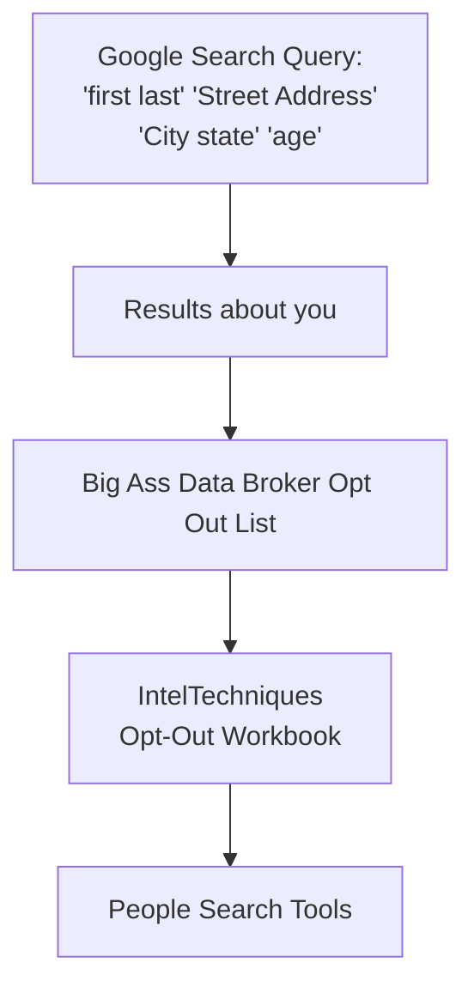

<p align="center">

</p>

## Table of Contents


1. [disclaimer](#disclaimer)
2. [Suggestions](#Suggestions)
3. [Why](#why)
4. [OSINT/OPSEC Tools](#osintopsec-Tools)
   - [methodology](./markdown/methodology.md)
5. [key points](#key-points)
6. [OPSEC](#operations-security-is-a-systematic-process-for) 
   - [How to OPSEC](#how-to-opsec)
   - [Physical Security](./markdown/Physical-Security.md)
      - [disinformation](#disinformation) 
7. [Open Source Intelligence (OSINT)](#open-source-intelligence-osint)
   - [Who uses Open-Source Intelligence (OSINT)?](#who-uses-open-source-intelligence-osint)
   - [Sources of OSINT](#sources-of-osint)
8. [Digital Profiling](#digital-profiling-osint-profiling)
9. [closed sourced](#closed-sourced-info)
      - [Breached Data](#breached-data)
      - [Curl commands](#Curl-commands)
      - [CSINT](./markdown/CSINT.md)
10. [IMINT](#IMINT)
    - [Reverse search](./markdown/IMINT.md#reverse-search-google)
    - [SOCMINT](./markdown/IMINT.md#socmint-social-intelligence)
11. [Real world examples of OSINT](#real-world-examples-of-osint)
      - [2016 Airstrike Coordination](#in-the-year-2016-a-basket-weaving-image-board-used-osint-to-pay-some-supposed-terrorist-a-vist-from-a-govt-in-russia-resulting-in-airstrikes)
      - [2017 Shia LaBeouf Protest](#in-2017-shia-labeouf-had-a-protest-due-to-trumps-election-this-resulted-in-a-basket-weaving-image-board-using-osint-and-sky-patterns-to-figure-out-where-a-flag-is)
12. [Tools](#tools)
      - [Toolchain Recommendations](#toolchain-recommendations)
13. [People search tools (in the states)](#people-search-tools-in-the-states)
14. [Grey literature](#grey-literature)
15. [Breached Data](#breached-data)
16. [Social Media](#social-media)
17. [Self OSINT](#toolchain-self-osint)
18. [Curated lists](#curated-lists)
19. [References](#References)

## ***DISCLAIMER***

I am **not responsible** for any misuse, abuse, or unethical actions taken with the tools or methods listed here. **OSINT is a neutral technique**—anyone can use it, and anyone can be targeted.

Note: Some domains (e.g., `exposed.lol`) may be expired. Refer to the curated list or alternate links provided.

## Suggestions

Open an [issue](https://github.com/airborne-commando/OPSEC-OSINT-Tools/issues) for any suggestions or feedback.

To update this guide use:
```
git pull
```
after cloning.

## Why?

People trust the internet too much. In today’s world, online and offline are practically the same—truth and fiction blur. This README exists to raise awareness. Clone it, fork it, remix it, or even turn it into a [Rentry](https://rentry.co/) page. Spread the knowledge however you like.

Also this guide can help prevent issues such as doxing. The obvious way is to follow [Key-Takeaways](#Key-Takeaways) and use [people search tools](#people-search-tools-in-the-states) with a self audit to reduce the amount of info you have on yourself publicly[^66][^50].

Can you predict someone’s behavior with this? not exactly; people are unpredictable at times.

# OSINT/OPSEC Tools

A list of OSINT/OPSEC tools I made, forked, and/or use.

If you want some quick methodology I suggest you read this [markdown](./markdown/methodology.md).

## Key points

## Notable Examples of Bad Tor OPSEC

- **School Bomb Threats**
    - Harvard’s Eldo Kim[^22] identified for using Tor on school network as the only user and admitting guilt.
- **Silk Road Case**
    - Ross Ulbricht[^5] linked to Silk Road by using his real name/email, posting about Tor, and failing to hide server IPs. The laptop was basically seized according to the FBI.

> "On Oct. 1, 2013, an F.B.I. operation in a public library in San Francisco ended with the arrest of Ross Ulbricht, who was the brain behind Silk Road... At that moment, another agent took the open laptop while logged into the Silk Road administrator's panel" (Oliyaee, 2024, para. 2).[^60]

>"ULBRICHT created Silk Road in January 2011, and owned and operated the underground website until it was shut down by law enforcement authorities in October 2013" <br>(U.S. Department of Justice, 2015, para. 1).[^5]

>"The FBI arrested Ulbricht and seized his laptop on October 1, 2013. A judge sentenced Ulbricht to life in prison for drug trafficking, computer hacking, and money laundering in 2015" (FBI, n.d., para. 2).[^59]

>"In 2015, Ulbricht was sentenced to life in prison but was pardoned in 2025" (Reiff, 2025, para. 3).[^61]

Ross was pardoned[^62] in 2025 by the trump administration.

- **LulzSec Hacking Group**
    - Members exposed themselves by discussing ops in public IRC[^56][^58][^21][^20], revealing personal info, using stolen cards[^57] to home addresses, and trusting informants.<br>

>"Spitler admitted to communicating during the data breach with his co-defendant, Andrew Auernheimer, 25, who was arrested January 18, 2011, in Fayetteville, Ark., while appearing in state court on unrelated drug charges. The two wrote each other during the breach using Internet Relay Chat, an Internet instant messaging program. Those chats included discussions between Spitler, Auernheimer, and other Goatse Security members about the best way to take advantage of the breach and associated theft" <br>(Federal Bureau of Investigation, 2012).[^57]

- **General Bad OPSEC Practices**
    - Poor compartmentalization, leaking sensitive info, predictable naming, traceable work hours, and unsecured servers.
- **Mullvad VPN: Security Contrast**[^2] [^3]
    - Features: anonymous accounts, strong encryption, no-logs, lockdown mode, DNS blockers, open-source, accepts Monero/cash and is independently audited[^64][^65][^63].
    - **Caution:** No tool is foolproof; human error remains the weakest link.


## Digital Profiling and Behavioral Analysis Guide

- **Understand the Basics**
    - Digital profiling gathers and analyzes online data; behavioral analysis infers motives, habits, and future actions.
- **Collect Digital Biographical Information**
    - Gather identifiers, track online activity, search for recurring usernames, document findings.
- **Analyze Behavioral Patterns**
    - Look for posting times, topics, language, interaction style, preferred platforms, and social networks.
- **Examples**
    - Use AI tools to analyze old posts for recurring interests; tools like Blackbird/Maigret help track usernames across platforms.
- **Assess Competencies and Affinities**
    - Evaluate technical skill, privacy awareness, sociability, and domain expertise.
- **Use Analytical Tools**
    - Employ search engines, data aggregators, visualization/statistics tools and Natural Language Processing (NLPs) for deeper analysis.
- **Iterate and Refine**
    - Continuously update the profile as new data emerges; use structured documentation.
- **Ethical and Legal Considerations**
    - Only use legally accessible data; respect privacy and avoid harassment.
- **Defending Against OSINT Profiling**
    - Practice good OPSEC, use disinformation, audit yourself, and set profiles to private.


## Real-World OSINT and OPSEC Examples

**Criminals**
*Sony Pictures Hack (2014):* Used OSINT on staff and infrastructure for phishing and breach.[^68]
>"Email notifications sent via accounts like designedcuratedamy58[@]gmail.com alerted operators whenever targets began assessments or ran malicious curl commands" (Priya, 2025, para. 14).[^69]

**Ashley Madison Breach (2015):** Used **CSINT** to leak sensitive user data, causing blackmail and public exposure.

>“When the company balked, the group published personal information about 36 million users. That’s a lot of very personal information of a lot of people” (Schifferle, 2016, para. 5).[^25]

**Civilians**
    - *Identifying Russian Soldiers:* Used facial recognition and open-source images to ID participants in conflicts.[^55]
    - *Cameroon Investigation:* Used metadata and geolocation to verify military abuses.[^23]

**Law Enforcement**
    - *Tracking Stolen Property:* Monitored online marketplaces to recover stolen goods.[^24]
    - *ShadowDragon’s SocialNet:* Mapped social networks from 200+ sources to aid investigations.[^4]

**OPSEC Failures**
    - *Guccifer 2.0:* Forgot to activate VPN, exposing real IP and identity.[^3]
    - *Silk Road’s Ross Ulbricht:* Used personal email and left digital traces, leading to arrest.[^5]

## (Operations Security) is a systematic process for:
1. Identifying[^33]
2. Protecting and controlling critical information[^33][^34]

It's a security discipline and operations function that involves a continuous cycle of:
* Identifying critical information and indicators (CII)
  * Critical information and indicators are essential components of Operations Security aimed at protecting sensitive data that could be exploited by adversaries. Critical Information includes unclassified or controlled unclassified information about activities, intentions, capabilities, or limitations that adversaries can use to gain an advantage. Indicators are observable actions or pieces of information that reveal critical details about operations, such as sudden changes in procedures or increased security measures. Protecting this information involves identifying vulnerabilities and implementing countermeasures to prevent unauthorized disclosure
* Analyzing potential threats and vulnerabilities
* Assessing risks
* Developing countermeasures to protect CII

 is used to protect information and activities from adversaries. It helps identify and protect sensitive information that could give an adversary an advantage. OPSEC principles can be applied in daily life, such as not sharing personal information like a DOB, street address, email, phone number.

**Examples of OPSEC mistakes include:**
* Over-sharing personal information online

   * Chris Chan:<br>
     has a huge digital footprint and is easily fooled by trolls online.[^40][^41][^42"]

* suspectAGB: as stated by the BBC.
>"Tariq Monteiro, 23, and Siyad Mohamud, 24, were part of a group which targeted Alex Smith over a gang-based feud as he left a restaurant near Euston station on 12 August 2019. The pair fled to Kenya immediately after the incident and were arrested in Nairobi last year. They both refused to appear for their sentencing hearing at the Old Bailey. Monteiro, of no fixed address, was ordered to serve a minimum of 24 years in prison, while Mohamud, of Barker Drive, Camden, will serve at least 23 years." (Evans 2023, para. 1–4)[^44]

He shared a kitchen photo and people were able to deduce where he was due to an appliance. As stated by bugzorc opsecfail

>"Observant individuals quickly pinpointed his location, thanks to telltale signs like common household plugs and the typical kitchen setup. Moreover, the metadata of his posts gave him away." <br>(bugzorc 2025, para. 1)[^43]

* Leaving unused social media online

**Interaction/elicitation:** 

Interacting with a target on social media has been shown to compromise anonymity, as noted by opsecfail. For instance, w0rmer uploaded a photo of his girlfriend that still contained GPS Exif data, which ultimately led investigators to her. When questioned, she admitted he had asked her to take the picture.<br>(bugzorc 2025, para. 3; opsecfail.github.io/blog.html?filecase=w0rmer)[^45]

Similarly, w0rmer himself explained in an interview that he often provoked people online and had a deliberate process for cleaning photos of metadata. However, during one publishing slip, he accidentally uploaded the wrong image that contained Exif data, which gave authorities critical information. <br>(“W0rmer – Darknet Diaries” 2020, 00:25:58–00:26:41; darknetdiaries.com/transcript/63)[^46]

* [examples of good and bad opsec and some osint.](./markdown/examples.md)
* Also some expanded [examples](./markdown/expanded-examples/)

OPSEC supplements other security disciplines rather than replacing them.

### How to OPSEC:

* **Use services that can conceal your identity:**
---

| **Category**               | **Tool/Technique**       | **Description**                                                                 | **Pros**                                      | **Cons/Limitations**                          |
|---------------------------|-------------------------|-------------------------------------------------------------------------------|---------------------------------------------|---------------------------------------------|
| **Encrypted Messaging**   | [Telegram](https://telegram.org/)                | Cloud-based messaging with optional E2E ("Secret Chats")                      | Widely adopted, feature-rich               | Not E2E by default; stores data on servers; requires phone number |
|                            | [Simplex](https://simplex.chat/)                 | No user identifiers (not even random numbers)                                 | Maximum metadata privacy                   | Less user-friendly; smaller network         |
|                            | [Signal](https://signal.org/download/)                  | E2E encrypted by default; minimal metadata retention                         | Gold standard for privacy; court-resistant | Requires phone number                       |
| **Anonymity Networks**    | [Tor](https://www.torproject.org/)                     | Routes traffic through encrypted nodes to hide IP                             | Free; robust against tracking              | Slow; frequent CAPTCHAs                     |
|                            | [Mullvad VPN](https://mullvad.net/en)             | No-logs VPN accepting Monero (XMR) payments                                   | Strong privacy; anonymous payment options  | VPNs can’t fix poor OPSEC habits            |
| **Cryptocurrency**        | [Monero (XMR)](https://www.getmonero.org/)            | Untraceable cryptocurrency                                                   | Private transactions                       | Requires mining/local node for full anonymity + time |
| **Identity Management**   | Unique Usernames        | Use different credentials per site                                           | Prevents correlation attacks               | Hard to manage without a password manager   |
|                            | Word Spinners           | Paraphrase text to avoid detection                                           | Evades plagiarism/identity linking        | May sound unnatural                         |
|                            | AI-Generated Faces      | Fake profile pictures (e.g., ThisPersonDoesNotExist.com)                     | Hides real identity                        | May look unnatural               |
| **Self-OSINT**           | Opt-Out Guides          | Remove personal data from people-search sites                                | Reduces digital footprint                 | Time-consuming; not all sites honor requests without payment |
| **OPSEC Resources**      | Bad OPSEC Examples      | [List of pitfalls](./markdown/badopsec.md) | Learn from others’ mistakes               | N/A                                        |
|                            | Good OPSEC Practices    | [Guidelines](./markdown/good-opsec.md) | Actionable tips                          | Requires discipline                         |
| **Tool Lists**           | OPSEC Tools             | [Curated list](./markdown/opsec.md) | Comprehensive resource                   | May need updates                            |

---

### **Key Takeaways**
1. **Messaging**:  
   - **Signal** OR **Simplex** > **Telegram** for privacy.[^30][^31][^32]

   - Remember: E2E ≠ total anonymity (metadata leaks/habits matter)[^45][^46][^8][^43].


2. **Anonymity**:  
   - **Tor** + **Mullvad VPN** + **XMR** = layered protection.  
   - Avoid logging into personal accounts while using these tools.
   - Pitfalls: you need to use TOR and Mullvad separately for maximum Anonymity, use a [Virtual Machine](./markdown/opsec.md#virtualization) for VPN's and TOR on another (or the host).

3. **Identity**:  
   - **Unique usernames** + **Unique behavior** = harder to trace.  

4. **Self-Audit**:  
   - Regularly **opt out** of data brokers and **[OSINT yourself](#toolchain-self-osint)**.  

5. **OPSEC Mindset**:  
   - Follow **[good OPSEC](./markdown/good-opsec.md)** and avoid **[bad habits](./markdown/badopsec.md)**.


**Note**:

By TOR I mean Tor Browser, VPN as in Virtual Private Network, and by Virtual Private Network I mean by Virtual Private Network Service - IE: Mullvad (though it can be other types of VPN's out there as long as it's safe to use and vetted by privacy experts). XMR is Monero Coin or Monero for short, a Privacy Coin.

Check Wikipedia or the sources cited If you're confused on all of these here:
1. VPN service[^9][^10], what we're gonna use here.
2. TOR, What should be used separately.[^12][^11][^13]
3. XMR, for VPN's that take XMR as payment.[^14]

---

### **Pro Tips**
- **Monero Mining**: Run a local node to avoid centralized exchanges tracing purchases.[^15]

For full tool details, see the **[OPSEC Tools List](./markdown/opsec.md)**.

## disinformation

Disinformation[^16][^17] in the context of OSINT (Open Source Intelligence) refers to deliberate actions taken to obscure, mislead, or mask the true activities, intentions, or identities of individuals or organizations from those conducting open-source intelligence gathering. [here](./markdown/disinformation.md).

## Open Source Intelligence (OSINT)

**<div align="center">What is it, how is this used and why is it important:</div>**

- OSINT is the practice of collecting and analyzing information from public sources to address specific intelligence needs. OSINT is used by government agencies and commercial organizations for various purposes, including:

  - Reconnaissance
  - Cyber crime investigations
  - Market trend analysis
  - Brand positioning analysis
  - Measuring risk to an organization
  - Understanding the actor, tactics, and targets
  - Gather real-time information
  - Make informed decisions
  - Receive early warnings of potential threats

## Who uses Open-Source Intelligence (OSINT)?

- National Security and Intelligence Agencies, Law Enforcement, Businesses, Cybersecurity and Cyber-crime Groups, Privacy-Conscious People, Non-Governmental Organizations

  - The CIA[^27], Defense Intelligence Agency (DIA)[^26], and Office of the Director of National Intelligence (ODNI) all use OSINT[^1].
  - OSINT can protect citizens (private or otherwise) from identity theft, sexual violence, and abuse[^52][^53].
  - OSINT can monitor competitors, investigate new markets, and plan marketing activities[^51].
  - OSINT can gather intelligence about specific targets online.
  - OSINT can check how outsiders can break into their computing devices.[^49]
  - OSINT can be used on oneself to secure privacy.[^50]
  - Bellingcat[^48] and the Center for Information Resilience[^47] use OSINT.
  - And you! Yes, you can use OSINT.

## Sources of OSINT
OSINT can gather information from various sources, including:
- Public government data as stated by the University of North Texas Libraries[^35].

Public data is data that is used, reused and or redistributed. Government entities operating at various judicial levels such as local, state, federal, and the international levels. This creates various amounts of public data, which is accessible without restrictions. Terms of use must be agreed to or approved depending on consideration before accessing these datasets and or records, such as Heath (HIPPA) and or Educational Data.

Such can include for example [casesearch](https://ujsportal.pacourts.us/casesearch) in Pennsylvania Courts; landlord, criminal, civil et al should have an address as that's public govt info. 

A Parcel search for [tax history](https://public.eriecountypa.gov/property-tax-records/property-records/property-tax-search/search-by-parcel.aspx).

An official [Justice site](https://www.justice.gov/jmd/ls/state) listing all states and their local judicial. Case search should be in state judiciary, also for other information such as tax records and property records.

- According to Johns Hopkins University it is. 
    

>“A subfield of publishing which distributes academic research and scholarship” (Shin, 2025)[^67].


- Commercial data:

>"Commercial Data means any and all data and information relating to an identified or identifiable Person (whether the information is accurate or not), alone or in combination with other information, which Person is or was an actual or prospective customer of, or consumer of products offered by, the VS Business or L Brands Business, as applicable. Commercial Data means any and all data collected or otherwise processed by the Seller Entities relating to a customer of the Business" (Law Insider, 2025).[^36]
  
- Grey literature:

>"Grey literature, as defined by the Welch Medical Library, is "information produced on all levels of government, academics, business and industry in electronic and print formats not controlled by commercial publishing i.e. where publishing is not the primary activity of the producing body" <br>(Joseph, 2025, paras. 1–2)"[^37].

- genealogical OSINT:

> Genealogy: Using family history research and genealogy databases as an intelligence-gathering tool.
> Death records: Gathering intelligence from records such as death notices, obituaries, gravestone databases, and burial registries.(news papers or local news sites) 

>"Genealogical research is the tracing of an individual's ancestral history using historical records, both official and unofficial" (University of Maryland Libraries, n.d., para. 1).[^39]

>"Genealogy is the study of families and their ancestors and histories" <br>(Virginia Tech University Libraries, n.d., para. 1).[^38]

- Google Dorks:

| Operator              | Description                                     | Example                       |
| --------------------- | ----------------------------------------------- | ----------------------------- |
| `site:`               | Search within a specific website or domain      | `site:example.com`            |
| `intitle:`            | Find pages with specific words in the **title** | `intitle:"login page"`        |
| `allintitle:`         | All words must appear in the **title**          | `allintitle:admin login`      |
| `inurl:`              | Words in the **URL**                            | `inurl:admin`                 |
| `allinurl:`           | All terms in the **URL**                        | `allinurl:dashboard admin`    |
| `filetype:` or `ext:` | Search for specific file types                  | `filetype:pdf` or `ext:xls`   |
| `intext:`             | Word or phrase in the **page body**             | `intext:"confidential"`       |
| `allintext:`          | All terms in the **body text**                  | `allintext:password username` |
| `link:`               | Pages linking to a specified URL                | `link:example.com`            |
| `define:`             | Look up a word definition                       | `define:opsec`                |
| `related:`            | Find sites similar to a URL                     | `related:example.com`         |
| `*`                   | Wildcard – matches any word                     | `"admin * login"`             |
| `OR`                  | Either search term can appear                   | `login OR signin`             |
| `AND`                 | Both terms must appear (default behavior)       | `username AND password`       |
| `-`                   | Exclude term                                    | `login -facebook`             |
| `"`                   | Exact phrase                                    | `"confidential file"`         |


[Advanced Search Operators](https://docs.google.com/document/d/1ydVaJJeL1EYbWtlfj9TPfBTE5IBADkQfZrQaBZxqXGs) Created by [Daniel Russell](https://sites.google.com/site/dmrussell/more-about-dan)[^70].


**Default Behavior**
- Google treats multiple words as if connected by AND, so results must contain all terms unless you specify otherwise.
- Quotation marks, site:, and filetype: are among the most commonly used explicit operators for more targeted searches.

These operators are not used unless you include them in your query—Google’s default is simply to return results matching all your search terms, ranked by relevance.


### Real world examples of OSINT

## In the year 2016, a basket weaving image board used OSINT to pay some supposed terrorist a visit from a govt in Russia resulting in airstrikes.

>"In 2016, amid the Syrian Civil War, rebel groups tried to overthrow President Assad, leading to foreign involvement from the U.S. and Russia. On 4chan, users identified a rebel camp from a Jaysh al-Izza video and relayed its coordinates to Russian contacts, resulting in airstrikes after the camp was located twice (Pezle, 2022)."[^8][^7]

UPDATE: Turns out it was a really complex war[^19] the 4chan got involved in, still keeping this up as a key example however; the main issue is that they exposed their training locations with geographic locations to the internet like complete morons.
Thus bad opsec.

## In 2017, Shia LaBeouf had a protest due to Trumps election; this resulted in a basket weaving image board using OSINT and sky patterns to figure out where a flag is.

>"In 2017, 4chan users managed to track down and replace Shia LaBeouf's "He Will Not Divide Us" protest flag. Using only the live-stream footage of the flag, they analyzed flight patterns, star positions, and a tweet to locate the flag in Greeneville, Tennessee. A local troll then honked his car horn until the sound was picked up on the live-stream, pinpointing the exact location. The flag was replaced with a Trump hat, marking the end of this elaborate trolling operation (Lamoureux, Mack 2017)."[^6]

## Digital profiling (OSINT profiling).

Digital profiling and behavioral analysis are powerful techniques for understanding individuals based on their online activities and digital footprints. While these methods are often used by professionals, you can apply many of the same principles and processes yourself by following a structured approach. This creates possible interest and hobbies of an individual.

Read more inside this readme on [Digital Profiling](./markdown/Digital-Profiling.md)

## Closed Sourced Info

- [HUMINT](./markdown/HUMINT.md)

**HUMINT can be collected overtly (e.g., interviews, debriefings, diplomatic reporting) or covertly (e.g., espionage, clandestine surveillance).**

[Breached Data](#breached-data)

> And remember, closed sourced info can change depending on context. If it came from social media then it's considered open source as it's already out there. If it's from a closed source document like let's say a USB drive then consider it closed source.

See also **[CSINT](./markdown/CSINT.md)**

# IMINT

[IMINT](./markdown/IMINT.md)(Image Intelligence) involves collecting and analyzing visual imagery—satellite, aerial, drone, or ground photos—to extract useful information.[^1][^28]
Contains information such as [SOCMINT](./markdown/IMINT.md#socmint-social-intelligence) and [Reverse Search](./markdown/IMINT.md#reverse-search-google).

GEOINT[^1][^28] is information on geographic locations. Geospatial data may also be called GEOINT data. It's to understand human activity or events and to layer that with data along with geolocations and timing. It has non-military uses as well, example would be for first responders issuing an emergency for a wildfire[^29].

Three examples of GEOINT tools that you can access right now:
- [Earth](https://earth.google.com/web/)
- [Maps](https://www.google.com/maps)
- [bing maps](https://www.bing.com/maps)

## Tools

---

| Category | Tool | Link | Functionality | Notes |
| :--- | :--- | :--- | :--- | :--- |
| **Search Engine Queries** | dorksearch | [Link](https://dorksearch.com/) | Advanced Google dorking | Manual query building |
| | Google-FU | [GitHub](https://github.com/airborne-commando/GoogleFU-improved) | Advanced Google dorking | Rate limits, CAPTCHAs |
| | gdork | [GitHub](https://github.com/airborne-commando/tapermonkey-collection/tree/main) | Shell script for Google dorking | In development tapermonkey script |
| | Google Advanced | [Link](https://www.google.com/advanced_search) | Direct Google dorking | No saved searches; [Example](https://www.google.com/search?as_q=OSINT&as_epq=tools&as_sitesearch=github.com) |
| **Biometric Analysis** | Facecheck.ID | Fork [GitHub](https://github.com/airborne-commando/facecheck.id-results-extractor-mobile) [Main](https://github.com/vin3110/broken-access-control-poc) | Reverse image search bypass | Tampermonkey required; source links only |
| **Genealogy** | genealogyintime | [genealogyintime](http://www.genealogyintime.com/tools/genealogy-search-engine.html) | A search engine that's specifically made for genealogy, can find obits and is *free** | not HTTPS, need to know what you're looking for. |
| | findagrave | [findagrave](https://www.findagrave.com/) | A grave searching site | have to know the name of the person, city; also *may* not be listed. |
| **Jobs** | Resume Indeed | [Link](https://resumes.indeed.com/) | Resume search | Expensive subscription |
| | LinkedIn | [Link](https://LinkedIn.com/) | Company/person info | Verification often needed |
| **Financial** | Paypal | [Link](https://www.paypal.com/us/home) | Person confirmation via email/phone | Account required |
| **Username/Email Search** | Blackbird | [GitHub](https://github.com/p1ngul1n0/blackbird) | Cross-platform username/email lookup | CLI only |
| | Crow (GUI) | [GitHub](https://github.com/airborne-commando/crow) | GUI for Blackbird | Same as CLI |
| | Sherlock | [GitHub](https://github.com/sherlock-project/sherlock) | Username search (300+ sites) | CLI; false positives |
| | No-Shit-Sherlock | [GitHub](https://github.com/airborne-commando/no-shit-sherlock) | GUI for Sherlock | Inherits limitations |
| | Maigret | [GitHub](https://github.com/soxoj/maigret) | Username connections | Sherlock fork |
| | Maigret-Night (GUI) | [GitHub](https://github.com/airborne-commando/maigret-night) | GUI for Maigret | Same as CLI |
| | Holehe | [GitHub](https://github.com/megadose/holehe) | Email usage check | CLI; false positives |
| **Email Compromises** | Hudson Rock Extractor | [GitHub](https://github.com/airborne-commando/hudsonrock-search-extractor) | Manual email breach check | Flask-based; manual input |
| **Geolocation/GEOINT** | Google Maps | [Link](https://maps.google.com/) | Location pinpointing | Public data only |
| | Bing Maps | [Link](https://www.bing.com/maps) | Bird's eye/satellite view | Variable quality |
| | Google Earth | [Link](https://earth.google.com/web) | 3D/2D, historical views | Use with other services |
| | geohints | [Link](https://geohints.com/) | GeoGuessr metadata | Provides location clues |
| | GeoGuessr GPT | [Link](https://chatgpt.com/g/g-brlHi7t2R-geoguessr-gpt) | AI photo location | AI hallucinations; 3 free uploads |
| | findpiclocation | [Link](https://findpiclocation.com/) | AI photo location | Accuracy varies |
| **Generalized OSINT** | OSINT Rocks | [Link](https://osint.rocks/) | Multi-tool interface | Web-based |
| | one-plus | [Link](https://one-plus.github.io/access.html) | Toolkit with bookmarks | Tools may change |
| **MISC Tools** | zabasearch-auto | [GitHub](https://github.com/airborne-commando/zabasearch-auto) | US public info lookup | CLI; advanced usage |
| | link extractor and archive | [GitHub](https://github.com/airborne-commando/link-extractor-and-archive) | Archive.ph tool | CLI; basic pages; manual edits |
| [Tapermonkey Scripts](https://github.com/airborne-commando/tapermonkey-collection/tree/main) | voter reg status |  | PA voter info export | CSV output; Tampermonkey |
| | Universal Background Check |  | Exports from PeopleSearch/Voter data (light) | Tampermonkey script, not accurate for mm-dd. it is with year on DOB for votes. |
| | Breach.vip search and reddit analyzer |  | search known breached databases check wayback machine API for twitter usernames, analyze Reddit usernames | Still in development, trying to figure out the kinks.
| **Extensions** | Wayback machine | [FF](https://addons.mozilla.org/en-US/firefox/addon/wayback-machine_new/) [Chrome](https://chromewebstore.google.com/detail/wayback-machine/fpnmgdkabkmnadcjpehmlllkndpkmiak) | Wayback search; deleted tweets | Archived content only |
| | Archive Page | [FF](https://addons.mozilla.org/en-US/firefox/addon/archive-page/) [Chrome](https://chromewebstore.google.com/detail/archive-page/gcaimhkfmliahedmeklebabdgagipbia) | Archive.today search | Page must be archived |
| | Xcancel | [FF](https://addons.mozilla.org/en-US/firefox/addon/toxcancel/) [Chrome](https://chromewebstore.google.com/detail/xcancelcom-redirector) | Privacy Twitter front-end | Conflicts possible |
| | reddit-uncensored | [FF](https://addons.mozilla.org/en-US/firefox/addon/reddit-uncensored/) [Chrome](https://chrome.google.com/webstore/detail/amfnaoebakgdklcahkilhjoglflgnhbm) | Restores deleted Reddit content | Arctic Shift API |
| | usertoihsoyct | [GitHub](https://github.com/airborne-commando/usertoihsoyct) | Username redirect | Firefox addon |


---

### **Key Insights & Pro Tips**

1. **False Positives**:  
   - **Sherlock/Holehe**: Imgur often returns misleading results—verify manually.  
   - **Facecheck.ID**: Extracts links but doesn’t analyze images; cross-reference with [Pimeyes (10 searches)](https://pimeyes.com/en) or others listed on 6.  

2. **GUI vs. CLI**:  
   - **CLI Tools (Blackbird, Sherlock, Maigret)**: requires technical familiarity.  
   - **GUI Wrappers (Crow, No-Shit-Sherlock)**: Easier for beginners; same back-end logic.  

3. **Email Investigations**:  
   - Combine **Holehe** (account detection) + **Hudson Rock Extractor** (breach data) for thorough checks; see [**Toolchain Recommendations**](#Toolchain-Recommendations).  
   - For Gmail-specific OSINT, use **GHunt** (via OSINT Rocks).  
   - Verify a google email, you'll need to be logged in to your own:

            https://calendar.google.com/calendar/u/0/embed?src=youremail@gmail.com


A post from a linkedin account named Forensic OSINT[^18]:

> "In a clever LinkedIn post, 🔐Yoni  shares a privacy insight and a practical OSINT technique worth bookmarking.
> 
> First, the Gmail dot trick: Google ignores dots in addresses, so variations like davidsmith@gmail[.]com, d.a.v.i.d.s.m.i.t.h[@]gmail[.]com, and david.smith[@]gmail[.]com all route to the same inbox, a fact that’s often misunderstood in email investigations.
> 
> More importantly for OSINT work, Yoni highlights a method to check if an email is linked to a Google account using Google Calendar. Just plug the email into this URL while logged into your own Google account:
> 
> https[:]//calendar[.]google[.]com/calendar/u/0/embed?src=youremail@example[.]com
> 
> If the address is connected to a Google account, the calendar interface loads and displays the bolded email address in the bottom left. If it doesn’t exist, it simply shows “Google Calendar.”
> 
> 🔍 Why It Matters:
> This is a quick, non-intrusive way to validate if an email is active on Google’s ecosystem, especially helpful when vetting aliases, burner accounts, or verifying user identities in investigations (Forensic OSINT, 2025)."

4. **Geolocation**:  
   - Use **Google Maps Street View** to verify addresses/landmarks from other tools (e.g., ClustrMaps).
   - Use birds eye view in [bing maps](https://www.bing.com/maps)
   - use [google earth](https://earth.google.com/web/) for a detailed view.

5. **OPSEC Notes**:  
   - **Rate Limits**: Tools like Google-FU may trigger blocks—use proxies/VPNs.  
   - **Legality**: Avoid scraping private data (e.g., Facebook pro) without consent.  

6. **Bio-metric Analysis**: You can supplement your bio-metric analytics with these tools by extracting the results from:
 - faceonlive.com (3 or 4 search limit, may need TOR)
 - lenso.ai 

After that open image in new tab and save or drag it into facecheck.id and compare (as mentioned earlier on step 1)

---

### **Toolchain Recommendations**
- **Quick Username Search**: Crow (GUI for in-depth) → Maigret (GUI for in-depth) → Sherlock (CLI for depth).  
- **Email Breaches**: Have I Been Pwned → Pentester (freeish) → OSINT Rocks (Hudson Rock/Holehe) → LOLArchiver.  
- **Images**: Facecheck.ID → Pimeyes → lenso.ai → faceonlive  
- **Files**: Encrypted drives (LUKS) → veracrypt → keepassxc

Note on Pentester: Pentester can provide free results on usernames, etc but on a time limit, not worth to buy a service if you're smart and keep records (snapshot).

Note: For keepassxc it's a good idea to use a strong password or a YubiKey (hardware password/security key)
you may also create an additional database, one that has the password you can remember; the other that has the generated database password for sensitive files.

For niche tools, refer to the [Curated Lists](#curated-lists) section.

Pipeline discussed [here](./markdown/opsec.md#opsec-pipeline-for-secure-files)
    
## People search tools (in the states):

**DISCLAIMER: The type of info found on these sites appear to from other data brokers, social media profiles that are public or viewable by everyone, compiled data/info from federal, state, and local government public records.**

---

- people search aggregators[^54], typically used in the united states. can give you information on someone such as an email, home address, date of birth, etc.

---

| **Tool**               | **Lookup By**                | **Returns**                              | **Notes**                                                                 |
|------------------------|-----------------------------|------------------------------------------|---------------------------------------------------------------------------|
| **[FastPeopleSearch](https://www.fastpeoplesearch.com/)**   | Name, Phone, Address        | Age, Address, Phone, Email               | Free; data may be outdated.                                               |
| **[That's Them](https://thatsthem.com/)**        | Name, Email, IP, VIN, Phone | IP, Addresses, Phone, Email              | Aggregates data from Intelius/Spokeo; some paid results.                 |
| **[Nuwber](https://nuwber.com/)**            | Name, Phone, Email, Address | DOB, Address, Email, Phone               | Detailed reports may require payment.                                    |
| **[IDCrawl](https://idcrawl.com/)**           | Name, Username, Phone, Email | Names, Usernames, Phone, Email           | Focuses on usernames/social media.                                       |
| **[PeekYou](https://www.peekyou.com/)**           | Name, Username, State       | Age, Social Media, Emails, Addresses     | Strong for social media profiling.                                       |
| **[Webmii](https://webmii.com/)**            | First + Last Name           | Social Media, Search Results             | Lightweight; scans public web/social profiles.                           |
| **[PublicRecords](https://www.publicrecords.onlinesearches.com/)**     | Name, Address, State        | Name, Address, Partial Phone             | Free directory; redirects to Intelius for paid details.                  |
| **[ClustrMaps](https://clustrmaps.com/)**        | Name, Address               | Addresses, Residents, Property, IP Data  | Focuses on geolocation/demographics; may include ownership history.      |
| **[fastbackgroundcheck](https://www.fastbackgroundcheck.com)** | Name, Address, Phone Number | Name, Address, Phone Number, Emails | Seems to comb though billions of records as stated on it's [website](https://www.fastbackgroundcheck.com/about) |
| **[zbase](https://www.zabasearch.com/)** | first, last name, city state | Names, Possible Relatives, User IDs, Address, Phone Number, Emails, education, job history | comes from various sources, as stated on it's [faq](https://www.zabasearch.com/faq/), free partial look up and is **accurate*** |

---

### **Key Observations**:
1. **Free vs. Paid**: Most tools offer basic info for free but upsell detailed reports (e.g., PublicRecords → Intelius).  
2. **Data Sources**: Many pull from the same breaches/public records (emails/phones often outdated but still in use).  
3. **Specializations**:  
   - *Social Media*: PeekYou, IDCrawl.  
   - *Geo-location*: ClustrMaps.  
   - *Comprehensive*: FastPeopleSearch, Nuwber, fastbackgroundcheck.  

**Disclaimer**: Accuracy varies; users rarely update emails unless compromised. Use ethically!

- For additional tools see [Curated lists](#curated-lists)

## Grey literature

Use this site; [do not register](https://vote.gov/register), check a voter registration. Will probably need more info in some states; while others need less.

An automatic tool that I've made for [pa voter services](https://github.com/airborne-commando/voter-reg-status). Feel free to fork for other states.

## Breached Data:
---

| **Tool**               | **Lookup By**       | **Returns**                              | **Limitations/Costs**                          | **Notes**                                                                 |
|------------------------|--------------------|------------------------------------------|-----------------------------------------------|---------------------------------------------------------------------------|
| **[Have I Been Pwned](https://haveibeenpwned.com/)**  | Email, Phone       | Breach names, dates, compromised data    | Free; no passwords/raw data                   | Trusted source; alerts for new breaches.                                  |
| **[BreachDirectory](https://breachdirectory.org/)**    | Email, Username    | Partial password hashes (SHA-1, first 4 chars), length | Free; no full passwords            | Useful for credential stuffing checks.                                    |
| **[Breach.vip](https://Breach.vip)**         | Email, Username    | Minecraft-focused leaks (usernames, IPs) | Free; requires login                          | Niche for gaming accounts; "memey" but functional.                        |
| **[LeakPeek](https://leakpeek.com/)**           | Email, Username    | Partial breach snippets (e.g., domains)  | 5 free searches; Tor bypass possible          | Paid plans for full data; obfuscates results.                             |
| **[LOLArchiver](https://osint.lolarchiver.com/)**        | Email, Username    | Full breach databases (e.g., emails, passwords) | Paid service only                     | For OSINT professionals; curated high-value leaks.                        |
| **[Icebreaker](https://github.com/airborne-commando/ice-breaker)**         | Local breach files | Parses/analyzes large breach datasets    | Python/EXE; works best for <1000GB files      | Demo script provided; use with caution (e.g., [Facebook 533M leak](https://github.com/davidfegyver/facebook-533m)).        |
| **[hashes.com](https://hashes.com/)**         | Hash (MD5, SHA-1, etc.) | Decrypted passwords (if hash is cracked) | Free/paid cracking tools                      | Useful for reversing hashes from breaches.                               |
| **[pentester.com](https://pentester.com/)**          | Email, Username    | Full breach details (more than HIBP)     | ***Free**; no Tor needed; use incognito/private browsing mode.                           | Extensive; may include sensitive data.                    |
| **[Hudson Rock](https://www.hudsonrock.com/threat-intelligence-cybercrime-tools)**          | Email, Username, Domain, APK    | Infostealer infection indication, general information     | Free; no passwords/raw data                           | Infostealer only data                    |
| **[archive.trace.rip](https://archive.trace.rip/)**          | detailed information    | user submitted     | Historical Data Breaches Archive                           | data breaches and scrapes throughout history                    |

## Curl commands

**Breach VIP API curl commands / Alias**

    breachemail() {
      curl -X POST https://breach.vip/api/search \
           -H "Content-Type: application/json" \
           -d "{\"term\": \"$1\",\"fields\": [\"email\"],\"wildcard\": false, \"case_sensitive\": false}" \
       >     /tmp/results-email.txt && cat /tmp/results-email.txt
    }
    
    breachuser() {
      curl -X POST https://breach.vip/api/search \
           -H "Content-Type: application/json" \
           -d "{\"term\": \"$1\",\"fields\": [\"username\"],\"wildcard\": false, \"case_sensitive\": true}" \
       >     /tmp/results-user.txt && cat /tmp/results-user.txt
    }
    
    breachphone() {
      curl -X POST https://breach.vip/api/search \
           -H "Content-Type: application/json" \
           -d "{\"term\": \"$1\",\"fields\": [\"phone\"],\"wildcard\": true, \"case_sensitive\": false}" \
       >     /tmp/results-phone.txt && cat /tmp/results-phone.txt
    }
    
    breachname() {
      curl -X POST https://breach.vip/api/search \
           -H "Content-Type: application/json" \
           -d "{\"term\": \"$1\",\"fields\": [\"name\"],\"wildcard\": false, \"case_sensitive\": true}" \
       >     /tmp/results-name.txt && cat /tmp/results-name.txt
    }


**R00M101**

    analyze() {
      curl -X GET "https://api.r00m101.com/analyze/$1" -H "accept: application/json" > /tmp/reddit-user.txt && cat /tmp/reddit-user.txt
    }


Take a look at the documents which I will [link here](https://breach.vip/api/docs)

---

### **Key Takeaways**:
1. **Free vs. Paid**:  
   - *Free*: HIBP, BreachDirectory, Pentester, Hashes.com, breach.vip.  
   - *Limited Free*: LeakPeek (5 searches), Breach.vip (login required).  
   - *Paid*: LOLArchiver, LeakPeek plans.  

2. **Specializations**:  
   - *Password Recovery*: Hashes.com (decrypt hashes), BreachDirectory (partial hashes).  
   - *Gaming Leaks*: Breach.vip (Minecraft).  
   - *Local Analysis*: Icebreaker (Python tool for large datasets).  

3. **Ethical/Legal Notes**:  
   - Many tools provide **partial data** (e.g., first 4 chars of passwords) to comply with ethics.  
   - Use **Tor** with LeakPeek to bypass search limits.  
   - Avoid misuse: Some tools (e.g., Pentester) may expose sensitive data.  

4. **For Large Datasets**:  
   - [Icebreaker](https://github.com/airborne-commando/ice-breaker) + [Facebook 533M](https://github.com/davidfegyver/facebook-533m) (no passwords) for bulk analysis.  

---

### **Additional Resources**:
- **Curated Lists**: Check [Curated Lists](#curated-lists) for more niche tools.  
- **Demo Scripts**: [Icebreaker](https://github.com/airborne-commando/ice-breaker) includes a demo for testing.  

## social media
---

| **Platform**  | **Tool**               | **URL**                              | **Functionality**                          | **Limitations/Notes**                     |
|--------------|-----------------------|--------------------------------------|------------------------------------------|------------------------------------------|
| **General**  | Social Searcher       | [social-searcher.com](https://www.social-searcher.com/) | Searches multiple platforms at once | navigate public web search results more easily, does not collect, store, or scrape data from any social media platforms, and we do not access private content or use any official or unofficial APIs. [about](https://www.social-searcher.com/about/) |
| **Snapchat** | Snapchat Map          | [map.snapchat.com](https://map.snapchat.com/) | View public Snapchat location stories | Requires Snapchat account |
| **Instagram**| Dumpor               | [dumpor.com](https://dumpor.com/)    | View profiles/stories anonymously      | May have rate limits |
|              | imginn               | [imginn.com](https://imginn.com/)    | View profiles/stories anonymously      |                      |
| **Twitter**  | Sotwe                | [sotwe.com](https://www.sotwe.com/)  | Privacy-focused Twitter front-end             | No login required |
|              | Xcancel              | [xcancel.com](https://xcancel.com/)  | Privacy-focused Twitter front-end             | No login required, Lightweight interface |
|              | Nitter               | [nitter.net](https://nitter.net/)    | Privacy-focused Twitter front-end      | No login required |
| **Facebook** | Facebook Search      | [facebook.com/search](https://www.facebook.com/search/) | Native Facebook search tool | Limited without login |
|              | WhoPostedWhat       | [whopostedwhat.com](https://www.whopostedwhat.com/) | Search Facebook posts by date/keyword | Requires precise queries, public accounts |
| **reddit**   | r00m101.com | [r00m101](https://r00m101.com/)       | Get detailed info from an active or deleted reddit account including “stage of life” and “hobbies”. | Pricing for full scope and features |
|              | ihsoyct | [ihsoyct](https://ihsoyct.github.io/index.html) | Get archived posts from a reddit account from both APIs | [Host](https://arctic-shift.photon-reddit.com/live-charts/) can be down, [pushpull](https://pullpush.io/) is still non-functional as of writing. see [limitations](https://github.com/Fubs/reddit-uncensored?tab=readme-ov-file#limitations) different repo but raises a good point on archives. |

---

### **Pro Tips & Workarounds**

1. **Facebook Private Accounts**:
   - Method 1: Create a fake account (difficult due to Facebook's verification)
   - Method 2: Use browser's *Inspect Element* → *Device Simulator* (or mobile phone) + direct URL
   - Always try logged out or in private mode first

2. **LinkedIn Limitations**:
   - If profiles don't load:
     - Wait 1-2 minutes (cookie/IP rotation)
     - Create a basic account (avoid looking suspicious)
   - HWID/IP tracking may block repeated searches

3. **Twitter Alternatives**:
   - Use **Nitter**/**Xcancel**/**Sotwe** to browse anonymously.

4. **Instagram**:
   - **Dumpor** bypasses some privacy settings
   - **Quick Use** https://dumpor.io/v/USERNAME replace ``USERNAME`` with the user you are trying to see
   - **Will not work with private accounts**
   - You may also use https://imginn.com/
       + [firefox](https://addons.mozilla.org/en-US/firefox/addon/imginn/)
       + [chrome](https://github.com/claromes/socialswitch) make sure to not use picuki, disable tiktok; use a different profile or browser. Can use firefox.

---

### **Key Takeaways**
- **Anonymity**: Tools like Nitter/Dumpor avoid platform tracking
- **Mobile Tricks**: Simulating mobile devices often works better for restricted content
- **Persistence**: Some platforms (LinkedIn/Facebook) require patience or account creation

- For additional tools see the Curated Lists section below.


## Curated lists

**OSINT Lists:**

- [Awesome OSINT](https://github.com/jivoi/awesome-osint) - a curated list of OSINT tools, blogs, and videos

- [OSINT for countries V2](https://github.com/paulpogoda/OSINT-for-countries-V2.0)

- [OSINT for countries](https://github.com/wddadk/OSINT-for-countries)
  
- [OSINT Framework](https://osintframework.com/) - a larger list of tools

- [OSINT Resources](https://sizeof.cat/post/osint-resources/) - Collection of OSINT resources that seems to be more up to date (includes NSFW)

  - [Archive](https://archive.ph/rZZf0)

- [cipher387's OSINT collection](https://github.com/cipher387/osint_stuff_tool_collection).

- [internet tools](https://fmhy.xyz/internet-tools#open-source-intelligence) 
  
- [OSINT toolbox](https://github.com/The-Osint-Toolbox) 

**Wiki's:**

- A whole reddit wiki from the [OSINT community](https://www.reddit.com/r/OSINT/wiki/index/)

**TOOLKIT:**

- bellingcat [toolkit](https://bellingcat.gitbook.io/toolkit)

**NEWSLETTER(S):**

- [OSINT news letter](https://osintnewsletter.com) Protip: use "topic" site:https://osintnewsletter.com

example: 

    "facecheck.id" site:https://osintnewsletter.com


**OPT OUTs**

- A whole [big ass list](https://github.com/yaelwrites/Big-Ass-Data-Broker-Opt-Out-List) to opt out and to compare info.

- [inteltechniques opt out workbook](https://inteltechniques.com/workbook.html)

- [Results about you (google index)](https://myactivity.google.com/results-about-you) - Check what google emails you; actually visit the website and see about doing an opt-out there.
  
- [people search tools](#people-search-tools-in-the-states)

## Toolchain (self-OSINT):

Google dorks: 





**Notice** 

[Results about you (google index)](https://myactivity.google.com/results-about-you) can also be emailed so keep that in mind when comparing info from these sources such as: 

- [(OPT OUT)](#people-search-tools-in-the-states)
- [osint resources](https://sizeof.cat/post/osint-resources/) 
- [osintframework](https://osintframework.com/) 
- [awesome osint](https://github.com/jivoi/awesome-osint?tab=readme-ov-file#-people-investigations) 
- [Internet tools](https://fmhy.xyz/internet-tools#open-source-intelligence) 
- [The Osint Toolbox](https://github.com/The-Osint-Toolbox/People-Search-OSINT) 
- [osint stuff tool collection](https://github.com/cipher387/osint_stuff_tool_collection?tab=readme-ov-file#universal-contact-search-and-leaks-search) 
  
Google will find websites containing your first-last name and address and will ask to remove it from the index. Before applying the removal process on google search be sure to remove info from the website itself that it's hosted on. Google Dorking seems to be a bit quicker and preemptive on removing info about yourself after you visit said sites (if applicable).

Also with doing google dorks the manual way is that you won't get flagged by google itself as a bot.

Additional tools:

- For additional tools see the curated-lists above

## Donations:

If you find this useful feel free to donate to this monero address:

<p align="left"></p>
<p>
<code>8BPdcsLtA5iWLNTWvYzUVyTWtQkM62e8r7xqAuwjXTSC4RcoSWqpmtyLsMYvz3QNZtT1rbgPUnmVpMAudhxTn6zkRxUFcZN</code>
</p>


## References:

[^1]: Office of the Director of National Intelligence. “Intelligence Community.” Office of the Director of National Intelligence, www.odni.gov/index.php/ncsc-what-we-do/121-dni/intelligence-community. Accessed 24 Sept. 2025. (Office of the Director of National Intelligence, “What Is Intelligence?,” sec.HUMINT)

[^2]: Mohammad Taha Khan, Joe DeBlasio, Geoffrey M. Voelker, Alex C. Snoeren, Chris Kanich, and Narseo Vallina-Rodriguez. 2018. An Empirical Analysis of the Commercial VPN Ecosystem. In Proceedings of the Internet Measurement Conference 2018 (IMC '18). Association for Computing Machinery, New York, NY, USA, 443–456. https://doi.org/10.1145/3278532.3278570

[^3]: “Library Research Guides: Digital Privacy: Digital Privacy Practices.” Indiana University Bloomington, wayback machine, 7 July 2025, https://web.archive.org/web/20250208104257/https://guides.libraries.indiana.edu/c.php?g=1325689&p=9771453.

[^3]: Department Of Justice. “Grand Jury Indicts 12 Russian Intelligence Officers for Hacking.” U.S. Department of Justice, 6 Feb. 2025, www.justice.gov/archives/opa/pr/grand-jury-indicts-12-russian-intelligence-officers-hacking-offenses-related-2016-election.

[^4]: Department of Homeland Security. Freedom of Information Act (FOIA) Activity for the Week of March 20, 2025- March 26, 2025 DHS Privacy Office March 31, 2025 Weekly FOIA Report. 31 Mar. 2025, www.dhs.gov/sites/default/files/2025-07/25_0731_PRIV_Chief_FOIA_Officers_Weekly_Report_March_31_25_to_June_30_25.pdf.

[^5]: “Ross Ulbricht, a/K/a ‘Dread Pirate Roberts,’ Sentenced in Manhattan.” U.S. Department of Justice, 29 May 2015, www.justice.gov/usao-sdny/pr/ross-ulbricht-aka-dread-pirate-roberts-sentenced-manhattan-federal-court-life-prison.

[^6]: Lamoureux, Mack, and Mack Lamoureux. “How 4Chan’s Worst Trolls Pulled off the Heist of the Century.” VICE, 27 July 2024, www.vice.com/en/article/4chan-does-first-good-thing-pulls-off-the-heist-of-the-century1.

[^7]: chasd00. "remember when 4chan figured out the location of a terrorist training camp from one of their PR photos and called in a literal airstrike? I like how 4chan is sometimes described as weaponized autism." 8 Dec. 2022, Imgur, https://imgur.com/N7DwWP1?r. Online forum comment.

[^8]: “The Time 4Chan Called in an Airstrike.” Youtube, uploaded by Pezle, 17 Aug. 2023, www.youtube.com/watch?v=OR6epSP_Xlw.

[^9]: "*Washington State Technology. What Is a VPN, and How Does It Work?*" Washington Technology Solutions. https://web.archive.org/web/20250403151533/https://watech.wa.gov/what-vpn-and-how-does-it-work. Accessed 25 Sept. 2025.

[^10]: State Of New Jersey. “Virtual Private Networks.” State Of New Jersey Cybersecurity & Communications Integration Cell, www.cyber.nj.gov/guidance-and-best-practices/wi-fi-network-security/virtual-private-networks. Accessed 25 Sept. 2025.

[^11]: New York University. “Demystifying the Dark Web: An Introduction to Tor and Onion Routing – Networks at ITP.” New York University, https://web.archive.org/web/20250811141831/https://itp.nyu.edu/networks/explanations/demystifying-the-dark-web-an-introduction-to-tor-and-onion-routing/.

[^12]: CISA. “Defending Against Malicious Cyber Activity Originating From Tor.” Cybersecurity Infrastructure Security Agency, 2 Aug. 2021, https://web.archive.org/web/20250908095402/https://www.cisa.gov/news-events/cybersecurity-advisories/aa20-183a.

[^13]: CIA. “CIA’s Latest Layer: An Onion Site - CIA.” CIA, 7 May 2019, https://web.archive.org/web/20210205193613/https://www.cia.gov/stories/story/cias-latest-layer-an-onion-site/.

[^14]: Kuo, Tsung-Ting et al. “Comparison of blockchain platforms: a systematic review and healthcare examples.” Journal of the American Medical Informatics Association : JAMIA vol. 26,5 (2019): 462-478. doi:10.1093/jamia/ocy185

[^15]: Rüth, Jan, et al. “Digging into Browser-Based Crypto Mining.” Proceedings of the Internet Measurement Conference 2018, ACM, 2018, pp. 70–76. Crossref, https://doi.org/10.1145/3278532.3278539.

[^16]: College of Staten Island. “CSI Library: Misinformation and Disinformation: Thinking Critically About Information Sources: Misinformation, Disinformation, and Malinformation.” Misinformation and Disinformation: Thinking Critically About Information Sources, uploaded by College of Staten Island, 25 Aug. 2025, www.library.csi.cuny.edu/misinformation.

[^17]: Ghenai, Amira, and Yelena Mejova. "Catching Fire: Identifying Propaganda on Social Media in the Context of the Russia-Ukraine War." *PLOS ONE*, vol. 17, no. 2, Feb. 2022, p. e0263421. *PubMed Central*, doi:10.1371/journal.pone.0263421. Accessed 22 Sept. 2025.

[^18]: Osint, Forensic. “In a Clever LinkedIn Post, Yoni Shares a Privacy Insight and a Practical OSINT Technique Worth Bookmarking.” linkedin, 7 Aug. 2025, www.linkedin.com/posts/forensicosint_in-a-clever-linkedin-post-yoni-shares-activity-7359045935919755266-JdTX.

[^19]: “Syria’s Civil War Reignites in Dramatic Fashion as Russia Joins Airstrikes on Rebels Who Seized Aleppo.” CBS News, 2 Dec. 2024, www.cbsnews.com/news/syria-war-aleppo-airstrikes-russia-assad-rebels-offensive.

[^20]: FBI. “Leading Member of the International Cyber Criminal Group LulzSec Sentenced in Manhattan Federal Court.” FBI, 27 May 2014, https://www.fbi.gov/contact-us/field-offices/newyork/news/press-releases/leading-member-of-the-international-cyber-criminal-group-lulzsec-sentenced-in-manhattan-federal-court.

[^21]: Hope Trampski. “Hacktivism: The Short Life of LulzSec.” Purdue University cyberTAP, 5 Dec. 2024, https://web.archive.org/web/20250303215642/https://cyber.tap.purdue.edu/blog/articles/hacktivism-the-short-life-of-lulzsec/.

[^22]: “Harvard Student Charged With Making Hoax Bomb Threat.” United States Department of Justice, 16 Dec. 2014, https://web.archive.org/web/20250710222935/https://www.justice.gov/usao-ma/pr/harvard-student-charged-making-hoax-bomb-threat.

[^23]: “Cameroon: Soldiers Get 10 Years for Murder of Civilians.” Human Rights Watch, 28 Oct. 2020, www.hrw.org/news/2020/09/23/cameroon-soldiers-get-10-years-murder-civilians.

[^24]: MPA, Brandon Burley. “OSINT Tools for Investigators to Track Criminal Activity Online.” Lexipol Media Group, 23 Aug. 2025, www.police1.com/investigations/thinking-like-a-criminal-how-osint-can-take-your-investigations-further.

[^25]: Schifferle, L. W. (2016, December 14). *Ashley Madison settles with FTC over data security.* Federal Trade Commission. https://web.archive.org/web/20250801210212/https://www.ftc.gov/business-guidance/blog/2016/12/ashley-madison-settles-ftc-over-data-security

[^26]: DIA. “OPEN SOURCE INTELLIGENCE (OSINT).” Defense Intelligence Agency, 23 Oct. 2023, www.dia.mil/About/Open-Source-Intelligence.

[^27]: ODNI and CIA. “ODNI and CIA Release the Intelligence Community OSINT Strategy for 2024-2026.” office of the director of national intelligence, 8 Mar. 2024, www.dni.gov/index.php/newsroom/press-releases/press-releases-2024/3784-odni-and-cia-release-the-intelligence-community-osint-strategy-for-2024-2026.

[^28]: “IC21: The Intelligence Community in the 21st Century.” U.S. Government Publishing Office, https://web.archive.org/web/20250118091240/https://www.govinfo.gov/content/pkg/GPO-IC21/html/GPO-IC21-6.html. Accessed 25 Sept. 2025.

[^29]: dni. “JCAT Intelligence Guide for First Responders.” Office of the Director of National Intelligence, www.dni.gov/nctc/jcat/jcat_ctguide/intel_guide.html. Accessed 25 Sept. 2025.

[^30]: Gomzin, Slava. “Telegram May Not Be as Secure as It Claims.” IEEE Spectrum, 14 Oct. 2024, https://web.archive.org/web/20250905150200/https://spectrum.ieee.org/telegram-security.

[^31]: Signal. “Is It Private? Can I Trust It?” Signal, www.support.signal.org/hc/en-us/articles/360007320391-Is-it-private-Can-I-trust-it. Accessed 25 Sept. 2025.

[^32]: “SimpleX: Redefining Privacy by Making Hard Choices.” SimpleX, 16 May 2024, www.simplex.chat/blog/20240516-simplex-redefining-privacy-hard-choices.html.

[^33]: CSRC Content Editor. “*Operations Security (OPSEC) - Glossary.* *CSRC.*” Computer Security Resource Center, www.csrc.nist.gov/glossary/term/operations_security. Accessed 25 Sept. 2025.

[^34]: Department Of Labor. “Operations Security (OPSEC).” United States Department Of Labor, https://web.archive.org/web/20250516072228/https://www.dol.gov/agencies/oasam/centers-offices/emergency-management-center/operations-security. Accessed 25 Sept. 2025.

[^35]: “Guides: Finding Datasets: Public Data Sources.” University of North Texas Libraries, 22 Jan. 2025, https://guides.library.unt.edu/datasets/public-data-sources.

[^36]: Law Insider. (2025). *Commercial data definition*. Law Insider Dictionary. Retrieved from https://www.lawinsider.com  

[^37]: Joseph, E. (2025, September 24). *What is grey literature?* Johns Hopkins University, Welch Medical Library. https://browse.welch.jhmi.edu/c.php?g=1195274

[^38]: University of Maryland Libraries. (n.d.). *Research guides: Maryland genealogy: What is genealogical research?* University of Maryland. https://lib.guides.umd.edu/c.php?g=326980&p=2198795 

[^39]: Virginia Tech University Libraries. (n.d.). *Research guides: Genealogy: Index.* Virginia Tech. https://guides.lib.vt.edu/topics/genealogy

[^40]: “The Comprehensive Chris Chan Documentary.” www.youtube.com, uploaded by GenoSamuel, 24 Feb. 2019, www.youtube.com/playlist?list=PLABqEYq6H3vpCmsmyUnHnfMOeAnjBdSNm. 

[^41]: Leighton, Mara, et al. “A Timeline of Chris Chan’s Incest Charge and Dismissal, Which Came After Years of Online Trolling That Documented the Creator’s Relationship With Her Mother.” Business Insider, 18 Aug. 2024, www.businessinsider.com/chris-chan-saga-timeline-incest-charges-arrest-2021-8. 

[^42"]: IMDb. “Christine Weston Chandler.” IMDb, www.imdb.com/name/nm4813395. Accessed 25 Sept. 2025.

[^43]: bugzorc. “suspectAGB.” *opsecfail*, www.opsecfail.github.io/blog.html?filecase=suspectAGB. Accessed 25 Sept. 2025.

[^44]: Evans, Jacob. “Alex Smith: Drill Rappers Sentenced to Life Over Street Stabbing.” *BBC*, 12 May 2023, [www.bbc.com/news/uk-england-london-65570367](https://www.bbc.com/news/uk-england-london-65570367).

[^45]: bugzorc. “W0RMER.” opsecfail, https://opsecfail.github.io/blog.html?filecase=w0rmer. Accessed 25 Sept. 2025.

[^46]: “W0rmer – Darknet Diaries.” darknetdiaries, episode 63, 14 Apr. 2020, https://darknetdiaries.com/transcript/63.

[^47]: Centre for Information Resilience. “OSINT 101: What Is Open Source Intelligence (OSINT)? - Centre for Information Resilience.” Centre for Information Resilience, 1 Sept. 2023, https://info-res.org/afghan-witness/articles/osint-101-what-is-open-source-intelligence-osint. Accessed 25 Sept. 2025.

[^48]: Wild, Johanna. “Introducing Bellingcat’s Collaborative Open Source Toolkit.” Bellingcat, 24 Sept. 2024, www.bellingcat.com/resources/2024/09/24/bellingcat-online-investigations-toolkit.

[^49]: Ibm. “Penetration Testing.” ibm.com, www.ibm.com/think/topics/penetration-testing. Accessed 25 Sept. 2025.

[^50]: Martisiute, Laura. “A Guide to Doxxing Yourself on the Internet - JoinDeleteMe.” joindeleteme, 22 Jan. 2024, www.joindeleteme.com/doxxing/a-guide-to-doxxing-yourself-on-the-internet.

[^51]: U.S. Small Business Administration. “Market Research and Competitive Analysis.” U.S. Small Business Administration, https://web.archive.org/web/20250928084324/https://www.sba.gov/business-guide/plan-your-business/market-research-competitive-analysis archived. Accessed 25 Sept. 2025.

[^52]: FBI. “Behavioral Analysis.” FBI, https://web.archive.org/web/20251002110329/https://www.fbi.gov/how-we-investigate/behavioral-analysis archived. Accessed 25 Sept. 2025.

[^53]: Bagdasar, Hannah. “Recognising Sexual and Gender-Based Violence as an Open Source Researcher - Bellingcat.” Bellingcat, 3 Mar. 2023, www.bellingcat.com/resources/2023/03/03/sexual-and-gender-based-violence-open-source-researche-osint-digital.

[^54]: FTC. “What to Know About People Search Sites That Sell Your Information.” FTC, July 2022, https://web.archive.org/web/20251004225452/https://consumer.ftc.gov/articles/what-know-about-people-search-sites-sell-your-information. archived

[^55]: Bhuiyan, Johana. “Ukraine Uses Facial Recognition Software to Identify Russian Soldiers Killed in Combat.” The Guardian, 24 Mar. 2022, www.theguardian.com/technology/2022/mar/24/ukraine-facial-recognition-identify-russian-soldiers. Internet Archive, https://archive.ph/PGrf0

[^56]: “Hacker Pleads Guilty to Infiltrating AT&T Servers, iPad Data Breach.” FBI, 23 June 2011, https://web.archive.org/web/20250418203907/archives.fbi.gov/archives/newark/press-releases/2011/hacker-pleads-guilty-to-infiltrating-at-t-servers-ipad-data-breach. archived

[^57]: Federal Bureau of Investigation. (2012, March 6). Six hackers in the United States and abroad charged for crimes affecting over one million victims. FBI. https://web.archive.org/web/20251006042908/https://archives.fbi.gov/archives/newyork/press-releases/2012/six-hackers-in-the-united-states-and-abroad-charged-for-crimes-affecting-over-one-million-victims archived

[^58]: Katz, Basil. “Four Irish, British Suspects Helped Stratfor Hack: U.S.” Reuters, 2 May 2012, www.reuters.com/article/world/us/four-irish-british-suspects-helped-stratfor-hack-us-idUSBRE8411P7.

[^58]: Adler, David. “Silk Road: The Dark Side of Cryptocurrency.” Fordham Journal of Corporate and Law, 21 Feb. 2018, news.law.fordham.edu/jcfl/2018/02/21/silk-road-the-dark-side-of-cryptocurrency.

[^59]: “Ross William Ulbricht’s Laptop.” FBI, www.fbi.gov/history/artifacts/ross-william-ulbrichts-laptop. Accessed 25 Sept. 2025.

[^60]: Oliyaee, A. (2024, March 31). *Ross Ulbricht’s laptop: The heart of the Silk Road.* *Plasbit.* https://web.archive.org/web/20241110235927/https://plasbit.com/blog/ross-ulbricht-laptop

[^61]: Reiff, Nathan. “Who Is Ross Ulbricht?” Investopedia, 24 Jan. 2025, www.investopedia.com/tech/ross-ulbricht-dark-net-pirate.

[^62]: Hayes, Christal. “Trump Pardons Silk Road Creator Ross Ulbricht.” BBC, 22 Jan. 2025, www.bbc.com/news/articles/cz7e0jve875o. https://web.archive.org/web/20250922150728/https://www.justice.gov/pardon/media/1386096/dl?inlinepardon from trump

[^63]: Mullvad. “No-logging of User Activity Policy.” Mullvad, 23 May 2025, mullvad.net/en/help/no-logging-data-policy.

[^64]: mullvad. “*Mullvad VPN* *Privacy Is a Universal Right.*” Mullvad, 27 Mar. 2025, mullvad.net/en/blog/tag/audits.

[^65]: “Why Mullvad VPN?” Mullvad, mullvad.net/en/why-mullvad-vpn. Accessed 25 Sept. 2025.

[^66]: Electronic Frontier Foundation. "Doxxing: Tips To Protect Yourself Online & How to Minimize Harm." Electronic Frontier Foundation, 14 Dec. 2020, www.eff.org/deeplinks/2020/12/doxxing-tips-protect-yourself-online-how-minimize-harm. Accessed 23 Sept. 2025.

[^67]: Shin, Nancy. "Scholarly Publishing Explained." *Welch Medical Library*, Johns Hopkins University, Sep 25, 2025. https://browse.welch.jhmi.edu/scholarly_publishing/explanation

[^68]: “North Korean Regime-Backed Programmer Charged With Conspiracy To.” United States Department of Justice, 6 Feb. 2025, https://web.archive.org/web/20251006082434/https://www.justice.gov/archives/opa/pr/north-korean-regime-backed-programmer-charged-conspiracy-conduct-multiple-cyber-attacks-and.

[^69]: Priya. (2025, September 5). *North Korean hackers shift strategies – Replacing old infrastructure with new assets*. *Cyberpress*. https://cyberpress.org/north-korean-hackers/

[^70]: Russell, D. (n.d.). More about Daniel. Google Sites. https://sites.google.com/site/dmrussell/more-about-dan