# Table of Contents

1. [Reverse Search (Google)](#reverse-search-google) 
1a. [reconnaissance framework](IMINT.md#reconnaissance-framework)
   * [How to Use Reverse Image Search](#how-to-use-reverse-image-search)  
     - [On Mobile](#on-mobile)  
     - [On Desktop](#on-desktop)  
   * [What You Can Use It For](#what-you-can-use-it-for)  
     - [Find an Article](#find-an-article)  
     - [Identify a Device Name or Type](#identify-a-device-name-or-type)  
     - [Find a Brand, Restaurant, or Location](#find-a-brand-restaurant-or-location)  
   * [What You Cannot Do](#what-you-cannot-do)  
   * [Extra Tips](#extra-tips)  

3 [GEOINT (Geographical Intelligence)](#GEOINT)
   * [What is GEOINT]()

4. [IMINT (Imagery Intelligence)](#imint-imagery-intelligence)  
   * [Definition](#definition)  
   * [Who Uses IMINT?](#who-uses-imint)  
   * [SOCMINT (Social Intelligence)](#socmint-social-intelligence)  
   * [Using Public Images with Maps](#using-public-images-with-maps)  
   * [Ten Practical Applications](#ten-practical-applications)  
   * [Ethical and Legal Considerations](#ethical-and-legal-considerations)  

5. [Combining IMINT, SOCMINT, and Digital Profiling](#combining-imint-socmint-reverse-search-and-digital-profiling)  
   * [Multidimensional Intelligence](#multidimensional-intelligence)  
   * [Enhanced Geolocation](#enhanced-geolocation)  
   * [Improved Digital Profiling](#improved-digital-profiling)  
   * [OPSEC Assessment](#opsec-assessment)  
   * [Real-World Applications](#real-world-applications)  

6. [10 Practical Use Cases](#10-practical-use-cases)  
7. [Best Practices & Cautions](#best-practices--cautions)

---

## Reconnaissance Framework

---

# Reverse Search (Google)

Reverse image search tools like **Google Image Search** and **Google Lens** enable you to use images instead of text to find related information online.

### How to Use Reverse Image Search

#### On Mobile
- Open the Google app or go to google.com.
- Tap the **Google Lens** icon (camera).
- Take a photo or upload one from your device.
- Adjust the focus area if needed and view results.

#### On Desktop
- Visit google.com or images.google.com.
- Click the **camera icon** (Google Lens).
- Upload an image, paste an image URL, or drag and drop.
- View results showing visually similar images and related pages.

### What You Can Use It For
- **Find an article:** Locate the original article or similar ones using screenshots or photos.[^bellingcat_newtech]
- **Identify device name or type:** Identify brands and models of devices (e.g., Samsung, Pixel, Apple).
- **Find brand, restaurant, or location:** Recognize logos, storefronts, food items, or landmarks.[^bellingcat_newtech]

### What You Cannot Do
- **Reverse search people:** Not designed for facial recognition or identifying individuals.
- If you wanted to reverse search people, please use this tool for [facecheck.id](https://github.com/vin3110/facecheck.id-results-extractor).[^osint45][^osint_aug23][^osint_apr23]

### Extra Tips
- On mobile browsers, request the desktop site for full features.
- Long-press images in Chrome mobile and select “Search Image with Google.”
- Don't just rely on google image search, you may have to manually deduce an image (is this really a iphone or samsung)

---

# GEOINT

What is GEOINT?[^odni]

Geospatial Intelligence is the analysis and visual representation of security related activities on the earth. It is produced through an integration of imagery, imagery intelligence, and geospatial information.

# IMINT (Imagery Intelligence)

### Definition
IMINT—Imagery Intelligence[^odni][^odni_intel] includes representations of objects reproduced electronically or by optical means on film, electronic display devices, or other media. Imagery can be derived from visual photography, radar sensors, and electro-optics. NGA is the manager for all imagery intelligence activities, both classified and unclassified, within the government, including requirements, collection, processing, exploitation, dissemination, archiving, and retrieval.[^odni][^odni_intel]

### Who Uses IMINT?
- **Civilians:** Disaster tracking, social media verification, urban planning (unclassified).[^govinfo]
- **Law Enforcement:** Surveillance, crime investigation, missing persons search (classified).[^odni]

### SOCMINT (Social Intelligence)

SOCMINT[^hhs][^rit] refers to collecting and analyzing digital data about social relationships and networks, primarily through metadata, social media activity, and geolocation data. It focuses on:

- **Social Networks:** Mapping social dynamics and connections.
- **Data Sources:** Social platforms (Facebook, Instagram, LinkedIn), communications metadata, location info.
- **Analytical Depth:** Large-scale data and algorithms reveal patterns beyond traditional human or signals intelligence.

> See also [Digital Profiling](Digital-Profiling.md), which closely relates to SOCMINT.

### Using Public Images with Maps
Cross-referencing public images with mapping **GEOINT** tools like Google Maps or Street View can:
- Verify locations
- Track events or individuals
- Investigate crimes or fraud
- Identify vehicles, buildings, or terrain

### Ten Practical Applications
- Confirm social media post locations
- Investigate crime scenes or accidents
- Verify travel photo authenticity
- Locate missing persons
- Detect unauthorized construction
- Map protest activities
- Validate disaster imagery
- Identify specific objects or vehicles
- Enhance geographic data with user-contributed imagery

### Ethical and Legal Considerations
Use IMINT responsibly, respecting privacy and laws, especially with personally identifiable or sensitive information.

---

# Combining IMINT, SOCMINT, Reverse Search and Digital Profiling

Combining visual intelligence (IMINT) with social data (SOCMINT) and digital profiling significantly enhances investigative depth and accuracy.

### Multidimensional Intelligence
- IMINT provides visual context (locations, layouts, environmental changes).[^pezle][^vice4chan]
- SOCMINT and digital profiling supply social and behavioral data from online footprints.[^pezle][^vice4chan]
- Google Reverse search can identify landmarks, devices and brands.[^bellingcat_reverse][^bellingcat_newtech]
- Together, these reveal identities, timelines, and interactions in a holistic manner.

### Enhanced Geolocation
- Identify landmarks in images via IMINT.[^pezle][^vice4chan]
- Cross-reference with social data and OSINT tools to connect locations with people or events.[^pezle][^vice4chan]

### Improved Digital Profiling
- Analyze social media[^kraakevik] images with IMINT location verification.[^pezle][^vice4chan]
- Use Google reverse search to figure out a device and a users ecosystem (android, apple, mac) and to find landmarks or brands (a restaurant, a landmark, et al).[^bellingcat_reverse][^bellingcat_newtech][^vice4chan]
- Layer data from emails, usernames, and phone lookups to build comprehensive profiles.[^dol]

### OPSEC Assessment
- Use IMINT to assess physical security vulnerabilities (entry points, cameras).[^pezle][^vice4chan]
- Use OSINT to identify digital exposure (breached credentials, leaked emails).
- This combined view uncovers physical and cyber vulnerabilities.

### Real-World Applications
- Missing persons searches combining photo and location data.[^maltego]
- Crime scene analysis with visual and digital evidence[^NIJ].
- Event verification by matching social media and satellite data[^pezle][^vice4chan].

---

# 10 Practical Use Cases

1. Locate residences by matching social media photos with maps and verifying identities.
2. Track suspect movements using geotagged images and breached data.
3. Verify viral news images with satellite imagery and digital footprints.
4. Identify OPSEC failures from location-revealing social posts.
5. Monitor illegal construction using satellite imagery and public records.
6. Support disaster response by mapping affected areas and finding contacts.
7. Detect fraud by matching online listing photos with real locations.
8. Analyze protest sites via crowd photos and satellite images.
9. Investigate cyberstalking by tracing images to locations and accounts.
10. Assess facility security combining IMINT layout and breached credential checks.

---

# Best Practices & Cautions

- Respect privacy laws and ethical guidelines.
- Verify findings through multiple sources.
- Protect your own digital footprint and OPSEC during investigations.

---

back to the readme [main OPSEC-OSINT-Tools repository](../README.md).

sources:

[^odni]: Office of the Director of National Intelligence. "Intelligence Community." *ODNI*, https://www.odni.gov/index.php/ncsc-what-we-do/121-dni/intelligence-community. Accessed 22 Sept. 2025.

[^odni_intel]: "What is Intelligence?" *Office of the Director of National Intelligence*, www.dni.gov/index.php/what-we-do/what-is-intelligence. Accessed 22 Sept. 2025.

[^rit]: "2023-10_CPSI Working Paper_Social Media Intelligence Best Practices.pdf." Rochester Institute of Technology, 23 Sept. 2025, https://www.rit.edu/liberalarts/sites/rit.edu.liberalarts/files/docs/CRIM%20Resources/2023-10_CPSI%20Working%20Paper_Social%20Media%20Intelligence%20Best%20Practices.pdf. Web. Accessed 23 Sept. 2025.

[^kraakevik]: Kraakevik, Jeff. "Crafting a Positive Professional Digital Profile to Augment Your Practice." *Neurology: Clinical Practice*, vol. 6, no. 1, 2016, pp. 87–93. PMC, https://pmc.ncbi.nlm.nih.gov/articles/PMC5765898/.

[^hhs]: U.S. Department of Health and Human Services, Health Sector Cybersecurity Coordination Center. *OSINT How-To*. Analyst Note: TLP White, 9 Aug. 2022. PDF file. https://www.hhs.gov/sites/default/files/osint-how-to-analyst-note-tlpwhite.pdf.

[^maltego]: "How OSINT Helps Find Missing Persons." *Maltego Blog*, Maltego Technologies GmbH, 29 Aug. 2023, www.maltego.com/blog/how-osint-helps-find-missing-persons/.

[^NIJ]: Johnson, Tracey L., et al. Introducing the NIJ Forensic Intelligence Framework: Pillars and Guiding Principles for Successful Implementation. U.S. Department of Justice, National Institute of Justice, Nov. 2024, p. 6. https://www.ojp.gov/pdffiles1/nij/309128.pdf

[^pezle]: Pezle. "The Time 4Chan Called in an Airstrike." *YouTube*, 17 Aug. 2023, www.youtube.com/watch?v=OR6epSP_Xlw. Accessed 22 Sept. 2025.

[^vice4chan]: Lamoureux Mack. "How 4Chan's Worst Trolls Pulled Off the Heist of the Century." *VICE*, https://www.vice.com/en/article/4chan-does-first-good-thing-pulls-off-the-heist-of-the-century1/. Accessed 22 Sept. 2025.

[^bellingcat_newtech]: "Using New Tech to Investigate Old Photographs." *Bellingcat*, 9 Aug. 2022, www.bellingcat.com/resources/2022/08/09/using-new-tech-to-investigate-old-photographs/.

[^bellingcat_reverse]: "Guide to Using Reverse Image Search for Investigations." *Bellingcat*, 26 Dec. 2019, www.bellingcat.com/resources/how-tos/2019/12/26/guide-to-using-reverse-image-search-for-investigations/.

[^dol]: "Youth." *U.S. Department of Labor*, Employment and Training Administration, 2000, www.dol.gov/sites/dolgov/files/ETA/advisories/TEIN/2000/youth.htm. Accessed 22 Sept. 2025.

[^govinfo]: *U.S. Intelligence Community 21 (IC21): Intelligence Community in the 21st Century*. U.S. Government Publishing Office, 1996, www.govinfo.gov/content/pkg/GPO-IC21/html/GPO-IC21-6.html. Accessed 22 Sept. 2025.

[^osint45]: "45." *The OSINT Newsletter*, 19 July 2023. *archive.ph*, archive.ph/7koNk. Accessed 22 Sept. 2025.

[^osint_aug23]: "The OSINT Newsletter: August 2023." *The OSINT Newsletter*, 30 Aug. 2023. *archive.ph*, archive.ph/dZdBA. Accessed 22 Sept. 2025.

[^osint_apr23]: "April OSINT 2023." *The OSINT Newsletter*, 28 Apr. 2023. *archive.ph*, archive.ph/BPW3U. Accessed 22 Sept. 2025.