# Threat actor

**Although most biographies are about well-known individuals, everyone has biographical information about their own lives (Vocabulary.com)**[^2].

As stated in this graph and in the markdown for [Digital Profiling](../Digital-Profiling.md#digital-profiling-pipeline) also need to check out [the main guide](../../README.md).

**NOTE: DO NOT DO ANYHING DUMB LOL**

You can build a somewhat clear profile on someone; what their motives are, what they are feeling possibly, what makes them tick...

In this markdown I can give you some tangible examples.

Let's say there is a threat actor trying to gather information on an internet user, s/he collects as much information as s/he can.
Let's say this user has a huge *AND I MEAN HUGE* digital footprint; from older social media to adult sites.

Ok so now what? what can s/he gather? let's refer to this graph.

#### **Phase 1: Foundation & Planning**
The threat actor starts by defining the objective: to collect as much information as possible to understand the target's motives, feelings, and psychological triggers.

#### **Phase 2: Psychological Foundation**
The actor discovers that the target used the same email as a username on several sites. One of these sites was a Blogspot journal. By analyzing its content, the actor lays a psychological foundation: the user appeared sad or bipolar in the past, and this behavior seems to match their current online output. They've also collected other information such as political party. In an obituary, the internet user seems to suffer the same mental ailments just like the person named in the obit. Also seems to like drugs, just like the father does. The threat actor used a NLP to analyze the blogspot for a quick glance.

#### **Phase 3: Analysis & Processing (OSINT/SOCMINT)**
This is where the actor collects and analyzes public data:
*   **(3c) Digital Biography:** The user posted a picture next a house. This was later confirmed using government data and maps. Other social media posts also confirmed this location. In another location, there was a mobile home which was either owned by the father or another dwelling; later confirmed by govt records and a public post to be possible.
*   **(3c) Family & Interests:** A family obituary named the user's child and some family members. The user had also mentioned this child's name multiple times online. The user also publicly broadcasted their personal interests. In a news article, there was a conviction of drugs matching the fathers name. Was confirmed with court docs. The internet user is close with family and leans left like the family member named in the obit.
*   **(3e) Competencies & Affinities:** The assessment shows the user has poor privacy habits and low-moderate technical skill. However, they are highly sociable. In another location, the threat actor confirmed a mobile home with a camera at the doorway.
*   **(3d) Behavioral Patterns:** The user's behavior seems immature. Their old journal entries showed they were upset about uncontrollable issues and obsessed with something, leading to depression—a trait that appears to reflect their current state.

**HUMINT (Human Intelligence):** The threat actor actively engaged with the user using an alias on a fetish site, asking about their family or child, politics and pointing out interest to elicit a response. This confirmed the information gathered and provided further insight into their behavior. The internet user seems easy to evoke and or to elicit a response. 

**Much like this graph here:**

#### **Phases 4, 5, & 6: Image Intelligence (IMINT) and cross reference**
The actor moved to verify the collected information:
*   They used **Google Maps, Google Earth, and Street View** to confirm the user's location(s) and dwellings **GEOSPITAL/GEOINT**.
*   They **cross-referenced** this with parcel address data from historical archives.
*   It was further examined by govt records and later confirmed to be a possible dwelling for the father (home) and the daughter possibly lives at a mobile home (public posts, IMINT, HUMINT).
*   They've Used **bio-metrics** to gather additional sources and to collect more info to form a complete and refined digital biography.
*   All information was **multi-sourced**, meaning it was confirmed through several independent channels.

#### CSINT (Closed source Intel)

This isn't in the graph, but a threat actor can use CSINT and past data breaches (either from a telegram, github repo, et al) to collect more info about someone.

*   What the actor found was that the internet user also used to use adult hookup sites which fit the profile.
*   In another data breach, there was a closet site; which the actor already knew about; but it had also confirmed the internet users DOB just like the previous adult sites had.

#### **Phase 7: Verification & Triangulation**
The actor correlated all the intelligence—OSINT, SOCMINT (Social Media Intelligence), CSINT, IMINT (Imagery Intelligence),GEOSPITAL and GEOINT—to build a verified profile. They knew the user's:
*   Location(s) and dwellings (possibly backed by GOV info).
*   Sensitive family information (backed by AI identity enumeration, obits, social media, et al)
*   Psychological state (past and present), blogspot/Snapchat.
*   dating sites (deactivated), pentester/breaches.
*   Interests, political leanings (including fathers, explained below), digital biography, previous and current career (archived websites and social media posts).
*   This person used 12 different usernames across their accounts, and they were active on 13 distinct platforms VIA [crow](https://github.com/airborne-commando/Crow) (a blackbird GUI) and [facecheck](https://facecheck.id/) which is bio-metrics.

Explanation on political leanings:

The political leanings were all figured out with this script named [voter reg status](https://github.com/airborne-commando/voter-reg-status), all it does it guess the DOB of someone if you have enough info (such as zip and county)

#### **Conclusion (Phases 8 & 9)**
The threat actor Used Phase 8 (a counter-OSINT audit, which is a defensive step) and used an alias and burner email address on a fetish site that the target was on for HUMINT (earlier step), and also went to **Phase 9**.
They compiled a report and archived some websites to document all findings. Since this is a threat actor, their intentions are dubious, and this compiled information could be used for malicious purposes such as doxing or **future psychological warfare**.

As a result, said user had ***some*** measures but didn't seem to care... or did it

- User some popular videos and deleted/deactivated it's account on that other site.
- User had placed false breadcrumbs for the threat actor, which is still bad security. 

- What the user can do is the following:

- Take a look at the information already available online, see my [methods](./README.md) for scrubbing of information [^1].
- See if you can identify who you can tell what on specific things; like your diets, hobbies, issues.
- Read up on the Terms of Service, most websites have those such as Facebook and snap.
  
That's pretty much it, pretty cut and dry.

## References:

[^1]: Barnett, Daly. “Doxxing: Tips To Protect Yourself Online & How to Minimize Harm” EFF, December 16. 2020, https://www.eff.org/deeplinks/2020/12/doxxing-tips-protect-yourself-online-how-minimize-harm

[^2]: "Biographical." Vocabulary.com Dictionary, Vocabulary.com, https://www.vocabulary.com/dictionary/biographical. Accessed 27 Sep. 2025