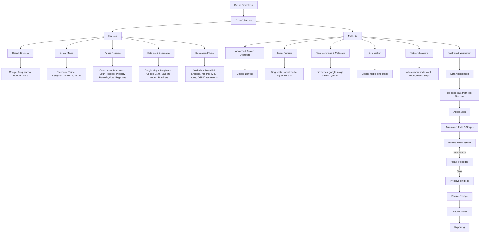

```mermaid
flowchart TD
    A["Define Objectives"] --> B["Data Collection"]
    B --> C["Sources"] & D["Methods"]
    C --> C1["Search Engines"] & C2["Social Media"] & C3["Public Records"] & C4["Satellite & Geospatial"] & C5["Specialized Tools"]
    C1 --> C1a["Google, Bing, Yahoo, Google Dorks"]
    C2 --> C2a["Facebook, Twitter, Instagram, LinkedIn, TikTok"]
    C3 --> C3a["Government Databases, Court Records, Property Records, Voter Registries"]
    C4 --> C4a["Google Maps, Bing Maps, Google Earth, Satellite Imagery Providers"]
    C5 --> C5a["Spiderfoot, Blackbird, Sherlock, Maigret, IMINT tools, OSINT frameworks"]
    D --> D1["Advanced Search Operators"] & D2["Digital Profiling"] & D3["Reverse Image & Metadata"] & D4["Geolocation"] & D5["Network Mapping"] & E["Analysis & Verification"]
    D1 --> D1a["Google Dorking"]
    D2 --> D2a["Blog posts, social media, digital footprint"]
    D3 --> D3a["biometrics, google image search, yandex"]
    D4 --> D4a["Google maps, bing maps"]
    D5 --> D5a["who communicates with whom, relationships"]
    F["Iterate if Needed"] -- Stop --> G["Preserve Findings"]
    G --> G1["Secure Storage"]
    G1 --> G2["Documentation"]
    G2 --> G3["Reporting"]
    H["Automation"] --> H1["Automated Tools & Scripts"]
    H1 --> H1a["chrome driver, python"]
    H3["Data Aggregation"] --> H3a["collected data from text files, csv"]
    H1a <-- New Leads --> F
    H3a --> H
    E --> H3
```
