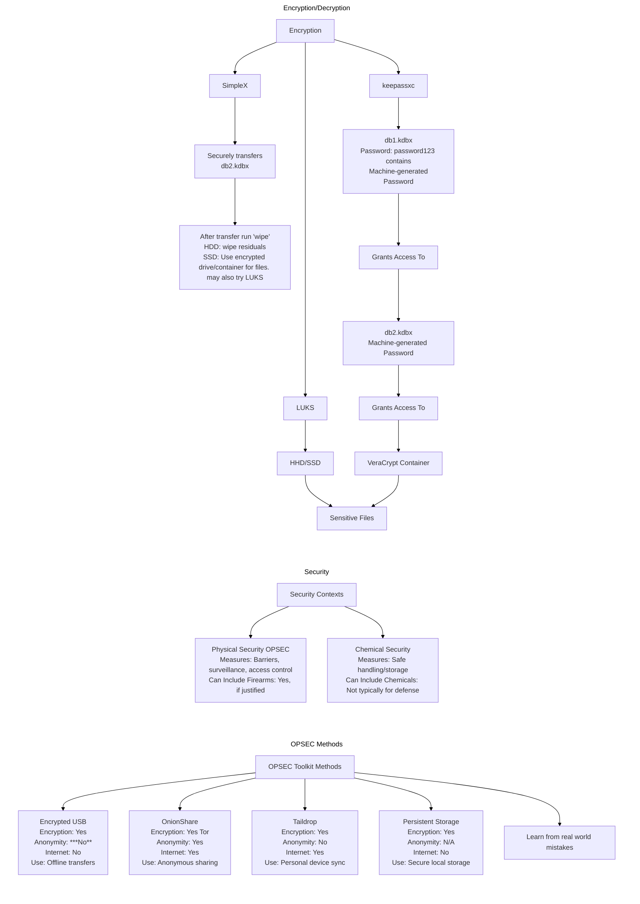

```mermaid
---
config:
  layout: dagre
---
flowchart LR
 subgraph subGraph0["OPSEC Methods"]
        A["OPSEC Toolkit Methods"]
        B["Encrypted USB<br>Encryption: Yes<br>Anonymity: ***No**<br>Internet: No<br>Use: Offline transfers"]
        C["OnionShare<br>Encryption: Yes Tor<br>Anonymity: Yes<br>Internet: Yes<br>Use: Anonymous sharing"]
        D["Taildrop<br>Encryption: Yes<br>Anonymity: No<br>Internet: Yes<br>Use: Personal device sync"]
        E["Persistent Storage<br>Encryption: Yes<br>Anonymity: N/A<br>Internet: No<br>Use: Secure local storage"]
        FF["Learn from real world mistakes"]
  end
 subgraph Security["Security"]
        Q["Security Contexts"]
        R["Physical Security OPSEC<br>Measures: Barriers, surveillance, access control<br>Can Include Firearms: Yes, if justified"]
        S["Chemical Security<br>Measures: Safe handling/storage<br>Can Include Chemicals: Not typically for defense"]
  end
 subgraph s1["Encryption/Decryption"]
        G1["db1.kdbx<br>Password: password123 <br> contains <br> Machine-generated Password"]
        H["Grants Access To"]
        J1["db2.kdbx<br>Machine-generated Password"]
        K["Grants Access To"]
        L["Sensitive Files"]
        N["SimpleX"]
        O["Securely transfers<br>db2.kdbx"]
        P@{ label: "After transfer run 'wipe'<br>HDD: wipe residuals<br>SSD: Use encrypted drive/container for files. may also try LUKS" }
        E1["Encryption"]
        D1["LUKS"]
        B1["HHD/SSD"]
        XC["keepassxc"]
        J["VeraCrypt Container"]
  end
    A --> B & C & D & E & FF
    Q --> R & S
    E1 --> XC & D1 & N
    XC --> G1
    D1 --> B1
    B1 --> L
    N --> O
    O --> P
    G1 --> H
    H --> J1
    J1 --> K
    K --> J
    J --> L
    P@{ shape: rect}
    style s1 fill:transparent,stroke:none,color:#000000
    style Security fill:transparent,stroke:none,color:#000000
    style subGraph0 fill:transparent,stroke:none,color:#000000
    linkStyle 0 stroke:#000000,fill:none
    linkStyle 1 stroke:#000000,fill:none
    linkStyle 2 stroke:#000000,fill:none
    linkStyle 3 stroke:#000000,fill:none
    linkStyle 4 stroke:#000000
    linkStyle 5 stroke:#000000,fill:none
    linkStyle 6 stroke:#000000,fill:none
    linkStyle 7 stroke:#000000,fill:none
    linkStyle 8 stroke:#000000,fill:none
    linkStyle 9 stroke:#000000,fill:none
    linkStyle 10 stroke:#000000,fill:none
    linkStyle 11 stroke:#000000,fill:none
    linkStyle 12 stroke:#000000,fill:none
    linkStyle 13 stroke:#000000,fill:none
    linkStyle 14 stroke:#000000,fill:none
    linkStyle 15 stroke:#000000,fill:none
    linkStyle 16 stroke:#000000,fill:none
    linkStyle 17 stroke:#000000,fill:none
    linkStyle 18 stroke:#000000,fill:none
    linkStyle 19 stroke:#000000,fill:none
```
