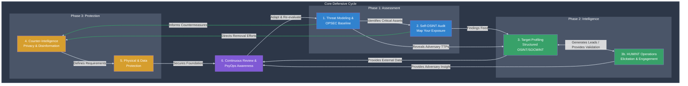

```mermaid
flowchart TB
 subgraph Core["Core Defensive Cycle"]
        direction LR
        
        subgraph Phase1["Phase 1: Assessment"]
            A["1. Threat Modeling &<br>OPSEC Baseline"]
            B["2. Self-OSINT Audit<br>Map Your Exposure"]
        end
        
        subgraph Phase2["Phase 2: Intelligence"]
            C["3. Target Profiling<br>Structured OSINT/SOCMINT"]
            H["3b. HUMINT Operations<br>Elicitation & Engagement"]
        end
        
        subgraph Phase3["Phase 3: Protection"]
            D["4. Counter-Intelligence<br>Privacy & Disinformation"]
            E["5. Physical & Data<br>Protection"]
        end
        
        F["6. Continuous Review &<br>PsyOps Awareness"]
  end
  
    %% Primary flow - left to right
    A -->|Identifies Critical Assets| B
    B -->|Findings Feed| C
    A -->|Reveals Adversary TTPs| C
    
    %% Intelligence loop
    C <-->|Generates Leads / Provides Validation| H
    
    %% Protection flow
    A -->|Informs Countermeasures| D
    B -->|Directs Removal Efforts| D
    D -->|Defines Requirements| E
    
    %% Feedback loop
    E -->|Secures Foundation| F
    C -->|Provides External Data| F
    H -->|Provides Adversary Insight| F
    F -->|Adapt & Re-evaluate| A

    %% Styling
    style Core fill:#2D3748,stroke:#4A5568,stroke-width:2px,color:#FFFFFF
    
    style Phase1 fill:#4A5568,stroke:none,color:#FFFFFF
    style Phase2 fill:#4A5568,stroke:none,color:#FFFFFF
    style Phase3 fill:#4A5568,stroke:none,color:#FFFFFF
    
    style A fill:#3182CE,color:#FFFFFF
    style B fill:#3182CE,color:#FFFFFF
    style C fill:#38A169,color:#FFFFFF
    style H fill:#38A169,color:#FFFFFF
    style D fill:#D69E2E,color:#FFFFFF
    style E fill:#D69E2E,color:#FFFFFF
    style F fill:#805AD5,color:#FFFFFF
    
    %% Link styling
    linkStyle default stroke:#CBD5E0,stroke-width:2px
    linkStyle 4 stroke:#38A169,stroke-width:2px
    linkStyle 5 stroke:#38A169,stroke-width:2px
```
