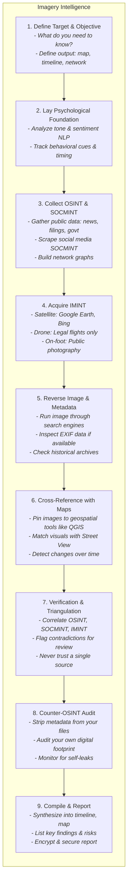

```mermaid
flowchart LR
    A[1. Define Target & Objective<br/>- <i>What do you need to know?<br/>- Define output: map, timeline, network</i>]
    
    B[2. Lay Psychological Foundation<br/>- <i>Analyze tone & sentiment NLP<br/>- Track behavioral cues & timing</i>]
    
    C[3. Collect OSINT & SOCMINT<br/>- <i>Gather public data: news, filings, govt<br/>- Scrape social media SOCMINT<br/>- Build network graphs</i>]
    
    D[4. Acquire IMINT<br/>- <i>Satellite: Google Earth, Bing<br/>- Drone: Legal flights only<br/>- On-foot: Public photography</i>]
    
    E[5. Reverse Image & Metadata<br/>- <i>Run image through search engines<br/>- Inspect EXIF data if available<br/>- Check historical archives</i>]
    
    F[6. Cross-Reference with Maps<br/>- <i>Pin images to geospatial tools like QGIS<br/>- Match visuals with Street View<br/>- Detect changes over time</i>]
    
    G[7. Verification & Triangulation<br/>- <i>Correlate OSINT, SOCMINT, IMINT<br/>- Flag contradictions for review<br/>- Never trust a single source</i>]
    
    H[8. Counter-OSINT Audit<br/>- <i>Strip metadata from your files<br/>- Audit your own digital footprint<br/>- Monitor for self-leaks</i>]
    
    I[9. Compile & Report<br/>- <i>Synthesize into timeline, map<br/>- List key findings & risks<br/>- Encrypt & secure report</i>]

    A --> B
    B --> C
    C --> D
    D --> E
    E --> F
    F --> G
    G --> H
    H --> I


    subgraph "Imagery Intelligence"
        A
        B
        C
        D
        E
        F
        G
        H
        I
    end
```
