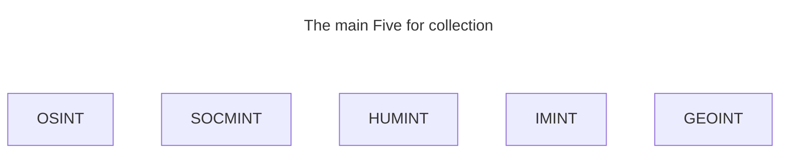

```mermaid
flowchart TB
    n3@{ label: "<span style=\"padding-left:\">The main Five for collection</span>" } ~~~ D["OSINT"]
    n3 ~~~ E["SOCMINT"] & F["HUMINT"] & n1@{ label: "<span style=\"padding-left:\"><span style=\"padding-left:\">IMINT</span></span>" } & n2@{ label: "<span style=\"padding-left:\"><span style=\"padding-left:\">GEOINT</span></span>" }

    n3@{ shape: text}
    E@{ shape: rect}
    F@{ shape: rect}
    n1@{ shape: rect}
    n2@{ shape: rect}
```

Back to the [main guide](../../README.md).