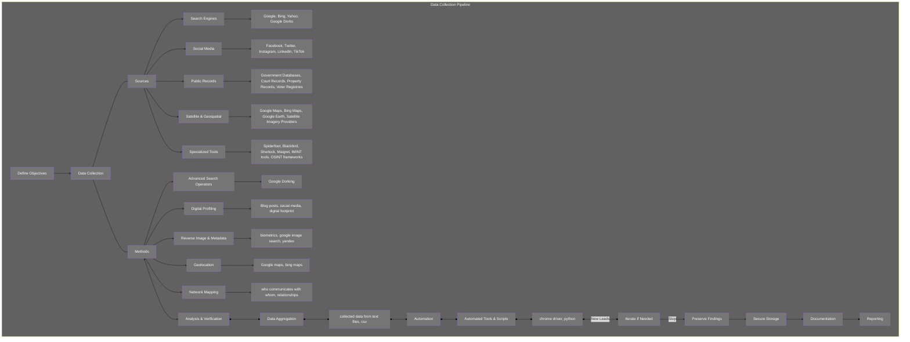

```mermaid
flowchart TB
 subgraph s1["Data Collection Pipeline"]
        A["Define Objectives"]
        B["Data Collection"]
        C["Sources"]
        D["Methods"]
        C1["Search Engines"]
        C2["Social Media"]
        C3["Public Records"]
        C4["Satellite & Geospatial"]
        C5["Specialized Tools"]
        C1a["Google, Bing, Yahoo, Google Dorks"]
        C2a["Facebook, Twitter, Instagram, LinkedIn, TikTok"]
        C3a["Government Databases, Court Records, Property Records, Voter Registries"]
        C4a["Google Maps, Bing Maps, Google Earth, Satellite Imagery Providers"]
        C5a["Spiderfoot, Blackbird, Sherlock, Maigret, IMINT tools, OSINT frameworks"]
        D1["Advanced Search Operators"]
        D2["Digital Profiling"]
        D3["Reverse Image & Metadata"]
        D4["Geolocation"]
        D5["Network Mapping"]
        E["Analysis & Verification"]
        D1a["Google Dorking"]
        D2a["Blog posts, social media, digital footprint"]
        D3a["biometrics, google image search, yandex"]
        D4a["Google maps, bing maps"]
        D5a["who communicates with whom, relationships"]
        F["Iterate if Needed"]
        G["Preserve Findings"]
        G1["Secure Storage"]
        G2["Documentation"]
        G3["Reporting"]
        H["Automation"]
        H1["Automated Tools & Scripts"]
        H1a["chrome driver, python"]
        H3["Data Aggregation"]
        H3a["collected data from text files, csv"]
  end
    A --> B
    B --- C & D
    C --> C1 & C2 & C3 & C4 & C5
    C1 --> C1a
    C2 --> C2a
    C3 --> C3a
    C4 --> C4a
    C5 --> C5a
    D --> D1 & D2 & D3 & D4 & D5
    D <--> E
    D1 --> D1a
    D2 --> D2a
    D3 --> D3a
    D4 --> D4a
    D5 --> D5a
    F -- Stop --> G
    G --> G1
    G1 --> G2
    G2 --> G3
    H <--> H1
    H1 <--> H1a
    H3 <--> H3a
    H1a <-- New Leads --> F
    H3a <--> H
    E <--> H3

    style A   fill:#757575,color:#FFFFFF
    style B   fill:#757575,color:#FFFFFF
    style C   fill:#757575,color:#FFFFFF
    style D   fill:#757575,color:#FFFFFF
    style C1  fill:#757575,color:#FFFFFF
    style C2  fill:#757575,color:#FFFFFF
    style C3  fill:#757575,color:#FFFFFF
    style C4  fill:#757575,color:#FFFFFF
    style C5  fill:#757575,color:#FFFFFF
    style C1a fill:#757575,color:#FFFFFF
    style C2a fill:#757575,color:#FFFFFF
    style C3a fill:#757575,color:#FFFFFF
    style C4a fill:#757575,color:#FFFFFF
    style C5a fill:#757575,color:#FFFFFF
    style D1  fill:#757575,color:#FFFFFF
    style D2  fill:#757575,color:#FFFFFF
    style D3  fill:#757575,color:#FFFFFF
    style D4  fill:#757575,color:#FFFFFF
    style D5  fill:#757575,color:#FFFFFF
    style E   fill:#757575,color:#FFFFFF
    style D1a fill:#757575,color:#FFFFFF
    style D2a fill:#757575,color:#FFFFFF
    style D3a fill:#757575,color:#FFFFFF
    style D4a fill:#757575,color:#FFFFFF
    style D5a fill:#757575,color:#FFFFFF
    style F   fill:#757575,color:#FFFFFF
    style G   fill:#757575,color:#FFFFFF
    style G1  fill:#757575,color:#FFFFFF
    style G2  fill:#757575,color:#FFFFFF
    style G3  fill:#757575,color:#FFFFFF
    style H   fill:#757575,color:#FFFFFF
    style H1  fill:#757575,color:#FFFFFF
    style H1a fill:#757575,color:#FFFFFF
    style H3  fill:#757575,color:#FFFFFF
    style H3a fill:#757575,color:#FFFFFF
    style s1 color:#FFFFFF,fill:#616161
    linkStyle 0 Stroke:#000000,fill:none
    linkStyle 1 Stroke:#000000,fill:none
    linkStyle 2 Stroke:#000000,fill:none
    linkStyle 3 Stroke:#000000,fill:none
    linkStyle 4 Stroke:#000000,fill:none
    linkStyle 5 Stroke:#000000,fill:none
    linkStyle 6 Stroke:#000000,fill:none
    linkStyle 7 Stroke:#000000,fill:none
    linkStyle 8 Stroke:#000000,fill:none
    linkStyle 9 Stroke:#000000,fill:none
    linkStyle 10 Stroke:#000000,fill:none
    linkStyle 11 Stroke:#000000,fill:none
    linkStyle 12 Stroke:#000000,fill:none
    linkStyle 13 Stroke:#000000,fill:none
    linkStyle 14 Stroke:#000000,fill:none
    linkStyle 15 Stroke:#000000,fill:none
    linkStyle 16 Stroke:#000000,fill:none
    linkStyle 17 Stroke:#000000,fill:none
    linkStyle 18 Stroke:#000000,fill:none
    linkStyle 19 Stroke:#000000,fill:none
    linkStyle 20 Stroke:#000000,fill:none
    linkStyle 21 Stroke:#000000,fill:none
    linkStyle 22 Stroke:#000000,fill:none
    linkStyle 23 Stroke:#000000,fill:none
    linkStyle 24 Stroke:#000000,fill:none
    linkStyle 25 Stroke:#000000,fill:none
    linkStyle 26 Stroke:#000000,fill:none
    linkStyle 27 stroke:#000000
    linkStyle 28 stroke:#000000,fill:none
    linkStyle 29 stroke:#000000,fill:none
    linkStyle 30 stroke:#000000,fill:none
    linkStyle 31 stroke:#000000,fill:none
    linkStyle 32 stroke:#000000,fill:none
    linkStyle 33 stroke:#000000,fill:none
```
