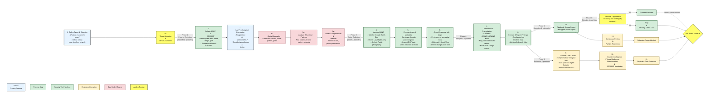

```mermaid
---
config:
  layout: dagre
---
flowchart LR
 subgraph LEGEND["Legend"]
        L_Phase["Phase<br>Primary Process"]
        L_Step["Process Step"]
        L_Security["Security Tool / Method"]
        L_Defensive["Defensive Operation"]
        L_Data["Data Node / Source"]
        L_Audit["Audit & Review"]
  end
 subgraph P1["Phase 1: 
 Planning & Scoping"]
        A@{ label: "<span style=\"padding-left:\">1b. <br/>Threat Modeling <br/>&amp;<br>OPSEC Baseline</span>" }
        TM@{ label: "<span style=\"padding-left:\">1. Define Target &amp; Objective<br>- What do you need to know?<br>- Define output: <br/>map, timeline, network</span>" }
        B["3. 
        Lay Psychological Foundation<br>- Analyze tone 
        &amp; 
        sentiment NLP<br>- Track behavioral cues 
        &amp; 
        timing"]
        C["2. 
        Collect OSINT 
        &amp; 
        SOCMINT<br>- Gather public data: news, filings, govt<br>- Scrape social media SOCMINT"]
        DB["3c. 
        Digital Biography<br>Gather IDs, emails, social profiles, posts"]
        BP["3d. 
        Analyze Behavioral Patterns<br>Find patterns in time, topics, networks"]
        CA["3e. 
        Assess Competencies 
        &amp; 
        Affinities<br>Technical skill, 
        privacy awareness"]
        D["4. 
        Acquire IMINT<br>- Satellite: Google Earth, Bing<br>- Drone: Legal flights only<br>- On-foot: Public photography"]
        E["5. 
        Reverse Image &amp; Metadata<br>- Run image through search engines<br>- Inspect EXIF data<br>- Check historical archives"]
        F["6. 
        Cross-Reference with Maps<br>- Pin images to geospatial tools<br>- Match with Street View<br>- Detect changes over time"]
        G["7. 
        Verification &amp; Triangulation<br>- Correlate: 
        OSINT, SOCMINT, IMINT<br>- Flag contradictions for review<br>- Never trust a single source"]
        PF["8. 
        Compile &amp; Report Findings<br>- Synthesize into 
        timeline, map<br>- List key findings &amp; risks"]
        H["9. 
        Counter-OSINT Audit<br>- Strip metadata from your files<br>- Audit your own digital footprint<br>- Monitor for self-leaks"]
        CI["10. 
        Counter-Intelligence<br>Privacy Hardening, Disinformation,
        &amp; 
        SOCMINT Monitoring"]
        PDP["11. 
        Physical &amp; Data Protection"]
        I["12. 
        Finalize &amp; Secure Report<br>- Encrypt &amp; secure report"]
        CR["13. 
        Continuous Review 
        &amp;<br>PsyOps Awareness"]
        DM["Defensive Psyop Mindset"]
        EC["Ethical &amp; Legal Check<br>All data public and legally obtained?"]
        END_Good["Process Complete"]
        END_Bad["Stop 
        &amp; 
        Securely Delete Data"]
  end
    PF -- Phase 6:<br>Reporting &amp; Integration --> I
    PF -- Phase 5:<br>Defensive Operations --> H
    I -- Phase 0:<br>Ethical &amp; Legal Gate --> EC
    I --> CR
    EC -- Yes --> END_Good
    EC -- No --> END_Bad
    DB --> BP
    BP --> CA
    D --> E
    E --> F
    F -- Phase 4:<br>Analysis &amp; Synthesis --> G
    H --> CI
    CI --> PDP
    CR --> DM
    G --> PF
    TM --> A
    A -- "<span style=padding-left:>Phase 2:<br>Passive Collection<br>(SOCMINT &amp; OSINT)</span>" --> C
    C --> B
    B --> DB
    CA -- "<span style=padding-left:><span style=padding-left:><span style=padding-left:>Phase 3:</br>Active Collection</br>(IMINT &amp; GEOINT)</span></span></span>" --> D
    END_Bad --> n1["See phase 1 and 1b"]
    DM --> n1
    PDP --> n1
    END_Good -. Data is never finished .- n1
    A@{ shape: rect}
    TM@{ shape: rect}
    n1@{ shape: diam}
     L_Phase:::phase
     L_Step:::security
     L_Security:::security
     L_Defensive:::defensive
     L_Data:::data
     L_Audit:::audit
     A:::audit
     TM:::phase
     B:::phase
     C:::step
     DB:::data
     BP:::data
     CA:::data
     D:::step
     E:::step
     F:::step
     G:::step
     PF:::step
     H:::defensive
     CI:::defensive
     PDP:::defensive
     I:::security
     CR:::defensive
     DM:::defensive
     EC:::audit
     END_Good:::step
     END_Bad:::step
     n1:::audit
     P1:::phaseCluster
    classDef phaseCluster fill:none,stroke:#333,stroke-width:3px,color:#000
    classDef phase fill:#e6f3ff,stroke:#333,stroke-width:2px,color:#000
    classDef step fill:#d4edda,stroke:#155724,stroke-width:2px,color:#000
    classDef security fill:#d4edda,stroke:#155724,stroke-width:2px,color:#000
    classDef defensive fill:#fff3cd,stroke:#856404,stroke-width:2px,color:#000
    classDef data fill:#f8d7da,stroke:#721c24,stroke-width:1px,color:#000
    classDef audit fill:#fffd6e, stroke:#383d41, stroke-width:2px, color:#000
    style P1 color:#FFFFFF,stroke:none
    style LEGEND color:#FFFFFF,fill:transparent,stroke:none
```
