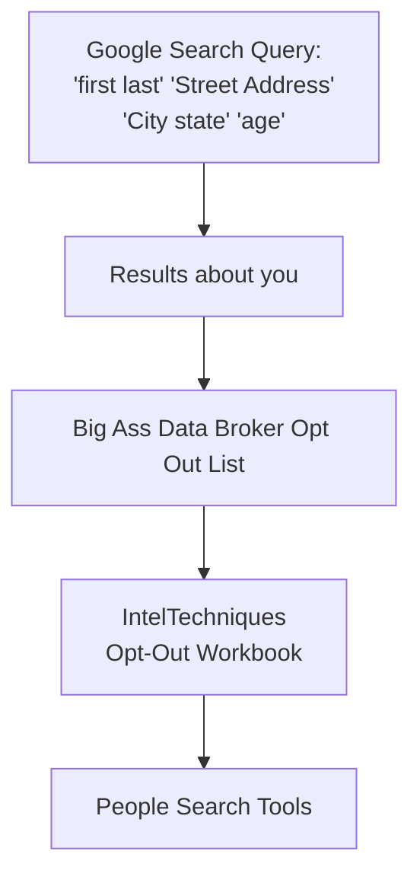

```mermaid
flowchart TD
    A@{ label: "Google Search Query:<br>'first last' 'Street Address'<br>'City state' 'age'" } --> B["Results about you"]
    B --> C["Big Ass Data Broker Opt Out List"]
    C --> D["IntelTechniques<br>Opt-Out Workbook"]
    D --> E["People Search Tools"]

    A@{ shape: rect}
```
