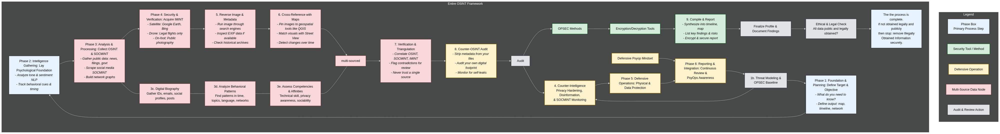

# Three letter agencies

Three-letter agencies, such as the FBI, CIA, or NSA, deploy a range of investigative techniques on threat actors that include protective intelligence and threat assessment investigations, as well as cyber threat hunting methodologies.

Protective intelligence investigative techniques focus on identifying and assessing individuals who pose threats to public officials or important targets. This involves gathering and analyzing information from diverse sources such as interviews, background checks, digital footprints, weapon and travel records, and behavioral analysis to evaluate the threat level. Investigators use methods including interviews, searches (of people, residences, vehicles), background checks, and reviewing communications or purchases to create a comprehensive threat profile. The goal is to prevent attacks by monitoring and intervening based on the threat assessment.

On the cyber side, agencies use threat hunting techniques such as Indicators of Compromise (IOCs) analysis, which involves searching logs and network traffic for digital signs of malicious activity. They also employ analysis of Tactics, Techniques, and Procedures (TTPs) to understand how threat actors conduct attacks, allowing more efficient detection and response tailored to known attacker behaviors. Digital forensics and incident response (DFIR) investigations help identify, investigate, and remediate cyberattacks within networks by thorough review of logs, file systems, and user activities.

The flowchart example provided aligns well with the investigative and operational framework that a three-letter agency might deploy against a threat actor. It includes structured phases such as:

- Foundation and Planning, which aligns with defining the target, objectives, and gathering preliminary intelligence.
- Intelligence Gathering, involving psychological analysis such as tone and behavior, plus collection from OSINT, SOCMINT (social media intelligence), and image intelligence (IMINT).
- Analysis and Verification phases that involve processing diverse data sources, cross-referencing, reverse image and metadata analysis, and triangulation which is critical in threat validation.
- Defensive operations focused on privacy hardening, counter-intelligence, and OPSEC (operational security) methods.
- Continuous reporting and auditing to ensure legality, ethics, and ongoing threat assessment.

This comprehensive cycle mirrors the protective intelligence investigative practices used by agencies, including gathering multi-source data (interviews, records, digital footprints), behavioral analysis, verification, and deploying defensive countermeasures and secure reporting. It also emphasizes OPSEC and legal compliance, which are essential procedural elements for formal sensitive investigations.

In essence, your flowchart succinctly captures a holistic operational and investigative methodology used by intelligence/security agencies against threat actors, integrating physical, behavioral, digital, and legal components into an enduring protective intelligence process.
