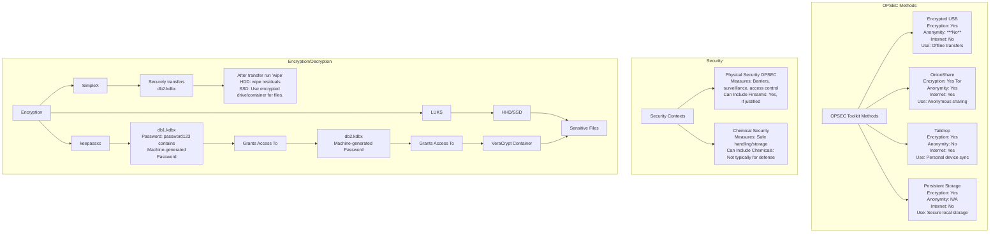

```mermaid
flowchart TD

    subgraph "OPSEC Methods"
    A
    B
    C
    D
    E
end

    A[OPSEC Toolkit Methods] --> B[Encrypted USB<br/>Encryption: Yes<br/>Anonymity: ***No**<br/>Internet: No<br/>Use: Offline transfers]
    A --> C[OnionShare<br/>Encryption: Yes Tor<br/>Anonymity: Yes<br/>Internet: Yes<br/>Use: Anonymous sharing]
    A --> D[Taildrop<br/>Encryption: Yes<br/>Anonymity: No<br/>Internet: Yes<br/>Use: Personal device sync]
    A --> E[Persistent Storage<br/>Encryption: Yes<br/>Anonymity: N/A<br/>Internet: No<br/>Use: Secure local storage]

    subgraph "Security"
    Q
    R
    S
    Q[Security Contexts] --> R[Physical Security OPSEC<br/>Measures: Barriers, surveillance, access control<br/>Can Include Firearms: Yes, if justified]
    Q --> S[Chemical Security<br/>Measures: Safe handling/storage<br/>Can Include Chemicals: Not typically for defense]
end

subgraph "Encryption/Decryption"

    G1
    H
    J1
    K
    L
    N
    O
    P
    E1
    D1
    B1
    
    E1[Encryption] --> XC[keepassxc] --> G1[db1.kdbx<br/>Password: password123 </br> contains <br> Machine-generated Password]

    E1[Encryption]  --> D1[LUKS] --> B1[HHD/SSD] --> L[Sensitive Files]

    E1[Encryption]  --> N[SimpleX] --> O[Securely transfers<br/>db2.kdbx] --> P[After transfer run 'wipe'<br/>HDD: wipe residuals<br/>SSD: Use encrypted drive/container for files.]

    
    G1[db1.kdbx<br/>Password: password123 </br> contains <br> Machine-generated Password] --> H[Grants Access To] --> J1[db2.kdbx<br/>Machine-generated Password] --> K[Grants Access To] -->J[VeraCrypt Container] --> L[Sensitive Files]

    end
```
