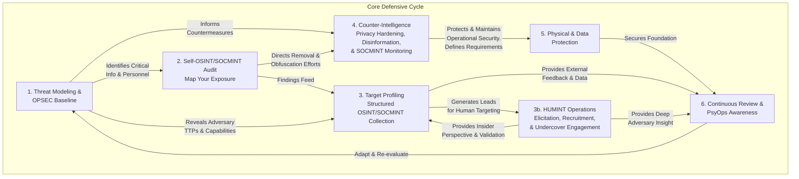

```mermaid
flowchart TD
    A[1. Threat Modeling &<br>OPSEC Baseline] -->|Identifies Critical<br>Info & Personnel| B[2. Self-OSINT/SOCMINT Audit<br>Map Your Exposure]
    B -->|Findings Feed| C[3. Target Profiling<br>Structured OSINT/SOCMINT Collection]
    
    A -->|Reveals Adversary<br>TTPs & Capabilities| C

    C -->|Generates Leads<br>for Human Targeting| H[3b. HUMINT Operations<br>Elicitation, Recruitment,<br>& Undercover Engagement]
    H -->|Provides Insider<br>Perspective & Validation| C

    A -->|Informs<br>Countermeasures| D[4. Counter-Intelligence<br>Privacy Hardening, Disinformation,<br>& SOCMINT Monitoring]
    B -->|Directs Removal &<br>Obfuscation Efforts| D
    
    D -->|Protects & Maintains<br>Operational Security.<br>Defines Requirements| E[5. Physical & Data<br>Protection]
    
    E -->|Secures Foundation| F[6. Continuous Review &<br>PsyOps Awareness]
    C -->|Provides External<br>Feedback & Data| F
    H -->|Provides Deep<br>Adversary Insight| F

    F -->|Adapt & Re-evaluate| A

    subgraph "Core Defensive Cycle"
        A
        B
        C
        H
        D
        E
        F
    end
```
