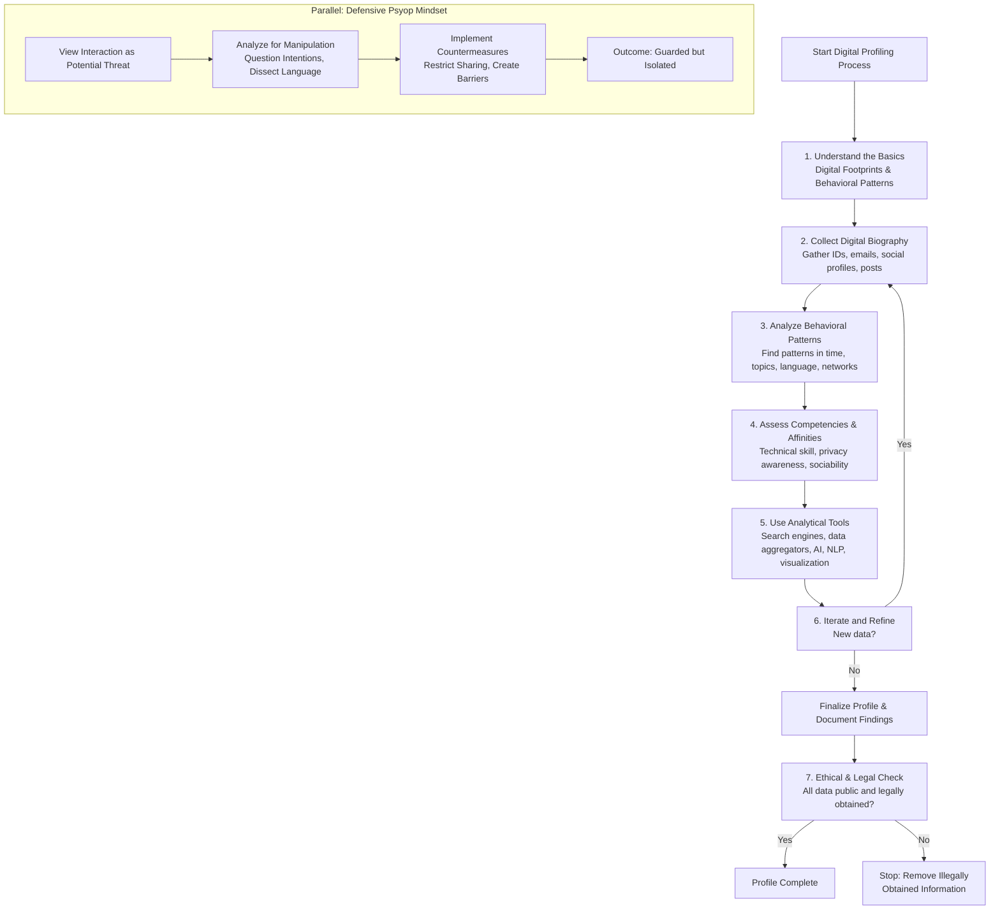

```mermaid
flowchart TD
    A[Start Digital Profiling Process] --> B[1. Understand the Basics<br>Digital Footprints & Behavioral Patterns]
    B --> C[2. Collect Digital Biography<br>Gather IDs, emails, social profiles, posts]
    C --> D[3. Analyze Behavioral Patterns<br>Find patterns in time, topics, language, networks]
    D --> E[4. Assess Competencies & Affinities<br>Technical skill, privacy awareness, sociability]
    E --> F[5. Use Analytical Tools<br>Search engines, data aggregators, AI, NLP, visualization]
    F --> G[6. Iterate and Refine<br>New data?]
    G -- Yes --> C
    G -- No --> H[Finalize Profile & Document Findings]
    
    H --> I[7. Ethical & Legal Check<br>All data public and legally obtained?]
    I -- Yes --> J[Profile Complete]
    I -- No --> K[Stop: Remove Illegally<br>Obtained Information]

    subgraph DefensiveMindset [Parallel: Defensive Psyop Mindset]
        L[View Interaction as Potential Threat] --> M[Analyze for Manipulation<br>Question Intentions, Dissect Language]
        M --> N[Implement Countermeasures<br>Restrict Sharing, Create Barriers]
        N --> O[Outcome: Guarded but Isolated]
    end
```
