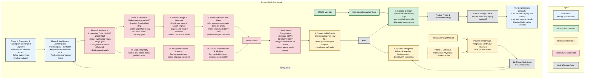

```mermaid
flowchart TD
 subgraph LEGEND["Legend"]
    direction LR
        L_Phase["Phase Box<br>Primary Process Step"]
        L_Security["Security Tool / Method"]
        L_Defensive["Defensive Operation"]
        L_Data["Multi-Source Data Node"]
        L_Audit["Audit & Review Action"]
  end
 subgraph subGraph1["Entire OSINT Framework"]
        B["Phase 2: Intelligence Gathering: Lay Psychological Foundation<br>- <i>Analyze tone &amp; sentiment NLP<br>- Track behavioral cues &amp; timing</i>"]
        C["Phase 3: Analysis &amp; Processing: Collect OSINT &amp; SOCMINT<br>- <i>Gather public data: news, filings, govt<br>- Scrape social media SOCMINT<br>- Build network graphs</i>"]
        D["Phase 4: Security &amp; Verification: Acquire IMINT<br>- <i>Satellite: Google Earth, Bing<br>- Drone: Legal flights only<br>- On-foot: Public photography</i>"]
        DB["3c. Digital Biography<br>Gather IDs, emails, social profiles, posts"]
        A["Phase 1: Foundation &amp; Planning: Define Target &amp; Objective<br>- <i>What do you need to know?<br>- Define output: map, timeline, network</i>"]
        TM["1b. Threat Modeling &amp;<br>OPSEC Baseline"]
        E["5. Reverse Image &amp; Metadata<br>- <i>Run image through search engines<br>- Inspect EXIF data if available<br>- Check historical archives</i>"]
        F["6. Cross-Reference with Maps<br>- <i>Pin images to geospatial tools like QGIS<br>- Match visuals with Street View<br>- Detect changes over time</i>"]
        GG["multi-sourced"]
        BP["3d. Analyze Behavioral Patterns<br>Find patterns in time, topics, language, networks"]
        CA["3e. Assess Competencies &amp; Affinities<br>Technical skill, privacy awareness, sociability"]
        G["7. Verification &amp; Triangulation<br>- <i>Correlate OSINT, SOCMINT, IMINT<br>- Flag contradictions for review<br>- Never trust a single source</i>"]
        H["8. Counter-OSINT Audit<br>- <i>Strip metadata from your files<br>- Audit your own digital footprint<br>- Monitor for self-leaks</i>"]
        HH["Audit"]
        CI["4. Counter-Intelligence<br>Privacy Hardening, Disinformation,<br>&amp; SOCMINT Monitoring"]
        PDP["Phase 5: Defensive Operations: Physical & Data Protection"]
        CR["Phase 6: Reporting &amp; Integration: Continuous Review &amp;<br>PsyOps Awareness"]
        DM["Defensive Psyop Mindset"]
        I["9. Compile &amp; Report<br>- <i>Synthesize into timeline, map<br>- List key findings &amp; risks<br>- Encrypt &amp; secure report</i>"]
        ENC["Encryption/Decryption Tools"]
        OPSEC["OPSEC Methods"]
        PF["Finalize Profile & Document Findings"]
        EC["Ethical &amp; Legal Check<br>All data public and legally obtained?"]
        END["The the process is complete.<br>if not obtained legally and publicly<br>then stop: remove Illegally<br>Obtained Information securely."]
  end
    DM --> CR
    OPSEC --> ENC
    ENC --> I
    EC --> END
    A --> B
    TM -- sanity check --> B
    B --> C
    C --> D
    C --- DB
    D --> E
    E --> F
    F --> GG
    DB --- BP
    BP --- CA
    CA --- GG
    GG --> G
    G --> H
    HH --> I & CI
    TM --> CI
    H --> HH
    CI --> PDP
    PDP --> CR
    CR --> TM
    I --> PF
    PF --> EC

     L_Phase:::phase
     L_Security:::security
     L_Defensive:::defensive
     L_Data:::data
     L_Audit:::audit
     B:::phase
     C:::data
     D:::data
     DB:::data
     A:::phase
     TM:::audit
     E:::data
     F:::data
     GG:::data
     BP:::data
     CA:::data
     G:::data
     H:::defensive
     HH:::audit
     CI:::defensive
     PDP:::defensive
     CR:::defensive
     DM:::defensive
     I:::security
     ENC:::security
     OPSEC:::security
     PF:::audit
     EC:::audit
     END:::phase
    classDef phase fill:#e6f3ff,stroke:#333,stroke-width:2px,color:#000
    classDef security fill:#d4edda,stroke:#155724,stroke-width:2px,color:#000
    classDef defensive fill:#fff3cd,stroke:#856404,stroke-width:2px,color:#000
    classDef data fill:#f8d7da,stroke:#721c24,stroke-width:1px,color:#000
    classDef audit fill:#e2e3e5,stroke:#383d41,stroke-width:2px,color:#000

```
