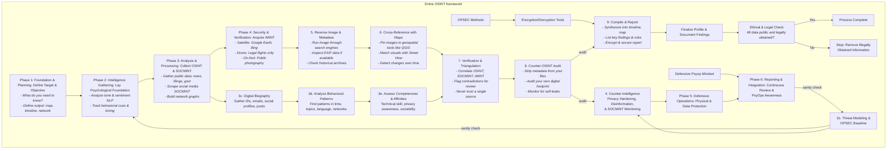

```mermaid
flowchart TD
    
    subgraph "Entire OSINT framework"
        B[Phase 2: Intelligence Gathering: Lay Psychological Foundation<br/>- <i>Analyze tone & sentiment NLP<br/>- Track behavioral cues & timing</i>]
        C[Phase 3: Analysis & Processing: Collect OSINT & SOCMINT<br/>- <i>Gather public data: news, filings, govt<br/>- Scrape social media SOCMINT<br/>- Build network graphs</i>]
        D[Phase 4: Security & Verification: Acquire IMINT<br/>- <i>Satellite: Google Earth, Bing<br/>- Drone: Legal flights only<br/>- On-foot: Public photography</i>]
        DB[3c. Digital Biography<br/>Gather IDs, emails, social profiles, posts]
        A[Phase 1: Foundation & Planning: Define Target & Objective<br/>- <i>What do you need to know?<br/>- Define output: map, timeline, network</i>]
        TM[1b. Threat Modeling &<br/>OPSEC Baseline]
        E[5. Reverse Image & Metadata<br/>- <i>Run image through search engines<br/>- Inspect EXIF data if available<br/>- Check historical archives</i>]
        F[6. Cross-Reference with Maps<br/>- <i>Pin images to geospatial tools like QGIS<br/>- Match visuals with Street View<br/>- Detect changes over time</i>]
        BP[3d. Analyze Behavioral Patterns<br/>Find patterns in time, topics, language, networks]
        CA[3e. Assess Competencies & Affinities<br/>Technical skill, privacy awareness, sociability]
        G[7. Verification & Triangulation<br/>- <i>Correlate OSINT, SOCMINT, IMINT<br/>- Flag contradictions for review<br/>- Never trust a single source</i>]
        H[8. Counter-OSINT Audit<br/>- <i>Strip metadata from your files<br/>- Audit your own digital footprint<br/>- Monitor for self-leaks</i>]
        CI[4. Counter-Intelligence<br/>Privacy Hardening, Disinformation,<br/>& SOCMINT Monitoring]
        PDP[Phase 5: Defensive Operations: Physical & Data Protection]
        CR[Phase 6: Reporting & Integration: Continuous Review &<br/>PsyOps Awareness]
        DM[Defensive Psyop Mindset] -->CR
        OPSEC[OPSEC Methods] --> ENC[Encryption/Decryption Tools] -->I[9. Compile & Report<br/>- <i>Synthesize into timeline, map<br/>- List key findings & risks<br/>- Encrypt & secure report</i>]
        PF[Finalize Profile & Document Findings]
        EC[Ethical & Legal Check<br/>All data public and legally obtained?]
        EC -->|Yes| END[Process Complete]
        EC -->|No| STOP[Stop: Remove Illegally<br/>Obtained Information]
    end


    %% Connections between phases
    A --> B
    TM -->|sanity check| B
    B --> C
    C --> D
    D --> E
    E --> F
    F --> G
    C --> DB
    DB --> BP
    BP --> CA
    CA --> G
    G --> H
    H -->|audit| I
    TM --> CI
    H -->|audit| CI
    CI --> PDP
    PDP -->CR
    CR -->|sanity check| TM
    I --> PF
    PF --> EC

    class A,TM,B,C,D,DB,E,F,BP,CA,G,H,I,PF,EC phase
    class OPSEC,ENC security
    class CI,PDP,CR,DM defensive
```
