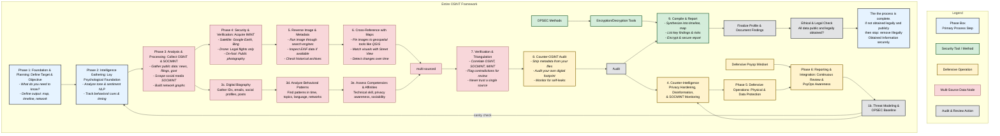

```mermaid
flowchart TD

    subgraph LEGEND["Legend"]
        direction LR
        L_Phase[Phase Box<br/>Primary Process Step]:::phase
        L_Security[Security Tool / Method]:::security
        L_Defensive[Defensive Operation]:::defensive
        L_Data[Multi-Source Data Node]:::data
        L_Audit[Audit & Review Action]:::audit
    end

    subgraph "Entire OSINT Framework"
        B[Phase 2: Intelligence Gathering: Lay Psychological Foundation<br/>- <i>Analyze tone & sentiment NLP<br/>- Track behavioral cues & timing</i>]:::phase
        C[Phase 3: Analysis & Processing: Collect OSINT & SOCMINT<br/>- <i>Gather public data: news, filings, govt<br/>- Scrape social media SOCMINT<br/>- Build network graphs</i>]:::data
        D[Phase 4: Security & Verification: Acquire IMINT<br/>- <i>Satellite: Google Earth, Bing<br/>- Drone: Legal flights only<br/>- On-foot: Public photography</i>]:::data
        DB[3c. Digital Biography<br/>Gather IDs, emails, social profiles, posts]:::data
        A[Phase 1: Foundation & Planning: Define Target & Objective<br/>- <i>What do you need to know?<br/>- Define output: map, timeline, network</i>]:::phase
        TM[1b. Threat Modeling &<br/>OPSEC Baseline]:::audit
        E[5. Reverse Image & Metadata<br/>- <i>Run image through search engines<br/>- Inspect EXIF data if available<br/>- Check historical archives</i>]:::data
        F[6. Cross-Reference with Maps<br/>- <i>Pin images to geospatial tools like QGIS<br/>- Match visuals with Street View<br/>- Detect changes over time</i>]:::data
        GG[multi-sourced]:::data
        BP[3d. Analyze Behavioral Patterns<br/>Find patterns in time, topics, language, networks]:::data
        CA[3e. Assess Competencies & Affinities<br/>Technical skill, privacy awareness, sociability]:::data
        G[7. Verification & Triangulation<br/>- <i>Correlate OSINT, SOCMINT, IMINT<br/>- Flag contradictions for review<br/>- Never trust a single source</i>]:::data
        H[8. Counter-OSINT Audit<br/>- <i>Strip metadata from your files<br/>- Audit your own digital footprint<br/>- Monitor for self-leaks</i>]:::defensive
        HH[Audit]:::audit
        CI[4. Counter-Intelligence<br/>Privacy Hardening, Disinformation,<br/>& SOCMINT Monitoring]:::defensive
        PDP[Phase 5: Defensive Operations: Physical & Data Protection]:::defensive
        CR[Phase 6: Reporting & Integration: Continuous Review &<br/>PsyOps Awareness]:::defensive
        DM[Defensive Psyop Mindset]:::defensive -->CR
        OPSEC[OPSEC Methods]:::security --> ENC[Encryption/Decryption Tools]:::security -->I[9. Compile & Report<br/>- <i>Synthesize into timeline, map<br/>- List key findings & risks<br/>- Encrypt & secure report</i>]:::security
        PF[Finalize Profile & Document Findings]:::audit
        EC[Ethical & Legal Check<br/>All data public and legally obtained?]:::audit
        EC -->END[The the process is complete.<br/>if not obtained legally and publicly<br/>then stop: remove Illegally<br/>Obtained Information securely.]:::phase
    end


    %% Connections between phases
    A --> B
    TM -->|sanity check|B
    B --> C
    C --> D
    D --> E
    E --> F
    F --> GG
    C --> DB
    DB --> BP
    BP --> CA
    CA --> GG
    GG --> G
    G --> H

    HH -->I
    TM -->CI
    H -->HH
    HH --> CI
    CI --> PDP
    PDP -->CR
    CR --> TM
    I --> PF
    PF --> EC

    classDef phase fill:#e6f3ff,stroke:#333,stroke-width:2px,color:#000;
    classDef security fill:#d4edda,stroke:#155724,stroke-width:2px,color:#000;
    classDef defensive fill:#fff3cd,stroke:#856404,stroke-width:2px,color:#000;
    classDef data fill:#f8d7da,stroke:#721c24,stroke-width:1px,color:#000;
    classDef audit fill:#e2e3e5,stroke:#383d41,stroke-width:2px,color:#000;
```
