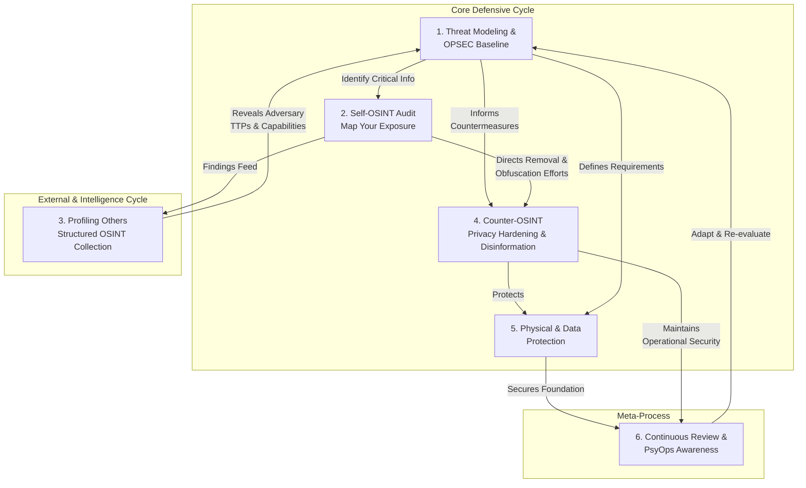

# methodology

A list of methodologies or a systematic approach. Everything will be found in the [main guide](README.md).

# 🔄 Summary: Unified OPSEC–OSINT Cycle

1. **Threat Modeling** → Identify what matters.  
2. **Self-OSINT Audit** → Map your exposure.  
3. **Profiling Others** → Structured intelligence collection.  
4. **Counter-OSINT** → Privacy hardening + disinformation.  
5. **Physical/Data Protection** → Encrypt, compartmentalize, destroy.  
6. **Continuous Review** → Adapt cycle, detect PsyOps, stay disciplined. 

***

# 🛡️ OPSEC–OSINT Master Lifecycle

### **Phase 1. Threat Modeling & OPSEC Baseline**
📍 *Goal: Know what you must protect and from whom.*

1. **Identify Critical Information (CII)**  
   - What do you not want adversaries to know? (emails, network access, home address, sensitive ops, habits).  
   - [Main Guide: CII cycle](README.md#operations-security-is-a-systematic-process-for)

2. **Analyze Threats & Vulnerabilities**  
   - Who might target you? Employer, stalker, law enforcement, competitor, criminal groups.  
   - Which vectors are exposed? (social media, old blogs, leaked credentials).

3. **Assess Risks**  
   - Probability × Impact = Risk priority.  
   Example: Old breached email reused across accounts → high risk.

4. **Develop Countermeasures**  
   - Use anonymization, encryption, compartmentalization, and **smokescreens**.

➡️ **Cycle**: *Identify → Analyze → Assess → Protect → Re-evaluate*  
*(Classic OPSEC process).*

***

### **Phase 2. Exposure Identification (Self-OSINT Pipeline)**
📍 *Goal: Audit yourself before adversaries do.*

1. **Google Dorks**: `"First Last" "Address"`, `"email.com" site:pastebin.com`  
2. **Check Google’s "Results About You" Index**  
3. **People Search Aggregators (US only)**: PeekYou, ClustrMaps, Nuwber  
4. **Breach Data**: HIBP → Pentester.com → LeakPeek  
5. **Compile Findings in CSV/Excel** (username/email variations, breached accounts, addresses).  
6. **Document & Categorize** by type (Emails, Phones, Addresses, Socials).

➡️ **Outcome**: A *map of your public exposure* across the web.

***

### **Phase 3. Profiling Others (Digital Profiling Cycle)**  
📍 *Goal: OSINT workflow for targets, investigations, or red-teaming.*

1. **Collect Digital Biography**  
   - Gather handles, emails, phone numbers.  
   - Use Maigret, Blackbird, Crow, Sherlock.  

2. **Analyze Behavioral Patterns**  
   - Posting hours → timezone.  
   - Topics/content → interests, affiliations.  
   - Reply habits → sociability/temperament.

3. **Assess Competencies & Countermeasures**  
   - Do they use VPN/Tor? Privacy-focused OS?  
   - Do they reuse usernames or reveal location data?

4. **Leverage IMINT / SOCMINT**  
   - Cross-check posted photos against Google Maps / Bing / GeoHints.  
   - Extract network ties through follows, likes, hashtags.

5. **Iterate**  
   - New email → re-run Phase 2 pipelines.  
   - Create timeline from old to new accounts.

➡️ *Digital profiling cycle = Biography → Behavior → Competency → Tools → Iterate.*

***

### **Phase 4. Counter-OSINT (Defensive Playbook)**  
📍 *Goal: Reduce footprint & mislead hostile collectors.*

1. **Compartmentalization**  
   - Separate work/personal/anonymous personas.  
   - Never reuse usernames/emails across compartments.

2. **Privacy Hardening**  
   - Lock down social media privacy.  
   - Opt-out of brokers via [Big Ass List](README.md#curated-lists) / IntelTechniques workbook.

3. **Smokescreen Ops**  
   - Flood decoy identities.  
   - Redirect investigators with misinformation.  
   - Create false ties (dummy handles, meaningless patterns).

4. **OPSEC Habits**  
   - Use Signal/SimpleX for chats.  
   - Use Tor and Mullvad VPN separately, not chained.  
   - Use Monero (XMR) or cash where anonymity is critical.

➡️ *Outcome: exposure shrinks + adversary signal-to-noise ratio collapses.*

***

### **Phase 5. Physical & Data Protection**  
📍 *Goal: Eliminate vulnerabilities in hardware, files, and physical space.*

1. **Physical Security**  
   - Locks, cameras, sometimes firearms or chemical deterrents (where legal).  
   - Layered defense (Perimeter → Interior → Access Control → Response).  

2. **Data-at-Rest Protection**  
   - Encrypt drives (VeraCrypt, LUKS).  
   - Password management: KeePassXC DB1 (human pw) → unlock DB2 → unlock containers (VeraCrypt).

3. **File Transfer OPSEC (Tails)**  
   - OnionShare / Taildrop for online.  
   - Encrypted USBs for offline.  

4. **Secure Data Destruction Matrix**  
   - HDD → DBAN → drill/hammer/shred platters.  
   - SSD/NVMe → nvme-cli / nvme-sanitize → destroy NAND chips directly.  
   - USB → fill with zeros → smash chip, don’t just format.  

➡️ *Outcome: No physical compromise leaks into digital OSINT exposure.*

***

### **Phase 6. Continuous Review & PsyOps Awareness**
📍 *Goal: Stay adaptive and guard against psychological operations.*

- **Iterate**: Run self-OSINT quarterly.  
- **Profile Adversaries**: Just as they profile you.  
- **PsyOps Awareness**: Recognize manipulation (sales, social media, politics).  
- **Guard Against Paranoia**: Skeptical without isolating yourself.

# 🔄 Unified OPSEC–OSINT Lifecycle

