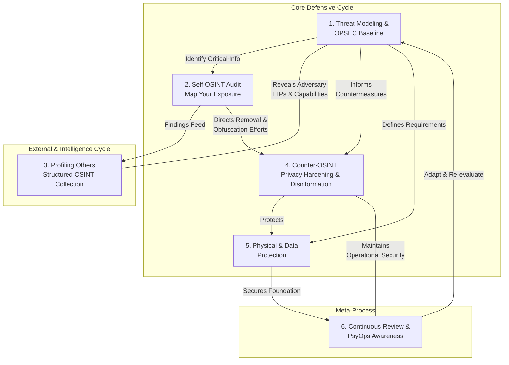

# Methodology Guide

## 🔄 Unified OPSEC–OSINT Lifecycle

---

## 🛡️ Phase 1: Threat Modeling & OPSEC Baseline

**Goal:** Systematically identify what must be protected, from whom, and how.

### Steps:
1. **Identify Critical Information (CII)**
   - Emails, addresses, network access, habits, operational details.
2. **Analyze Threats & Vulnerabilities**
   - Adversaries: employers, stalkers, law enforcement, competitors.
   - Vectors: social media, old blogs, leaked credentials.
3. **Assess Risks**
   - Probability × Impact = Risk priority.
4. **Develop Countermeasures**
   - Anonymization, encryption, compartmentalization, smokescreens.

**Tools & Techniques:**
- Use password managers ([KeePassXC](https://keepassxc.org/))
- Encrypt drives ([VeraCrypt](https://veracrypt.io/), [LUKS](https://guardianproject.info/archive/luks/))
- Adopt anonymous communication ([Signal](https://signal.org/), [Simplex](https://simplex.chat/))
- Refer to [Good OPSEC Practices](good-opsec.md) and avoid [Bad OPSEC](badopsec.md)

---

## 🧭 Phase 2: Self-OSINT Audit

**Goal:** Discover and map your own digital footprint before adversaries do.

### Steps:
1. **Google Dorks**: `"First Last" "Address"`, `"email.com" site:pastebin.com`
2. **Google’s "Results About You"**
3. **People Search Aggregators**: PeekYou, ClustrMaps, Nuwber, FastPeopleSearch
4. **Breach Data**: [HIBP](https://haveibeenpwned.com/), [Pentester](https://pentester.com/), [LeakPeek](https://leakpeek.com/)
5. **Compile Findings**: CSV/Excel with usernames, emails, addresses, etc.
6. **Document & Categorize**

**Tools:**
- [Big Ass Opt-Out List](https://github.com/yaelwrites/Big-Ass-Data-Broker-Opt-Out-List)
- [IntelTechniques Workbook](https://inteltechniques.com/workbook.html)

---

## 🔍 Phase 3: Profiling Others (Digital Profiling Cycle)

**Goal:** Conduct structured OSINT collection on targets.

### Steps:
1. **Collect Digital Biography**
   - Handles, emails, phones → Use [Maigret](https://github.com/soxoj/maigret), [Blackbird](https://github.com/p1ngul1n0/blackbird), [Sherlock](https://github.com/sherlock-project/sherlock)
2. **Analyze Behavioral Patterns**
   - Posting times, topics, language, sociability
3. **Assess Competencies & Countermeasures**
   - VPN usage, privacy practices, technical skill
4. **Leverage IMINT/SOCMINT**
   - Cross-reference photos with [Google Maps](https://maps.google.com/), [Bing Maps](https://www.bing.com/maps), [GeoHints](https://geohints.com/)
5. **Iterate**
   - Update profiles with new data, create timelines

**Advanced Techniques:**
- Use AI (e.g., ChatGPT, Claude) to analyze blog posts or social history
- Combine with [HUMINT](HUMINT.md) techniques for deeper insight

---

## 🕵️ Phase 4: Counter-OSINT (Defensive Playbook)

**Goal:** Reduce footprint and mislead intelligence collectors.

### Strategies:
1. **Compartmentalization**
   - Separate personas (work/personal/anonymous)
   - Never reuse usernames/emails across compartments
2. **Privacy Hardening**
   - Lock down social media privacy
   - Opt out of data brokers
3. **Smokescreen Ops**
   - Flood with decoy identities
   - Use misinformation (e.g., fake profiles, misleading patterns)
4. **OPSEC Habits**
   - Use [Tor](https://www.torproject.org/), [Mullvad VPN](https://mullvad.net/en)
   - Prefer [Monero (XMR)](https://www.getmonero.org/) for anonymous payments

**Tools:**
- [Stable Diffusion](https://github.com/AUTOMATIC1111/stable-diffusion-webui) for AI-generated faces
- [Free Article Spinner](https://free-article-spinner.com/) for text obfuscation
- [ExifTool](https://exiftool.org/) for metadata stripping

---

## 💾 Phase 5: Physical & Data Protection

**Goal:** Eliminate vulnerabilities in hardware, files, and physical space.

### Methods:
1. **Physical Security**
   - Locks, cameras, firearms (where legal), chemical deterrents
2. **Data-at-Rest Protection**
   - Encrypt drives (VeraCrypt, LUKS)
   - Use password managers with layered access
3. **Secure File Transfer**
   - [OnionShare](https://onionshare.org/), encrypted USBs, [TailsOS](https://tails.net/)
4. **Secure Data Destruction**
   - **HDD**: DBAN → drill/hammer/shred
   - **SSD/NVMe**: cli-nvme / nvme-sanitize → Destroy all NAND chips → shred/incinerate
   - **USB**: fill with zeros → Destroy memory chip → shred

**Guides:**
- [Physical Destruction Guide](physical-destruction.md)
- [OPSEC Toolkit](opsec.md)

---

## 🔁 Phase 6: Continuous Review & PsyOps Awareness

**Goal:** Stay adaptive and guard against psychological operations.

### Practices:
- **Run self-OSINT audits quarterly**
- **Profile adversaries** as they profile you
- **Recognize PsyOps** in media, social engineering, politics
- **Guard against paranoia**—balance skepticism with mental health

**Resources:**
- [Digital Profiling Defense](Digital-Profiling.md#best-way-to-fight-against-osint-profiling)
- [PsyOps Awareness](Digital-Profiling.md#applying-psyops)

---

## 🧠 Additional Methodologies Incorporated

### A. Smoke Screen Operations
- Deliberate obfuscation via disinformation, decoys, and noise.
- **Read more**: [Smoke Screen Operations](smokescreen-misinfo.md)

### B. HUMINT & RUMINT
- **HUMINT**: Human intelligence via interaction, interviews, social engineering.
- **RUMINT**: Rumor intelligence—useful but unverified.
- **Read more**: [HUMINT Guide](HUMINT.md)

### C. CSINT (Closed-Source Intelligence)
- Intelligence from non-public sources: breached data, proprietary info, internal records.
- **Read more**: [CSINT Overview](CSINT.md)

### D. IMINT & SOCMINT
- **IMINT**: Imagery intelligence (photos, maps, satellite imagery).
- **SOCMINT**: Social media intelligence (profiles, networks, behavior).
- **Read more**: [IMINT Guide](IMINT.md)

---

## ✅ Summary Table: OPSEC–OSINT Methodology

| Phase | Goal | Key Tools | Output |
|--------|------|-----------|---------|
| 1. Threat Modeling | Identify protectable assets | Brainstorming, risk matrices | List of CII, threats, countermeasures |
| 2. Self-OSINT | Map personal exposure | Google Dorks, breach sites | CSV of exposures |
| 3. Profiling | Collect target intelligence | Maigret, Sherlock, GeoHints | Digital biography, behavioral analysis |
| 4. Counter-OSINT | Reduce footprint | Opt-out tools, disinformation | Reduced exposure, misdirection |
| 5. Physical Protection | Secure hardware/data | Encryption, destruction tools | Secure devices, destroyed media |
| 6. Continuous Review | Adapt and detect deception | Periodic audits, PsyOps awareness | Updated OPSEC posture |

---

## 📚 References
- [Main Guide](README.md)
- [OPSEC Toolkit](opsec.md)
- [Good OPSEC](good-opsec.md)
- [Bad OPSEC](badopsec.md)
- [Real-World Examples](examples.md)
