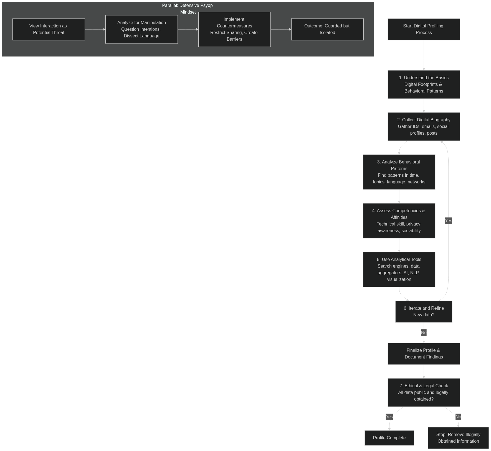

# As stated in this graph and in the markdown for [Digital Profiling](Digital-Profiling.md#digital-profiling-pipeline).
**NOTE: DO NOT DO ANYHING DUMB LOL**

You can build a somewhat clear profile on someone; what their motives are, what they are feeling possibly, what makes them tick...

In this markdown I can give you some tangible examples.

Let's say there is a threat actor trying to gather information on an internet user, s/he collects as much information as s/he can.
Let's say this user has a huge *AND I MEAN HUGE* digital footprint; from older social media to adult sites.

Ok so now what? what can s/he gather? let's refer to this graph.

First, start at phase 1: what does the threat actor need to know or what does s/he already know?

# Phase 2:

Well, from the looks of it; the internet user is a creator, ok now that's part of phase one but that doesn't tell anyone anything...

Well now here's the funny part, the user used it's email as a username on some sites (known with blackbird, et al).

Some of those sites contained a blogspot which was treated as a journal for a base of psychological profiling, it's dated; but it matches the current output; user seemed sad or bipolar at the time and current time.

ok so that's phase 2 outta the way.

# phase 3 3c 3d 3e:

The user had also posted a picture right next to it's house, which was later confirmed by govt data + maps (3c)(3). Was also confirmed by other social media postings(3c). Has a family obit for a parent which names the internet users child or family member, the internet users child or family member was named multiple times by the internet user AKA the OP. Interest was also revealed broadcasted from the internet user. it's privacy isn't really that great neither is it's tech skill(3e) and it's behavior patterns seem immature(3d); it does however seems highly sociable(3d). In it's old blogspot, the user seemed upset about issues it cannot control but also seemed obsessed with someone or something leading to a depression(3d) which reflected on what is today(3d). When prodding for info or doing a HUMINT, the threat actor may elicit a response from the internet user by asking about the child or family member in any which way. The threat actor did such thus confirming info(3d).

# Phase 4 5 6:

Verification

The threat actor, as discussed had acquired info about where the user is located, but would still like to verify; the threat actor had used google maps, google earth and even crossed referenced with maps with street view and earth and SOCMINT. The threat actor had also checked some historical archives such parcel addresses.

Multi-sourced:

# 7 Verification & Triangulation

The threat actor had as earlier stated done the following.

Had known the users interest; location, sensitve info such as a family member, psychological info (past present), a large digital bio and current career.

The threat actor doesn't need to do step 8; it skipped it.

The threat actor had gone to step 9; compiled a report to document findings.

Seeing how it's a threat actor, it may be dubious (breaches, leaks).
