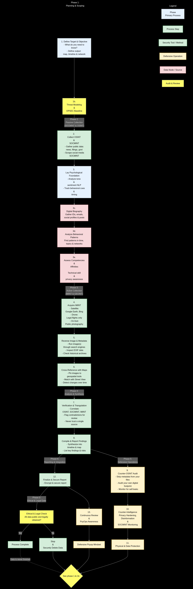

# As stated in this graph and in the markdown for [Digital Profiling](../Digital-Profiling.md#digital-profiling-pipeline) also need to check out [the main guide](../README.md).
**NOTE: DO NOT DO ANYHING DUMB LOL**

You can build a somewhat clear profile on someone; what their motives are, what they are feeling possibly, what makes them tick...

In this markdown I can give you some tangible examples.

Let's say there is a threat actor trying to gather information on an internet user, s/he collects as much information as s/he can.
Let's say this user has a huge *AND I MEAN HUGE* digital footprint; from older social media to adult sites.

Ok so now what? what can s/he gather? let's refer to this graph.

#### **Phase 1: Foundation & Planning**
The threat actor starts by defining the objective: to collect as much information as possible to understand the target's motives, feelings, and psychological triggers.

#### **Phase 2: Psychological Foundation**
The actor discovers that the target used the same email as a username on several sites. One of these sites was a Blogspot journal. By analyzing its content, the actor lays a psychological foundation: the user appeared sad or bipolar in the past, and this behavior seems to match their current online output. They've also collected other information such as political party.

#### **Phase 3: Analysis & Processing (OSINT/SOCMINT)**
This is where the actor collects and analyzes public data:
*   **(3c) Digital Biography:** The user posted a picture next a house. This was later confirmed using government data and maps. Other social media posts also confirmed this location. In another location, there was a mobile home which was either owned by the father or another dwelling; later confirmed by govt records and a public post to be possible.
*   **(3c) Family & Interests:** A family obituary named the user's child. The user had also mentioned this child's name multiple times online. The user also publicly broadcasted their personal interests. In a news article, there was a conviction of drugs matching the fathers name. Was confirmed with court docs.
*   **(3e) Competencies & Affinities:** The assessment shows the user has poor privacy habits and low-moderate technical skill. However, they are highly sociable. In another location, the threat actor confirmed a mobile home with a camera at the doorway.
*   **(3d) Behavioral Patterns:** The user's behavior seems immature. Their old journal entries showed they were upset about uncontrollable issues and obsessed with something, leading to depression—a trait that appears to reflect their current state.

**HUMINT (Human Intelligence):** The threat actor actively engaged with the user, asking about their family or child, politics and pointing out interest to elicit a response. This confirmed the information gathered and provided further insight into their behavior. The internet user seems easy to envoke and or to elicit a response.

#### **Phases 4, 5, & 6: Verification (IMINT)**
The actor moved to verify the collected information:
*   They used **Google Maps, Google Earth, and Street View** to confirm the user's location(s) and dwellings.
*   They **cross-referenced** this with parcel address data from historical archives.
*   It was further examined by govt records and later confirmed to be a possible dwelling for the father (home) and the daughter lives at a mobile home.
*   All information was **multi-sourced**, meaning it was confirmed through several independent channels.

#### **Phase 7: Verification & Triangulation**
The actor correlated all the intelligence—OSINT, SOCMINT (Social Media Intelligence), and IMINT (Imagery Intelligence)—to build a verified profile. They knew the user's:
*   Location(s) and dwellings
*   Sensitive family information
*   Psychological state (past and present)
*   Interests, political leanings, digital biography, and career

#### **Conclusion (Phases 8 & 9)**
The threat actor **skipped Phase 8** (a counter-OSINT audit, which is a defensive step) and went straight to **Phase 9**.
They compiled a report to document all findings. Since this is a threat actor, their intentions are dubious, and this compiled information could be used for breaches, leaks, or other malicious purposes.
